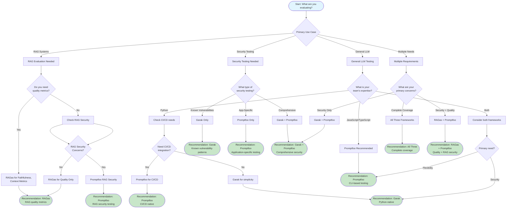

# Decision Framework for Framework Selection

Static decision flowchart and methodology for selecting the right LLM evaluation framework(s) for your needs.

## Decision Flowchart

## Decision Criteria

### By Use Case

| Use Case | Primary Framework | Secondary Framework | Rationale |
|----------|-------------------|---------------------|-----------|
| **RAG Development** | RAGas | Promptfoo | Quality metrics + RAG security |
| **RAG Security** | Promptfoo | Garak | RAG-specific security tests |
| **Chatbot Testing** | Promptfoo | Garak | Conversation testing + security |
| **Agent Development** | Promptfoo | - | Agent security suite |
| **Security Audit** | Garak | Promptfoo | Known vulnerabilities + dynamic attacks |
| **Model Comparison** | Promptfoo | - | Native side-by-side comparison |
| **Compliance** | Garak + Promptfoo | - | OWASP + compliance reporting |
| **CI/CD Testing** | Promptfoo | Garak | Native CI/CD + security |
| **Production Monitoring** | RAGas | Promptfoo | Quality tracking + regression |

### By Team Expertise

| Team Expertise | Recommended Framework | Considerations |
|----------------|----------------------|----------------|
| **Python-only** | Garak, RAGas | Both Python-native |
| **JavaScript/TypeScript** | Promptfoo | Native Node.js |
| **Multi-language** | Promptfoo + RAGas | Best of both ecosystems |
| **ML/Data Science** | RAGas | Aligns with Python ML stack |
| **Security** | Garak + Promptfoo | Comprehensive security |
| **DevOps/SRE** | Promptfoo | CI/CD native |
| **Full Stack** | Promptfoo | Works with both ecosystems |

### By Integration Requirements

| Integration Need | Best Framework | Reason |
|------------------|----------------|--------|
| **GitHub Actions** | Promptfoo | Native integration |
| **MLflow** | RAGas + Promptfoo | Native and via export |
| **LangChain** | RAGas + Promptfoo | Native LangChain support |
| **LlamaIndex** | RAGas | Native support |
| **Custom APIs** | Promptfoo + Garak | Flexible providers |
| **Docker** | All three | All containerizable |
| **Kubernetes** | Promptfoo | CLI-based, easier orchestration |

### By Cost Constraints

| Budget Level | Recommended Framework | Cost Optimization |
|--------------|----------------------|-------------------|
| **Low** | Garak | Static probes, minimal API usage |
| **Medium** | Promptfoo | Caching, selective evaluation |
| **High** | All three | Comprehensive coverage |

### By Compliance Requirements

| Compliance Need | Framework | Reason |
|----------------|-----------|--------|
| **OWASP LLM Top 10** | Garak + Promptfoo | Mapped coverage |
| **NIST AI RMF** | Promptfoo | Native support |
| **MITRE ATLAS** | Promptfoo | Native support |
| **EU AI Act** | Promptfoo | Native support |
| **SOC 2** | Garak + Promptfoo | Security + documentation |
| **ISO 27001** | Promptfoo Enterprise | Certified compliance |

## Quick Decision Questions

### Question 1: What are you evaluating?

- **RAG systems**: Go to RAGas framework profile
- **Chatbots**: Go to Promptfoo framework profile
- **AI agents**: Go to Promptfoo framework profile
- **Security**: Go to Garak or Promptfoo security evaluation

### Question 2: Do you need quality metrics?

- **Yes**: Consider RAGas (for RAG) or Promptfoo (model-graded)
- **No**: Focus on security frameworks

### Question 3: What's your team's primary language?

- **Python**: Garak or RAGas
- **JavaScript/TypeScript**: Promptfoo
- **Both**: Consider hybrid solutions

### Question 4: Do you need CI/CD integration?

- **Yes, native**: Promptfoo
- **Yes, custom**: Any framework (Python scripting)
- **No**: Any framework works

### Question 5: What's your budget?

- **Low API costs**: Garak (static probes)
- **Medium**: Promptfoo (caching)
- **High**: Any/all frameworks

## Framework Recommendations by Scenario

### Scenario 1: Enterprise RAG Application

**Requirements**:
- RAG quality metrics
- Security testing
- Compliance reporting
- CI/CD integration

**Recommendation**: RAGas + Promptfoo

**Implementation**:
- Use RAGas for faithfulness, context precision/recall
- Use Promptfoo for RAG security and CI/CD
- Integrate results in unified dashboard

### Scenario 2: AI Agent Platform

**Requirements**:
- Multi-turn security testing
- Tool misuse detection
- RBAC testing
- Python-based stack

**Recommendation**: Promptfoo (with Python subprocess for Garak if needed)

**Implementation**:
- Use Promptfoo agent security suite
- Add Garak for baseline security if desired
- Focus on agent-specific vulnerabilities

### Scenario 3: LLM Security Audit

**Requirements**:
- OWASP LLM Top 10 coverage
- Known vulnerability patterns
- Comprehensive reporting
- Python-only tooling

**Recommendation**: Garak + Promptfoo

**Implementation**:
- Run Garak for comprehensive baseline
- Run Promptfoo for application-specific attacks
- Cross-reference findings for complete coverage

### Scenario 4: Model Selection

**Requirements**:
- Side-by-side model comparison
- Performance metrics
- Cost analysis
- Quick iteration

**Recommendation**: Promptfoo

**Implementation**:
- Use native model comparison features
- Leverage web UI for visualization
- Export results for analysis

### Scenario 5: Production Monitoring

**Requirements**:
- Quality trend tracking
- Regression detection
- Integration with observability
- Automated alerts

**Recommendation**: RAGas (for RAG) + Promptfoo (for regression)

**Implementation**:
- Use RAGas with MLflow for quality tracking
- Use Promptfoo in CI/CD for regression testing
- Set up automated alerting

## Team Composition Considerations

### Small Team (<5 developers)

**Recommendation**: Start with single framework

| Team Skills | Recommended Framework |
|------------|----------------------|
| Python developers | Garak or RAGas |
| JavaScript developers | Promptfoo |
| Mixed skills | Promptfoo (broader coverage) |

**Rationale**: Smaller teams should minimize tool proliferation and learning overhead.

### Medium Team (5-20 developers)

**Recommendation**: Primary framework + supplementary as needed

| Focus | Primary | Supplementary |
|-------|---------|---------------|
| RAG applications | RAGas | Promptfoo (security) |
| Security | Garak | Promptfoo (dynamic) |
| Platform | Promptfoo | Garak (baseline) |

**Rationale**: Medium teams can handle 2 frameworks with clear responsibilities.

### Large Team (>20 developers)

**Recommendation**: All three frameworks with clear ownership

| Team | Framework Ownership |
|------|-------------------|
| ML/Data Science | RAGas |
| Security | Garak + Promptfoo |
| Platform Engineering | Promptfoo (CI/CD) |

**Rationale**: Large teams can dedicate resources to each framework and specialize.

## Implementation Phases

### Phase 1: Pilot (1-2 weeks)

- Select primary framework based on use case
- Run initial evaluations
- Validate approach
- Gather feedback

### Phase 2: Production (1-2 months)

- Integrate into CI/CD
- Set up monitoring and alerting
- Train team
- Document processes

### Phase 3: Expansion (Ongoing)

- Add supplementary frameworks as needed
- Optimize for cost and performance
- Expand coverage
- Refine based on experience

## Related Resources

- **Quick Reference**: [Quick Reference Guide](quick-reference.md)
- **Use Case Mapping**: [Use Case Recommendations](../comparisons/use-case-mapping.md)
- **Framework Profiles**: Detailed profiles for [Promptfoo](../frameworks/promptfoo.md), [Garak](../frameworks/garak.md), [RAGas](../frameworks/ragas.md)
- **Feature Matrix**: [Feature Comparison Matrix](../comparisons/feature-matrix.md)
