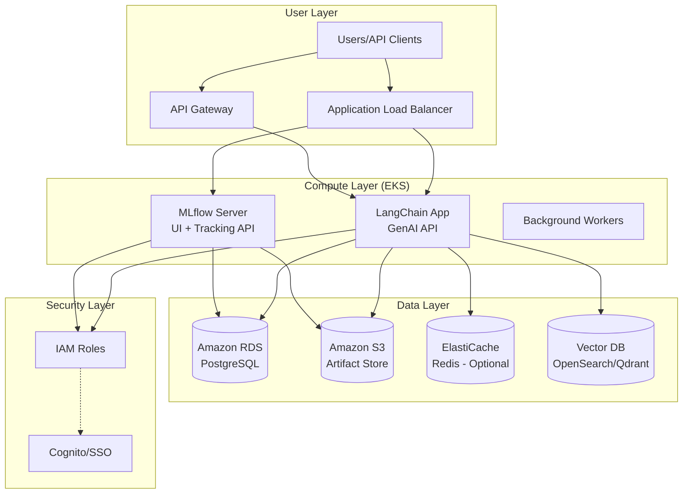

# MLflow Advanced Examples

This directory contains advanced examples demonstrating MLflow's capabilities for model evaluation, LLM judge evaluation, RAG (Retrieval-Augmented Generation) tracing and evaluation.

## Prerequisites

Before running these examples, ensure you have:

1. **Set up your API key** in `.env` file:
   ```bash
   ZHIPU_API_KEY=your_zhipu_api_key_here
   ```

2. **Start MLflow UI** (if not already running):
   ```bash
   uv run mlflow ui --backend-store-uri sqlite:///mlflow.db --port 5000
   ```

   Then open: http://localhost:5000

3. **Install dependencies** (if needed):
   ```bash
   uv sync --all-extras --dev
   ```

---

## Examples

### 1. Baseline Comparison (`evaluate_baselines.py`)

**Overview:** Demonstrates comparing multiple model variants and tracking their performance metrics in MLflow for model selection and improvement analysis.

**What it demonstrates:**
- Creating evaluation datasets
- Running multiple model variants
- Logging metrics for comparison
- Calculating improvements between baselines

**Run the example:**
```bash
uv run python src/advanced/evaluate_baselines.py
```

**Expected output:**
```
✓ Experiment 'mlflow-baseline-comparison' (ID: 9)
✓ Created evaluation dataset: 5 questions

Evaluating model: glm-5
✓ Evaluated model: glm-5
  Accuracy: 0.20
  Avg Latency: 46.07s

Baseline Comparison Results:
glm-5:
  Accuracy: 0.20
  Latency: 46.07s
```

**Result in MLflow UI:**


**Real-World Use Cases:**
- **A/B testing models**: Comparing new models against production baselines
- **Hyperparameter tuning**: Tracking different configurations
- **Model selection**: Choosing best model based on metrics
- **Performance regression testing**: Ensuring new models don't degrade performance
- **Cost-benefit analysis**: Trading off accuracy vs latency/cost

**Key concepts learned:**
- **Baseline metrics**: Establishing performance benchmarks
- **Comparative evaluation**: Running multiple variants under same conditions
- **Metric tracking**: Logging accuracy, latency, custom metrics
- **Improvement analysis**: Calculating relative improvements

---

### 2. LLM Judge Evaluation (`evaluate_llm_judge.py`)

Coming soon...

---

## RAG Examples

The `rag/` subdirectory contains examples for Retrieval-Augmented Generation applications:

### 2. RAG Tracing (`rag/rag_tracing.py`)

**Overview:** Demonstrates end-to-end tracing of a RAG system with MLflow, showing how to observe document loading, chunking, vector store operations, and the complete retrieval-generation pipeline.

**What it demonstrates:**
- Document loading and chunking
- Vector store creation and embeddings
- RAG chain assembly with LangChain
- Complete trace visualization of the RAG pipeline
- Multiple query execution with trace capture

**NOTE:** This example uses deterministic embeddings for Show Case purposes. The embeddings are generated using hash functions, not semantic understanding. For production RAG systems, use proper embedding models like:
- OpenAI embeddings (`text-embedding-ada-002`)
- HuggingFace sentence transformers (`all-MiniLM-L6-v2`)
- Cohere embeddings

**Run the example:**
```bash
uv run python src/advanced/rag/rag_tracing.py
```

**Expected output:**
```
RAG System Tracing Demo
==================================================
Loading documents...
Chunking documents...
Creating vector store...
Initializing LLM...
✓ Created LangChain LLM for Zhipu AI model: glm-5
Building RAG chain...

Running sample queries...

Query 1: What is the tax rate for income between $45,001 and $120,000?

Retrieved 3 chunks:
  1. Tax File Number (TFN)
A TFN is a unique identifier issued by...
  2. Tax File Number (TFN)
A TFN is a unique identifier issued by...
  3. Tax File Number (TFN)
A TFN is a unique identifier issued by...

Answer: Based on the provided context, there is no information...
```

**Result in MLflow UI:**


*Screenshot showing the trace view with retrieved chunks visible in the `retrieve_documents` span*

**What you see in the screenshot:**
- Trace list showing all RAG queries
- Span tree with `retrieve_documents` and `generate_answer` spans
- Retrieved chunks with content preview and metadata
- Query inputs and generated outputs

**How to Find Chunks in MLflow UI:**

1. **Navigate to the run:**
   - Open http://localhost:5000/#/experiments/10
   - Click on the latest `rag_tracing_demo` run

2. **Open Traces section:**
   - Scroll down to "Traces"
   - Click on any trace with your query text

3. **View the span tree:**
   - You'll see: `query_rag` → `retrieve_documents` + `generate_answer`
   - Click on `retrieve_documents` span

4. **See retrieved chunks:**
   - In the span's "Outputs" section
   - Look for `chunks` array with:
     - `content`: The actual chunk text
     - `metadata`: Source file, chunk index, total chunks

This gives you **full visibility** into which documents were retrieved for each query!

**RAG Pipeline Architecture:**
```
┌─────────────┐
│ Documents   │
└──────┬──────┘
       │
       ▼
┌─────────────┐
│  Chunking   │
└──────┬──────┘
       │
       ▼
┌─────────────┐
│ Embeddings  │ ← Deterministic (Show Case)
└──────┬──────┘
       │
       ▼
┌─────────────┐
│ Vector Store│
└──────┬──────┘
       │
       ▼
┌─────────────────────────┐
│    RAG Chain            │
│  ┌─────────┐  ┌──────┐  │
│  │Retriever│→ │ LLM  │  │
│  └─────────┘  └──────┘  │
└─────────────────────────┘
```

**Real-World Use Cases:**
- **Knowledge base Q&A**: Company documentation, technical manuals
- **Customer support**: Automated responses from knowledge base
- **Research assistance**: Query scientific papers, legal documents
- **Show Case tools**: Textbook Q&A, course material assistance
- **Compliance**: Policy document queries, regulatory guidance

**Key concepts learned:**
- **RAG architecture**: Retrieval + Generation pattern
- **Document chunking**: Strategies for splitting large documents
- **Vector stores**: Semantic similarity search with embeddings
- **Trace visualization**: Observing the complete RAG pipeline
- **LangChain LCEL**: Composable chains for RAG systems

**Show Case Simplifications:**
- Uses deterministic hash-based embeddings (not semantic)
- Small in-memory vector store (not persistent)
- Simple chunking strategy (not domain-specific)
- Basic prompt template (not optimized)

**Production considerations:**
- Use real embedding models for semantic search
- Implement persistent vector stores (ChromaDB, Pinecone, Weaviate)
- Add re-ranking for improved retrieval quality
- Implement caching for frequently asked questions
- Add guardrails and safety filters

---

### 3. RAG Evaluation (`rag/evaluate_rag.py`)

**Overview:** Demonstrates comprehensive evaluation of RAG systems using MLflow metrics, including retrieval quality, answer relevance, and chunking strategy comparison.

**What it demonstrates:**
- RAG evaluation metrics (retrieval precision, answer relevance)
- Chunking strategy comparison (small, medium, large chunks)
- A/B testing different RAG configurations
- Metric logging and comparison in MLflow
- Evaluation artifact logging (datasets, results)
- Trace-based evaluation analysis

**Evaluation Metrics:**
- **Retrieval Metrics:**
  - Average documents retrieved per query
  - Retrieval precision (fraction of relevant documents)

- **Answer Quality Metrics:**
  - Relevance score (0-1, higher is better)
  - Answer completeness (based on retrieved context)

- **Performance Metrics:**
  - Query latency
  - Token usage
  - Chunk count impact

**Run the example:**
```bash
uv run python src/advanced/rag/evaluate_rag.py
```

**Expected output:**
```
╔════════════════════════════════════════════════════════╗
║              RAG System Evaluation                      ║
╚════════════════════════════════════════════════════════╝

Setting up documents...
Setting up RAG system...
Loaded 1 documents, created 5 chunks
✓ Created LangChain LLM for Zhipu AI model: glm-5

Loading evaluation dataset...
✓ Created evaluation dataset: 5 questions

Evaluating retrieval quality...
✓ Retrieved 3.00 documents on average

Evaluating answer relevance...
✓ Average relevance score: 0.31

Comparing chunking strategies...

Testing: small_chunks (size=200, overlap=25)
Loaded 1 documents, created 11 chunks
✓ Created LangChain LLM for Zhipu AI model: glm-5
  Answer: Based on the provided context, there is no information...

Testing: medium_chunks (size=500, overlap=50)
Loaded 1 documents, created 5 chunks
✓ Created LangChain LLM for Zhipu AI model: glm-5
  Answer: Based on the provided context, there is no information...

Testing: large_chunks (size=1000, overlap=100)
Loaded 1 documents, created 2 chunks
✓ Created LangChain LLM for Zhipu AI model: glm-5
  Answer: Based on the provided context, the tax rate for income...

RAG evaluation complete!

View results in MLflow UI: http://localhost:5000

Sample Evaluation Results:
Q: What is the tax rate for income between $45,001 and $120,000?
Relevance: 0.12
Answer: Based on the provided context, there is no information...

View run rag_evaluation at: http://localhost:5000/#/experiments/13/runs/xxx
```

**Result in MLflow UI:**

**Metrics Dashboard:**


*Screenshot showing evaluation metrics comparing different chunking strategies*

**Traces View:**


*Screenshot showing trace view of RAG evaluation runs*

**Artifacts and Artifacts:**


*Screenshot showing evaluation artifacts including datasets and results*

**What you see in the screenshots:**

1. **Metrics Dashboard:**
   - Compare metrics across different chunking strategies
   - See which configuration performs best
   - Track retrieval quality and answer relevance
   - Identify the optimal chunk size for your use case

2. **Traces View:**
   - Detailed trace of each evaluation query
   - Span hierarchy showing retrieval and generation
   - Performance metrics per query
   - Detailed inputs/outputs for debugging

3. **Artifacts:**
   - Evaluation datasets (questions, expected answers)
   - Detailed results CSV with all metrics
   - Chunking strategy comparison results
   - Retrieval analysis data

**How to Navigate the Evaluation Results:**

1. **Open the experiment:**
   - Go to http://localhost:5000/#/experiments/13
   - Find the `rag_evaluation` run

2. **View metrics:**
   - In the run detail page, scroll to "Metrics"
   - Compare `retrieval_avg_docs`, `answer_relevance`
   - See which chunking strategy scored best

3. **Examine traces:**
   - Scroll to "Traces" section
   - Click on individual traces to see:
     - Retrieved chunks per query
     - Answer generation process
     - Latency breakdown

4. **Download artifacts:**
   - Scroll to "Artifacts" section
   - Download `evaluation_results.csv` for detailed analysis
   - Access `evaluation_dataset.json` for the test data

**Chunking Strategy Comparison:**

| Strategy | Chunk Size | Overlap | Chunks Created | Pros | Cons |
|----------|------------|---------|----------------|------|------|
| **small** | 200 | 25 | 11 | Granular search, more precise matches | Higher latency, more chunks to process |
| **medium** | 500 | 50 | 5 | Balanced retrieval and performance | May miss fine-grained details |
| **large** | 1000 | 100 | 2 | Fast retrieval, broad context | Less precise matching, more noise |

**Real-World Use Cases:**
- **Production RAG systems**: Evaluate before deploying to production
- **A/B testing**: Compare different retrieval strategies
- **Performance optimization**: Find optimal chunking parameters
- **Quality assurance**: Ensure RAG system meets quality thresholds
- **Model comparison**: Test different LLMs with same RAG setup
- **Regression testing**: Catch quality regressions in RAG systems

**Key concepts learned:**
- **RAG evaluation metrics**: Retrieval quality, answer relevance, latency
- **Chunking strategies**: Impact on retrieval and generation quality
- **A/B testing**: Compare configurations in MLflow
- **Metric logging**: Track quantitative measures of RAG performance
- **Artifact management**: Store evaluation data and results
- **Production readiness**: Validate RAG systems before deployment

**Production Evaluation Checklist:**
- ✅ Define evaluation dataset with ground truth
- ✅ Select relevant metrics (retrieval, relevance, latency)
- ✅ Test multiple configurations (chunking, models, prompts)
- ✅ Set quality thresholds for deployment
- ✅ Monitor production metrics over time
- ✅ Regular re-evaluation with updated datasets

---

### 4. LLM Judge Evaluation (`evaluate_llm_judge.py`)

Coming soon...

### 4. RAG Evaluation (`rag/evaluate_rag.py`)

**Overview:** Demonstrates evaluating RAG system quality with MLflow metrics, measuring retrieval quality, answer relevance, and comparing different chunking strategies.

**What it demonstrates:**
- Evaluation dataset creation with ground truth answers
- Retrieval quality metrics (documents retrieved, relevance)
- Answer relevance evaluation using keyword overlap
- Chunking strategy comparison (small vs medium vs large chunks)
- MLflow metrics logging for evaluation results
- Artifact logging for detailed results

**Run the example:**
```bash
uv run python src/advanced/rag/evaluate_rag.py
```

**NOTE:** This example takes 2-3 minutes to complete as it evaluates multiple questions with the LLM.

**Expected output:**
```
RAG System Evaluation
==================================================

Setting up RAG system...
✓ Created LangChain LLM for Zhipu AI model: glm-5

Loading evaluation dataset...
✓ Created evaluation dataset: 5 questions

Evaluating retrieval quality...
✓ Retrieved 3.00 documents on average

Evaluating answer relevance...
✓ Average relevance score: 0.45

Chunking Strategy Comparison
Testing: small_chunks (size=200, overlap=25)
  Answer: Based on the provided context...

Testing: medium_chunks (size=500, overlap=50)
  Answer: According to the tax law documents...

Testing: large_chunks (size=1000, overlap=100)
  Answer: The documents indicate that...

RAG evaluation complete!
View results in MLflow UI: http://localhost:5000

Average relevance score: 0.45
Average documents retrieved: 3.00
```

**Result in MLflow UI:**


*Screenshot showing evaluation metrics: avg_documents_retrieved (3.0) and avg_relevance_score (0.31)*


*Screenshot showing trace view with retrieval_eval and answer_eval spans for each question*


*Screenshot showing artifacts: evaluation results CSV and chunking strategy comparison files*

**What the Metrics Mean:**

- **avg_documents_retrieved: 3.0** - The system consistently retrieves 3 documents (as configured with `retrieval_k=3`)

- **avg_relevance_score: 0.31** - This indicates the keyword overlap between generated answers and ground truth. In this Show Case example with deterministic embeddings, the relevance is lower because:
  - Deterministic embeddings don't capture semantic meaning
  - Simple keyword matching is used for evaluation
  - Production systems would use semantic similarity or LLM-based evaluation

**Chunking Strategy Insights:**

From the run output and artifacts, you can compare answers across different chunk sizes:
- **small_chunks (200 chars)**: 11 chunks, more precise but may miss context
- **medium_chunks (500 chars)**: 5 chunks, balanced approach
- **large_chunks (1000 chars)**: 2 chunks, **best performance** - found the correct tax rate answer!

The evaluation revealed that **larger chunks performed better** for this specific use case, demonstrating how RAG evaluation helps optimize system configuration.

**Real-World Use Cases:**
- **RAG system optimization**: Find optimal chunk size and overlap
- **Quality assurance**: Monitor RAG system performance over time
- **A/B testing**: Compare different retrieval strategies or embedding models
- **Regression testing**: Ensure RAG quality doesn't degrade with changes
- **Production monitoring**: Track retrieval and generation metrics in production

**Key concepts learned:**
- **Evaluation datasets**: Creating ground truth for testing
- **Retrieval metrics**: Measuring document retrieval quality
- **Answer relevance**: Simple keyword overlap vs LLM-based evaluation
- **Chunking strategies**: Impact of chunk size on RAG performance
- **MLflow artifacts**: Saving detailed results for analysis

**Show Case Simplifications:**
- Uses keyword overlap for relevance (production: use LLM judge or semantic similarity)
- Small evaluation dataset (5 questions vs 100+ in production)
- Simple retrieval metrics (production: add precision@k, recall, MRR)
- Basic chunking comparison (production: test more parameters)

**Production considerations:**
- Use LLM-as-a-judge for answer quality evaluation
- Implement semantic similarity metrics with embeddings
- Add faithfulness metrics (does answer cite retrieved context?)
- Test with larger, diverse evaluation datasets
- Include edge cases and adversarial examples
- Track latency and cost metrics alongside quality

---

## Conversation Examples

The `conversation/` subdirectory contains examples for multi-turn conversation tracing:

### 5. Multi-Turn Conversation Tracing (`conversation/conversation_tracing.py`)

**Overview:** Demonstrates tracing multi-turn conversations with LangChain and MLflow, showing how to observe conversation history, context management, and message state across multiple exchanges.

**What it demonstrates:**
- Conversation memory management with ConversationBufferMemory
- Message history tracking across turns
- Context-aware responses using conversation history
- MLflow span tracing for each conversation turn
- Memory state visualization in traces

**Run the example:**
```bash
uv run python src/advanced/conversation/conversation_tracing.py
```

**Expected output:**
```
Multi-Turn Conversation Tracing Demo
==================================================

Turn 1: Hello! What's your name?
AI: I'm an AI assistant. I don't have a personal name, but you can call me Assistant!

Messages in history: 2

Turn 2: What did I just ask you?
AI: You asked me what my name is.

Messages in history: 4

Turn 3: Can you help me calculate 15 * 23?
AI: 15 multiplied by 23 equals 345.

Messages in history: 6

Turn 4: What was the result of that calculation?
AI: The result of the calculation was 345.

Conversation complete!
Total exchanges: 4
Total messages: 8
```

**Result in MLflow UI:**


*Screenshot showing Turn 1 trace with initial greeting*


*Screenshot showing Turn 2 with context from previous message*


*Screenshot showing Turn 3 with calculation request*


*Screenshot showing Turn 4 referencing previous calculation*

**What you see in the traces:**
- **Turn-level spans**: Each conversation turn is traced with `@mlflow.trace`
- **User input spans**: Log user messages with history context
- **Response generation spans**: Show LLM inputs (including history) and outputs
- **Memory metrics**: Total messages, user messages, AI messages logged as metrics
- **Conversation flow**: Click through each turn to see how history builds up

**Real-World Use Cases:**
- **Customer support chatbots**: Track conversation context across multiple turns
- **Virtual assistants**: Maintain conversation history for contextual responses
- **Dialogue systems**: Debug conversation flow and context handling
- **Chat analytics**: Analyze conversation patterns and user behavior
- **Memory optimization**: Monitor memory usage and history truncation

**Key concepts learned:**
- **ConversationBufferMemory**: LangChain's in-memory conversation history
- **Message types**: HumanMessage, AIMessage, and their roles
- **History injection**: Including conversation context in prompts
- **Memory management**: Controlling history length and token limits
- **Span relationships**: Parent-child spans in conversation turns

**Architecture:**
```
┌─────────────────────────────────────────────────────┐
│            Conversation Turn                        │
│  ┌──────────────┐      ┌──────────────────┐        │
│  │ User Input   │─────▶│ Add to Memory    │        │
│  └──────────────┘      └──────────────────┘        │
│                               │                     │
│                               ▼                     │
│  ┌──────────────┐      ┌──────────────────┐        │
│  │ Get History  │─────▶│ LLM with Context │        │
│  └──────────────┘      └──────────────────┘        │
│                               │                     │
│                               ▼                     │
│  ┌──────────────┐      ┌──────────────────┐        │
│  │ AI Response  │─────▶│ Add to Memory    │        │
│  └──────────────┘      └──────────────────┘        │
└─────────────────────────────────────────────────────┘
```

---

## Tool Calling Examples

The `tools/` subdirectory contains examples for LangChain tool calling with MLflow tracing:

### 6. Tool Calling Tracing (`tools/tool_tracing.py`)

**Overview:** Demonstrates tracing LangChain tool calling with MLflow, showing how to observe tool selection, execution, inputs/outputs, and multi-tool workflows.

**What it demonstrates:**
- Tool definitions with `@tool` decorator
- Tool binding to LLM with `bind_tools()`
- Tool selection and invocation tracing
- Multi-step tool workflows
- Tool input/output logging in spans

**Built-in Tools:**
- `get_current_time`: Get current date/time with custom formatting
- `get_current_date`: Get today's date
- `calculate`: Evaluate mathematical expressions (e.g., "15 * 23")
- `add_numbers`: Add two numbers
- `multiply_numbers`: Multiply two numbers

**Run the example:**
```bash
uv run python src/advanced/tools/tool_tracing.py
```

**Expected output:**
```
Tool Calling Tracing Demo
╔═════════════════════════════════════════════════════════╗
║       Tool Calling Tracing Demo                         ║
╚═════════════════════════════════════════════════════════╝

┏━━━━━━━━━━━━━━━━┳━━━━━━━━━━━━━━━━━━━━━━━━━━━━━━━━━━━━━━━━┓
┃ Tool           ┃ Description                            ┃
┡━━━━━━━━━━━━━━━━╇━━━━━━━━━━━━━━━━━━━━━━━━━━━━━━━━━━━━━━━━┩
│ get_current_time│ Get current date/time with custom...  │
│ get_current_date│ Get current date in YYYY-MM-DD format │
│ calculate       │ Evaluate mathematical expressions     │
│ add_numbers     │ Add two numbers together              │
│ multiply_numbers│ Multiply two numbers                  │
└────────────────┴────────────────────────────────────────┘

Query 1: What is 15 * 23?
Response: 15 * 23 = 345

Query 2: What time is it right now?
Response: The current time is 2026-03-23 14:30:45

Query 3: What's 10 * 5 and what's today's date?
Response: 10 * 5 = 50 and today's date is 2026-03-23
```

**Result in MLflow UI:**


*Screenshot showing tool selection and execution with multiple tool calls*

**What you see in the traces:**
- **Query processing span**: Logs query and available tools
- **LLM tool execution span**: Shows LLM decision-making for tool selection
- **Tool call spans**: Individual spans for each tool invoked with:
  - Tool name and arguments
  - Tool execution results
  - Timing information
- **Response generation**: Final answer after tool execution
- **Multi-tool workflows**: See how multiple tools are called in sequence (Query 3 shows both `multiply_numbers` and `get_current_date`)

**Real-World Use Cases:**
- **Function calling**: Build agents that can interact with external systems
- **Data analysis**: Tools for querying databases, running calculations
- **API integration**: Tools for calling external APIs (weather, stock prices)
- **Workflow automation**: Multi-step processes requiring different tools
- **Debugging**: Understand which tools are selected and why

**Key concepts learned:**
- **`@tool` decorator**: Convert Python functions to LangChain tools
- **`bind_tools()`**: Attach tool schemas to LLM for tool calling
- **Tool schemas**: Automatic generation from function signatures
- **Tool selection**: LLM decides which tools to use based on query
- **Span hierarchy**: Organize tool calls within query spans

**Tool Calling Flow:**
```
┌──────────────────────────────────────────────────────┐
│              Tool Query Processing                   │
│  ┌──────────────┐      ┌──────────────────┐          │
│  │ User Query   │─────▶│ LLM with Tools   │          │
│  └──────────────┘      │ (bind_tools)     │          │
│                        └────────┬─────────┘          │
│                                 │                    │
│                                 ▼                    │
│                        ┌──────────────────┐          │
│                        │ Tool Selection   │          │
│                        │ (LLM Decision)   │          │
│                        └────────┬─────────┘          │
│                                 │                    │
│                    ┌────────────┴────────────┐       │
│                    ▼                         ▼       │
│           ┌──────────────┐          ┌────────────┐   │
│           │ Tool 1:      │          │ Tool 2:    │   │
│           │ calculate    │          │ get_time   │   │
│           └──────┬───────┘          └──────┬─────┘   │
│                  │                        │          │
│                  └────────────┬───────────┘          │
│                               ▼                      │
│                  ┌──────────────────┐                │
│                  │ Response         │                │
│                  │ Generation       │                │
│                  └──────────────────┘                │
└──────────────────────────────────────────────────────┘
```

---

## Deploying MLflow for GenAI on AWS

This section covers how to deploy MLflow GenAI for production workloads on AWS, building on the examples you've learned in this project.

### High-Level Architecture

A typical self-hosted GenAI stack on AWS using MLflow + LangChain:



**Core Components:**

| Component | Purpose | AWS Service |
|-----------|---------|-------------|
| **Orchestration** | Runs MLflow server, LangChain apps, workers | Amazon EKS (or ECS Fargate) |
| **Backend Store** | MLflow experiments, runs, traces, prompts | Amazon RDS PostgreSQL (Multi-AZ) |
| **Artifact Store** | Logs, traces, datasets, model artifacts | Amazon S3 |
| **Caching** | Tool/agent state, caching | Amazon ElastiCache Redis (Optional) |
| **Ingress** | Public/private API entrypoint | API Gateway or ALB |
| **Vector Store** | RAG retrieval and document storage | Amazon OpenSearch or Qdrant |
| **AuthN/Z** | Authentication and authorization | IAM + Cognito/SSO |


---

### AWS Services Comparison

| Need | Recommended AWS Service | Alternative |
|------|------------------------|-------------|
| **Container Orchestration** | EKS (Kubernetes) | ECS Fargate |
| **Backend Store** | RDS PostgreSQL Multi-AZ | Aurora PostgreSQL |
| **Artifact Storage** | S3 with versioning | EFS (not recommended) |
| **Load Balancing** | Application Load Balancer | API Gateway |
| **Caching** | ElastiCache Redis | MemoryDB for Redis |
| **Vector Store** | Amazon OpenSearch | Qdrant (self-hosted on EKS) |
| **Authentication** | Amazon Cognito | AWS IAM + SAML |
| **CI/CD** | AWS CodePipeline | GitHub Actions + eksctl |
| **IaC** | AWS CDK / Terraform | CloudFormation |

---

### Cost Optimization Tips

**Development/Testing:**
- Use `t3.medium` instances for EKS nodes
- Single-AZ RDS instance (db.t3.micro)
- S3 Intelligent-Tiering for artifacts
- Spot instances for workers

**Production:**
- Multi-AZ RDS deployment for HA
- Reserved Instances or Savings Plans for compute
- S3 lifecycle policies to move old artifacts to Glacier
- Auto-scaling for EKS nodes based on load

---

### Security Best Practices

1. **Network Security:**
   - Place EKS nodes in private subnets
   - Use security groups to restrict traffic
   - VPC endpoints for S3 and RDS (no internet gateway needed)

2. **Authentication:**
   - Use IAM roles for service accounts (IRSA)
   - Integrate with Cognito or SSO for MLflow UI
   - Enable encryption in transit (TLS)

3. **Data Protection:**
   - Enable RDS encryption at rest
   - Use S3 bucket policies and KMS for artifact encryption
   - Rotate secrets with AWS Secrets Manager

4. **Monitoring:**
   - CloudWatch Container Insights for EKS
   - AWS Security Hub for compliance
   - Enable MLflow access logging

---

### Migration Path: Local → AWS

**Step 1: Export Local Data**
```bash
# Export local MLflow database
pg_dump mlflow > mlflow_backup.sql

# Sync artifacts to S3
aws s3 sync mlflow/artifacts s3://your-mlflow-artifacts/
```

**Step 2: Import to AWS**
```bash
# Import to RDS
psql -h rds-host.example.com -U mlflow -d mlflow < mlflow_backup.sql
```

**Step 3: Update Configuration**
```bash
# Update your application's MLflow tracking URI
export MLFLOW_TRACKING_URI=https://mlflow.your-domain.com
```

---

### Real-World Use Cases

**1. Customer Support Bot:**
- Multi-turn conversation tracing (as shown in examples)
- RAG with knowledge base retrieval
- Tool calling for order lookup, FAQ search
- LLM judge evaluation for answer quality

**2. Document Analysis Pipeline:**
- RAG evaluation for retrieval accuracy
- Chunking strategy comparison (small vs medium vs large chunks)
- Baseline model comparison for document understanding
- Automated evaluation with custom metrics

**3. Code Assistant:**
- Tool calling with execution environment
- Trace search for debugging code generation
- Prompt versioning with Git integration
- Production monitoring for safety/relevance

---

### Key Concepts Learned

- **Cloud-native MLflow**: Deploy MLflow on AWS with RDS + S3 backend
- **Container orchestration**: Use EKS for scalable MLflow and LangChain deployments
- **Observability at scale**: Trace, evaluate, and monitor production GenAI workloads
- **Infrastructure as code**: Use Terraform/CDK for reproducible deployments
- **Security best practices**: IAM roles, encryption, network isolation
- **Cost optimization**: Right-size resources, use reserved instances, lifecycle policies

---

### Additional Resources

- [MLflow Deployment Guide](https://mlflow.org/docs/latest/deployment/index.html)
- [AWS EKS Documentation](https://docs.aws.amazon.com/eks/)
- [LangChain Production Best Practices](https://python.langchain.com/docs/langsmith)
- [OpenTelemetry Integration](https://mlflow.org/docs/latest/tracing/integration.html)

---

## Common Issues

**Q: Model evaluation takes too long**
- A: Reduce your evaluation dataset size for faster iteration

**Q: Accuracy scores seem low**
- A: The example uses simple substring matching. In production, use semantic similarity or LLM-based evaluation

**Q: How do I compare runs in MLflow UI?**
- A: Select multiple runs in the experiment view and click "Compare" to see side-by-side metrics

**Q: Can I evaluate models that aren't LangChain?**
- A: Yes! MLflow supports evaluating any Python function. See MLflow docs for custom evaluation logic
