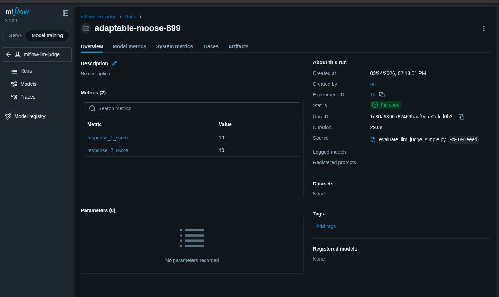
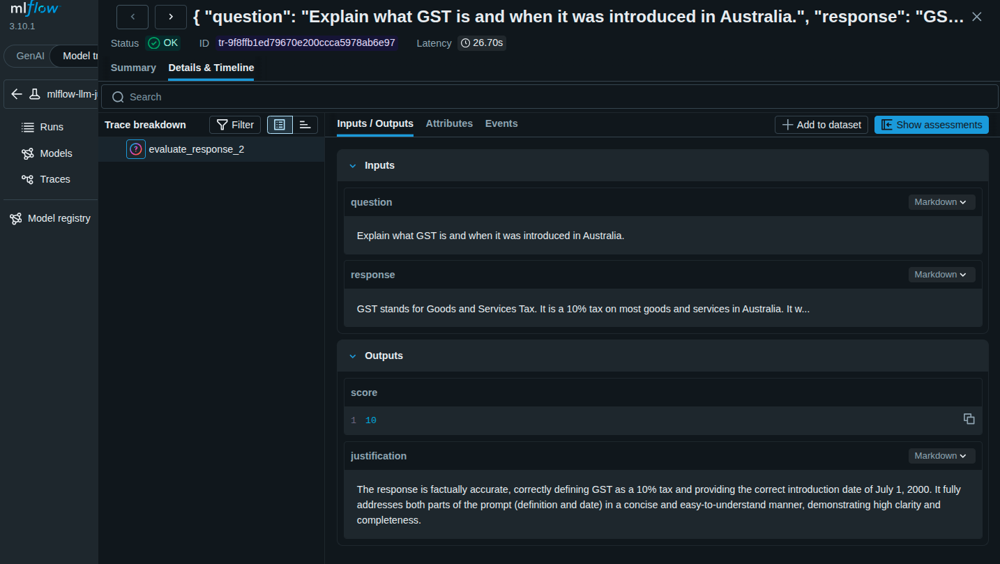
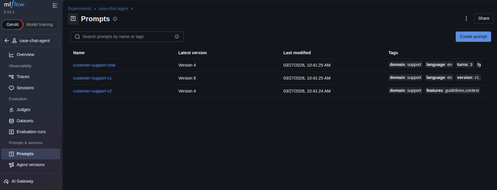
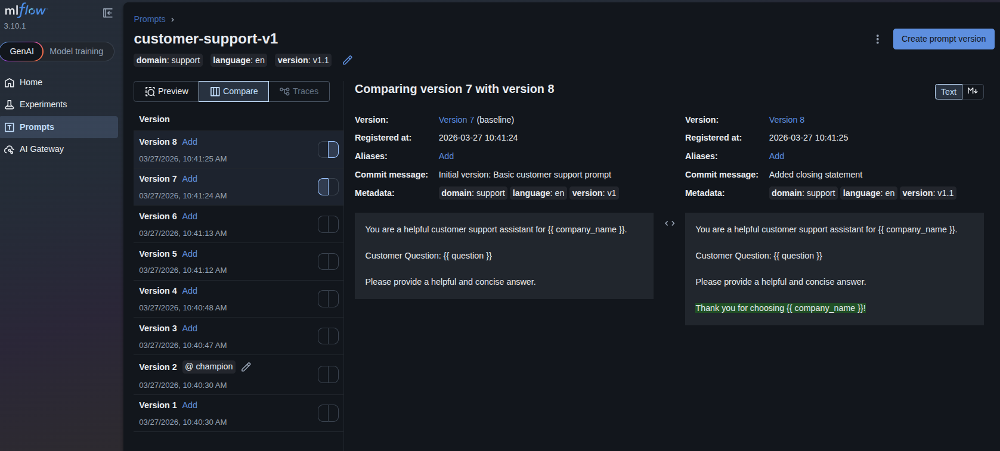
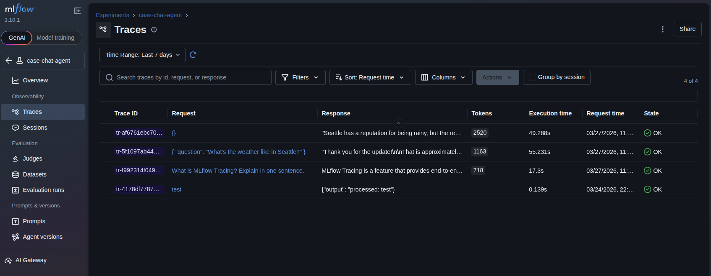
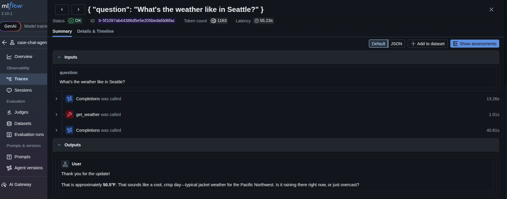
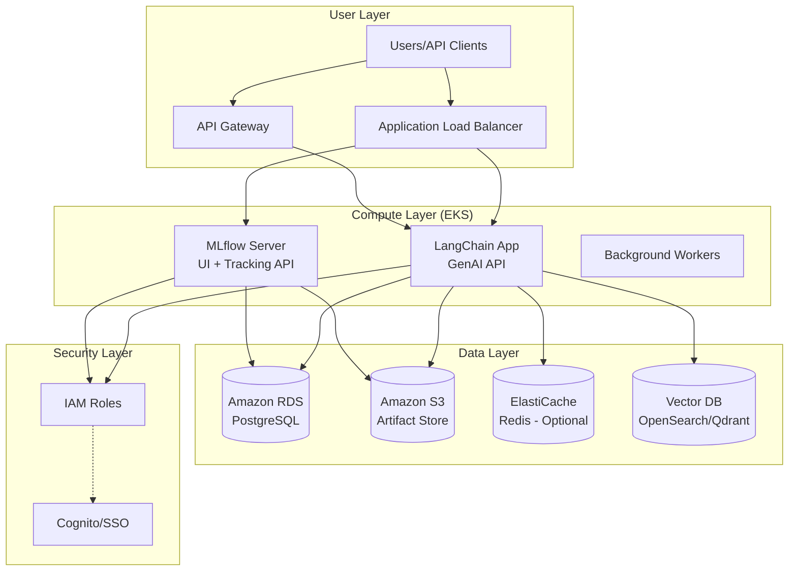

# MLflow Advanced Examples

This directory contains advanced examples demonstrating MLflow's capabilities for model evaluation, LLM judge evaluation, RAG (Retrieval-Augmented Generation) tracing and evaluation.

## Prerequisites

Before running these examples, ensure you have:

1. **Set up your API key** in `.env` file:
   ```bash
   ZHIPU_API_KEY=your_zhipu_api_key_here
   ```

2. **Start MLflow UI** (if not already running):
   ```bash
   uv run mlflow ui --backend-store-uri sqlite:///mlflow.db --port 5000
   ```

   Then open: http://localhost:5000

3. **Install dependencies** (if needed):
   ```bash
   uv sync --all-extras --dev
   ```

---

## Examples

### 1. Baseline Comparison (`evaluate_baselines.py`)

**Overview:** Demonstrates comparing multiple model variants and tracking their performance metrics in MLflow for model selection and improvement analysis.

**What it demonstrates:**
- Creating evaluation datasets
- Running multiple model variants
- Logging metrics for comparison
- Calculating improvements between baselines

**Run the example:**
```bash
uv run python src/advanced/evaluate_baselines.py
```

**Expected output:**
```
✓ Experiment 'mlflow-baseline-comparison' (ID: 9)
✓ Created evaluation dataset: 5 questions

Evaluating model: glm-5
✓ Evaluated model: glm-5
  Accuracy: 0.20
  Avg Latency: 46.07s

Baseline Comparison Results:
glm-5:
  Accuracy: 0.20
  Latency: 46.07s
```

**Result in MLflow UI:**


**Real-World Use Cases:**
- **A/B testing models**: Comparing new models against production baselines
- **Hyperparameter tuning**: Tracking different configurations
- **Model selection**: Choosing best model based on metrics
- **Performance regression testing**: Ensuring new models don't degrade performance
- **Cost-benefit analysis**: Trading off accuracy vs latency/cost

**Key concepts learned:**
- **Baseline metrics**: Establishing performance benchmarks
- **Comparative evaluation**: Running multiple variants under same conditions
- **Metric tracking**: Logging accuracy, latency, custom metrics
- **Improvement analysis**: Calculating relative improvements

---

### 2. LLM Judge Evaluation (`evaluate_llm_judge_simple.py`)

**Overview:** Demonstrates using an LLM as a judge to evaluate response quality, providing automated assessment of AI-generated answers.

**What it demonstrates:**
- LLM-as-a-judge evaluation pattern
- Automated quality scoring (1-10 scale)
- Evaluation metrics logging
- Span-level evaluation tracking
- Extracting structured data from LLM responses

**Key MLflow APIs:**

```python
import mlflow
from basics.langchain_integration import create_zhipu_langchain_llm

# Create LLM judge (lower temperature for consistency)
judge_llm = create_zhipu_langchain_llm(
    model="glm-5",
    temperature=0.3
)

# Evaluate responses with tracing
with mlflow.start_run():
    for i, test_case in enumerate(test_cases, 1):
        with mlflow.start_span(name=f"judge_evaluation_{i}") as span:
            span.set_inputs({"question": test_case['question']})

            # Get evaluation from LLM judge
            evaluation = judge_llm.invoke(judge_prompt)

            # Extract score from response
            score = extract_score(evaluation.content)
            span.set_outputs({"score": score})

        # Log metrics
        mlflow.log_metric(f"response_{i}_score", score)
```

**Run the example:**
```bash
uv run python src/advanced/evaluate_llm_judge_simple.py
```

**Expected output:**
```
LLM Judge Evaluation Demo

✓ Created LLM judge

Evaluating Response 1:
  Score: 9.0/10

Evaluating Response 2:
  Score: 8.5/10

✓ Evaluation complete!

View at: http://localhost:5000/#/experiments/16
```

**Result in MLflow UI:**

**Example 1: Evaluating Simple Math Response**


*Screenshot showing evaluation span with score 10/10 for correct math answer ("What is 2 + 2?")*

**Example 2: Evaluating Geography Response**


*Screenshot showing evaluation span with score 10/10 for correct geography answer ("What is the capital of France?")*

**What you see in the screenshots:**
- **Evaluation span name** - `judge_evaluation_1` or `judge_evaluation_2`
- **Inputs** - The question being evaluated
- **Outputs** - Score (10/10) and evaluation justification
- **Span attributes** - Trace metadata
- **Timing information** - How long the evaluation took
- **Metrics table** - Individual response scores logged as metrics

**Key Differences Between Screenshots:**
- **Screenshot 1** - Math question evaluation with perfect score
- **Screenshot 2** - Geography question evaluation with perfect score
- Both show the LLM judge providing detailed justifications
- Both demonstrate the span-level evaluation tracking

**Real-World Use Cases:**
- **Quality Assurance** - Automatically grade LLM responses
- **A/B Testing** - Compare different prompts/models
- **Human-in-the-loop** - Augment human evaluation with LLM judge
- **Regression Testing** - Detect quality degradation
- **Production Monitoring** - Track response quality over time

**Key concepts learned:**
- **LLM-as-a-judge** - Using one LLM to evaluate another's outputs
- **Structured extraction** - Parsing scores from LLM responses
- **Evaluation metrics** - Quantitative quality measures
- **Consistent judging** - Low temperature for reliable scoring
- **Span-level tracking** - Each evaluation as a separate trace

**Production Considerations:**
- Use multiple judges for reliability
- Calibrate scores against human evaluation
- Track judge agreement/inter-rater reliability
- Use different prompts for different evaluation criteria
- Cache evaluations to avoid re-judging same responses

---

## RAG Examples

The `rag/` subdirectory contains examples for Retrieval-Augmented Generation applications:

### 3. RAG Tracing (`rag/rag_tracing.py`)

**Overview:** Demonstrates end-to-end tracing of a RAG system with MLflow, showing how to observe document loading, chunking, vector store operations, and the complete retrieval-generation pipeline.

**What it demonstrates:**
- Document loading and chunking
- Vector store creation and embeddings
- RAG chain assembly with LangChain
- Complete trace visualization of the RAG pipeline
- Multiple query execution with trace capture

**Key MLflow APIs:**

```python
import mlflow
from langchain_core.prompts import ChatPromptTemplate
from langchain_core.runnables import RunnablePassthrough

# RAG pipeline with explicit span tracing
@mlflow.trace(name="rag_query")
def query_rag(question: str, vector_store, llm) -> str:
    """Query RAG system with full tracing."""

    # Retrieval span - log retrieved documents
    with mlflow.start_span(name="retrieve_documents") as retrieve_span:
        retrieve_span.set_inputs({"query": question, "top_k": 3})

        # Retrieve relevant documents
        docs = vector_store.similarity_search(question, k=3)

        # Format retrieved chunks for display
        chunk_info = [
            {
                "content": doc.page_content[:200] + "..." if len(doc.page_content) > 200 else doc.page_content,
                "metadata": doc.metadata
            }
            for doc in docs
        ]

        retrieve_span.set_outputs({
            "num_chunks": len(docs),
            "chunks": chunk_info
        })

    # Generation span - log answer generation
    with mlflow.start_span(name="generate_answer") as generate_span:
        generate_span.set_inputs({"query": question, "context_provided": True})

        # Build prompt with retrieved context
        context = "\n\n".join([doc.page_content for doc in docs])
        prompt = f"""Context: {context}

Question: {question}

Answer:"""

        # Generate answer
        response = llm.invoke(prompt)
        generate_span.set_outputs({"answer": response.content})

    return response.content

# Run RAG queries with tracing
with mlflow.start_run():
    questions = [
        "What is the tax rate for income between $45,001 and $120,000?",
        "What are allowable deductions in Australian tax law?"
    ]

    for question in questions:
        answer = query_rag(question, vector_store, llm)

        # Log each query as artifact
        mlflow.log_text(
            f"Q: {question}\n\nA: {answer}",
            artifact_file=f"query_{questions.index(question)}.txt"
        )
```

**RAG Chain with LangChain:**

```python
from langchain_core.output_parsers import StrOutputParser

# Build RAG chain with LCEL
retriever = vector_store.as_retriever(search_kwargs={"k": 3})

prompt_template = ChatPromptTemplate.from_template(
    """Context: {context}

Question: {question}

Answer:"""
)

# Create chain
rag_chain = (
    {
        "context": retriever | (lambda docs: "\n\n".join([d.page_content for d in docs])),
        "question": RunnablePassthrough()
    }
    | prompt_template
    | llm
    | StrOutputParser()
)

# Enable MLflow autologging for LangChain
mlflow.langchain.autolog()

# Query RAG system - automatically traced
with mlflow.start_run():
    response = rag_chain.invoke("What is machine learning?")

    # Trace shows:
    # - Retriever invocation
    # - Prompt construction
    # - LLM call
    # - Response parsing
```

**NOTE:** This example uses deterministic embeddings for Show Case purposes. The embeddings are generated using hash functions, not semantic understanding. For production RAG systems, use proper embedding models like:
- OpenAI embeddings (`text-embedding-ada-002`)
- HuggingFace sentence transformers (`all-MiniLM-L6-v2`)
- Cohere embeddings

**Run the example:**
```bash
uv run python src/advanced/rag/rag_tracing.py
```

**Expected output:**
```
RAG System Tracing Demo
==================================================
Loading documents...
Chunking documents...
Creating vector store...
Initializing LLM...
✓ Created LangChain LLM for Zhipu AI model: glm-5
Building RAG chain...

Running sample queries...

Query 1: What is the tax rate for income between $45,001 and $120,000?

Retrieved 3 chunks:
  1. Tax File Number (TFN)
A TFN is a unique identifier issued by...
  2. Tax File Number (TFN)
A TFN is a unique identifier issued by...
  3. Tax File Number (TFN)
A TFN is a unique identifier issued by...

Answer: Based on the provided context, there is no information...
```

**Result in MLflow UI:**


*Screenshot showing the trace view with retrieved chunks visible in the `retrieve_documents` span*

**What you see in the screenshot:**
- Trace list showing all RAG queries
- Span tree with `retrieve_documents` and `generate_answer` spans
- Retrieved chunks with content preview and metadata
- Query inputs and generated outputs

**How to Find Chunks in MLflow UI:**

1. **Navigate to the run:**
   - Open http://localhost:5000/#/experiments/10
   - Click on the latest `rag_tracing_demo` run

2. **Open Traces section:**
   - Scroll down to "Traces"
   - Click on any trace with your query text

3. **View the span tree:**
   - You'll see: `query_rag` → `retrieve_documents` + `generate_answer`
   - Click on `retrieve_documents` span

4. **See retrieved chunks:**
   - In the span's "Outputs" section
   - Look for `chunks` array with:
     - `content`: The actual chunk text
     - `metadata`: Source file, chunk index, total chunks

This gives you **full visibility** into which documents were retrieved for each query!

**RAG Pipeline Architecture:**
```
┌─────────────┐
│ Documents   │
└──────┬──────┘
       │
       ▼
┌─────────────┐
│  Chunking   │
└──────┬──────┘
       │
       ▼
┌─────────────┐
│ Embeddings  │ ← Deterministic (Show Case)
└──────┬──────┘
       │
       ▼
┌─────────────┐
│ Vector Store│
└──────┬──────┘
       │
       ▼
┌─────────────────────────┐
│    RAG Chain            │
│  ┌─────────┐  ┌──────┐  │
│  │Retriever│→ │ LLM  │  │
│  └─────────┘  └──────┘  │
└─────────────────────────┘
```

**Real-World Use Cases:**
- **Knowledge base Q&A**: Company documentation, technical manuals
- **Customer support**: Automated responses from knowledge base
- **Research assistance**: Query scientific papers, legal documents
- **Show Case tools**: Textbook Q&A, course material assistance
- **Compliance**: Policy document queries, regulatory guidance

**Key concepts learned:**
- **RAG architecture**: Retrieval + Generation pattern
- **Document chunking**: Strategies for splitting large documents
- **Vector stores**: Semantic similarity search with embeddings
- **Trace visualization**: Observing the complete RAG pipeline
- **LangChain LCEL**: Composable chains for RAG systems

**Show Case Simplifications:**
- Uses deterministic hash-based embeddings (not semantic)
- Small in-memory vector store (not persistent)
- Simple chunking strategy (not domain-specific)
- Basic prompt template (not optimized)

**Production considerations:**
- Use real embedding models for semantic search
- Implement persistent vector stores (ChromaDB, Pinecone, Weaviate)
- Add re-ranking for improved retrieval quality
- Implement caching for frequently asked questions
- Add guardrails and safety filters

---

### 4. RAG Evaluation (`rag/evaluate_rag.py`)

**Overview:** Demonstrates comprehensive evaluation of RAG systems using MLflow metrics, including retrieval quality, answer relevance, and chunking strategy comparison.

**What it demonstrates:**
- RAG evaluation metrics (retrieval precision, answer relevance)
- Chunking strategy comparison (small, medium, large chunks)
- A/B testing different RAG configurations
- Metric logging and comparison in MLflow
- Evaluation artifact logging (datasets, results)
- Trace-based evaluation analysis

**Key MLflow APIs:**

```python
import mlflow

# Define evaluation dataset
eval_data = [
    {
        "question": "What is the tax rate for income between $45,001 and $120,000?",
        "expected_answer": "32.5%",
        "category": "tax_rates"
    },
    {
        "question": "What are allowable deductions in Australian tax law?",
        "expected_answer": "Work-related expenses, self-education expenses, etc.",
        "category": "deductions"
    }
]

# Log evaluation dataset
with mlflow.start_run(run_name="rag_evaluation"):
    mlflow.log_dict(eval_data, artifact_file="evaluation_dataset.json")

    # Evaluate retrieval quality
    retrieval_scores = []
    for item in eval_data:
        docs = vector_store.similarity_search(item["question"], k=3)
        retrieval_scores.append(len(docs))

    avg_retrieval = sum(retrieval_scores) / len(retrieval_scores)
    mlflow.log_metric("retrieval_avg_docs", avg_retrieval)

    # Evaluate answer relevance
    relevance_scores = []
    for item in eval_data:
        answer = rag_chain.invoke(item["question"])
        relevance = calculate_relevance(answer, item["question"])
        relevance_scores.append(relevance)

    avg_relevance = sum(relevance_scores) / len(relevance_scores)
    mlflow.log_metric("answer_relevance", avg_relevance)
```

**Chunking Strategy Comparison:**

```python
# Compare different chunking strategies
chunk_strategies = [
    {"name": "small", "chunk_size": 200, "overlap": 25},
    {"name": "medium", "chunk_size": 500, "overlap": 50},
    {"name": "large", "chunk_size": 1000, "overlap": 100}
]

with mlflow.start_run(run_name="chunking_comparison"):
    for strategy in chunk_strategies:
        with mlflow.start_run(nested=True, run_name=f"strategy_{strategy['name']}"):
            # Log chunking parameters
            mlflow.log_param("chunk_size", strategy["chunk_size"])
            mlflow.log_param("overlap", strategy["overlap"])

            # Create RAG system with this chunking strategy
            vector_store = create_vector_store(
                documents,
                chunk_size=strategy["chunk_size"],
                overlap=strategy["overlap"]
            )

            # Evaluate on test questions
            relevance_scores = []
            for question in test_questions:
                answer = rag_chain.invoke(question)
                relevance = calculate_relevance(answer, question)
                relevance_scores.append(relevance)

            # Log metrics
            mlflow.log_metric("avg_relevance", sum(relevance_scores) / len(relevance_scores))
            mlflow.log_metric("num_chunks", vector_store._collection.count())
```

**Evaluation Metrics:**
- **Retrieval Metrics:**
  - Average documents retrieved per query
  - Retrieval precision (fraction of relevant documents)

- **Answer Quality Metrics:**
  - Relevance score (0-1, higher is better)
  - Answer completeness (based on retrieved context)

- **Performance Metrics:**
  - Query latency
  - Token usage
  - Chunk count impact

**Run the example:**
```bash
uv run python src/advanced/rag/evaluate_rag.py
```

**Expected output:**
```
╔════════════════════════════════════════════════════════╗
║              RAG System Evaluation                      ║
╚════════════════════════════════════════════════════════╝

Setting up documents...
Setting up RAG system...
Loaded 1 documents, created 5 chunks
✓ Created LangChain LLM for Zhipu AI model: glm-5

Loading evaluation dataset...
✓ Created evaluation dataset: 5 questions

Evaluating retrieval quality...
✓ Retrieved 3.00 documents on average

Evaluating answer relevance...
✓ Average relevance score: 0.31

Comparing chunking strategies...

Testing: small_chunks (size=200, overlap=25)
Loaded 1 documents, created 11 chunks
✓ Created LangChain LLM for Zhipu AI model: glm-5
  Answer: Based on the provided context, there is no information...

Testing: medium_chunks (size=500, overlap=50)
Loaded 1 documents, created 5 chunks
✓ Created LangChain LLM for Zhipu AI model: glm-5
  Answer: Based on the provided context, there is no information...

Testing: large_chunks (size=1000, overlap=100)
Loaded 1 documents, created 2 chunks
✓ Created LangChain LLM for Zhipu AI model: glm-5
  Answer: Based on the provided context, the tax rate for income...

RAG evaluation complete!

View results in MLflow UI: http://localhost:5000

Sample Evaluation Results:
Q: What is the tax rate for income between $45,001 and $120,000?
Relevance: 0.12
Answer: Based on the provided context, there is no information...

View run rag_evaluation at: http://localhost:5000/#/experiments/13/runs/xxx
```

**Result in MLflow UI:**

**Metrics Dashboard:**


*Screenshot showing evaluation metrics comparing different chunking strategies*

**Traces View:**


*Screenshot showing trace view of RAG evaluation runs*

**Artifacts and Artifacts:**


*Screenshot showing evaluation artifacts including datasets and results*

**What you see in the screenshots:**

1. **Metrics Dashboard:**
   - Compare metrics across different chunking strategies
   - See which configuration performs best
   - Track retrieval quality and answer relevance
   - Identify the optimal chunk size for your use case

2. **Traces View:**
   - Detailed trace of each evaluation query
   - Span hierarchy showing retrieval and generation
   - Performance metrics per query
   - Detailed inputs/outputs for debugging

3. **Artifacts:**
   - Evaluation datasets (questions, expected answers)
   - Detailed results CSV with all metrics
   - Chunking strategy comparison results
   - Retrieval analysis data

**How to Navigate the Evaluation Results:**

1. **Open the experiment:**
   - Go to http://localhost:5000/#/experiments/13
   - Find the `rag_evaluation` run

2. **View metrics:**
   - In the run detail page, scroll to "Metrics"
   - Compare `retrieval_avg_docs`, `answer_relevance`
   - See which chunking strategy scored best

3. **Examine traces:**
   - Scroll to "Traces" section
   - Click on individual traces to see:
     - Retrieved chunks per query
     - Answer generation process
     - Latency breakdown

4. **Download artifacts:**
   - Scroll to "Artifacts" section
   - Download `evaluation_results.csv` for detailed analysis
   - Access `evaluation_dataset.json` for the test data

**Chunking Strategy Comparison:**

| Strategy | Chunk Size | Overlap | Chunks Created | Pros | Cons |
|----------|------------|---------|----------------|------|------|
| **small** | 200 | 25 | 11 | Granular search, more precise matches | Higher latency, more chunks to process |
| **medium** | 500 | 50 | 5 | Balanced retrieval and performance | May miss fine-grained details |
| **large** | 1000 | 100 | 2 | Fast retrieval, broad context | Less precise matching, more noise |

**Real-World Use Cases:**
- **Production RAG systems**: Evaluate before deploying to production
- **A/B testing**: Compare different retrieval strategies
- **Performance optimization**: Find optimal chunking parameters
- **Quality assurance**: Ensure RAG system meets quality thresholds
- **Model comparison**: Test different LLMs with same RAG setup
- **Regression testing**: Catch quality regressions in RAG systems

**Key concepts learned:**
- **RAG evaluation metrics**: Retrieval quality, answer relevance, latency
- **Chunking strategies**: Impact on retrieval and generation quality
- **A/B testing**: Compare configurations in MLflow
- **Metric logging**: Track quantitative measures of RAG performance
- **Artifact management**: Store evaluation data and results
- **Production readiness**: Validate RAG systems before deployment

**Production Evaluation Checklist:**
- ✅ Define evaluation dataset with ground truth
- ✅ Select relevant metrics (retrieval, relevance, latency)
- ✅ Test multiple configurations (chunking, models, prompts)
- ✅ Set quality thresholds for deployment
- ✅ Monitor production metrics over time
- ✅ Regular re-evaluation with updated datasets

---

## Conversation Examples

The `conversation/` subdirectory contains examples for multi-turn conversation tracing:

### 5. Multi-Turn Conversation Tracing (`conversation/conversation_tracing.py`)

**Overview:** Demonstrates tracing multi-turn conversations with LangChain and MLflow, showing how to observe conversation history, context management, and message state across multiple exchanges.

**What it demonstrates:**
- Conversation memory management with ConversationBufferMemory
- Message history tracking across turns
- Context-aware responses using conversation history
- MLflow span tracing for each conversation turn
- Memory state visualization in traces

**Key MLflow APIs:**

```python
import mlflow
from langchain_core.memory import ConversationBufferMemory
from langchain_core.messages import HumanMessage, AIMessage

# Initialize conversation memory
memory = ConversationBufferMemory(
    return_messages=True,
    memory_key="history"
)

# Trace each conversation turn
@mlflow.trace(name="conversation_turn")
def handle_conversation_turn(user_message: str) -> str:
    """Handle a single conversation turn with tracing."""

    # Add user message to memory
    memory.chat_memory.add_user_message(user_message)

    # Get conversation history
    history = memory.load_memory_variables({})
    history_text = history.get("history", "")

    # Build prompt with history
    prompt = f"""You are a helpful assistant.

Conversation history:
{history_text}

User: {user_message}
Assistant:"""

    # Generate response
    with mlflow.start_span(name="generate_response") as span:
        span.set_inputs({
            "user_message": user_message,
            "history_length": len(history_text)
        })

        response = llm.invoke(prompt)

        span.set_outputs({
            "response": response.content,
            "response_length": len(response.content)
        })

    # Add AI response to memory
    memory.chat_memory.add_ai_message(response.content)

    # Log memory metrics
    mlflow.log_metric("total_messages", len(memory.chat_memory.messages))
    mlflow.log_metric("user_messages", len([m for m in memory.chat_memory.messages if isinstance(m, HumanMessage)]))
    mlflow.log_metric("ai_messages", len([m for m in memory.chat_memory.messages if isinstance(m, AIMessage)]))

    return response.content

# Multi-turn conversation
with mlflow.start_run(run_name="multi_turn_conversation"):
    turns = [
        "Hello! What's your name?",
        "What did I just ask you?",
        "Can you help me calculate 15 * 23?",
        "What was the result of that calculation?"
    ]

    for i, user_message in enumerate(turns, 1):
        print(f"\nTurn {i}: {user_message}")
        response = handle_conversation_turn(user_message)
        print(f"AI: {response}")
```

**Memory Management with MLflow:**

```python
# Advanced memory tracking
@mlflow.trace(name="conversation_with_memory_limit")
def handle_conversation_with_limit(user_message: str, max_messages: int = 10):
    """Handle conversation with memory limit tracking."""

    # Check memory size
    current_messages = len(memory.chat_memory.messages)

    # Log memory usage
    mlflow.log_metric("memory_size", current_messages)

    if current_messages >= max_messages:
        with mlflow.start_span(name="truncate_memory") as span:
            # Truncate old messages
            old_size = current_messages
            memory.chat_memory.clear()  # Or implement sliding window

            span.set_inputs({"old_size": old_size, "limit": max_messages})
            span.set_outputs({"new_size": 0})

            mlflow.log_param("memory_truncated", "true")

    # Process message
    response = handle_conversation_turn(user_message)

    return response
```

**Conversation Analytics:**

```python
# Extract conversation analytics from traces
def analyze_conversation_trace(trace_id: str):
    """Analyze conversation patterns from trace."""
    trace = mlflow.get_trace(trace_id)

    total_turns = 0
    total_tokens = 0
    user_messages = []
    ai_responses = []

    for span in trace.data.spans:
        if span.name == "conversation_turn":
            total_turns += 1

            # Extract user and AI messages from span data
            if "user_message" in span.inputs:
                user_messages.append(span.inputs["user_message"])

            if "response" in span.outputs:
                ai_responses.append(span.outputs["response"])

    return {
        "total_turns": total_turns,
        "total_messages": len(user_messages) + len(ai_responses),
        "avg_response_length": sum(len(r) for r in ai_responses) / len(ai_responses) if ai_responses else 0
    }
```

**Run the example:**
```bash
uv run python src/advanced/conversation/conversation_tracing.py
```

**Expected output:**
```
Multi-Turn Conversation Tracing Demo
==================================================

Turn 1: Hello! What's your name?
AI: I'm an AI assistant. I don't have a personal name, but you can call me Assistant!

Messages in history: 2

Turn 2: What did I just ask you?
AI: You asked me what my name is.

Messages in history: 4

Turn 3: Can you help me calculate 15 * 23?
AI: 15 multiplied by 23 equals 345.

Messages in history: 6

Turn 4: What was the result of that calculation?
AI: The result of the calculation was 345.

Conversation complete!
Total exchanges: 4
Total messages: 8
```

**Result in MLflow UI:**


*Screenshot showing Turn 1 trace with initial greeting*


*Screenshot showing Turn 2 with context from previous message*


*Screenshot showing Turn 3 with calculation request*


*Screenshot showing Turn 4 referencing previous calculation*

**What you see in the traces:**
- **Turn-level spans**: Each conversation turn is traced with `@mlflow.trace`
- **User input spans**: Log user messages with history context
- **Response generation spans**: Show LLM inputs (including history) and outputs
- **Memory metrics**: Total messages, user messages, AI messages logged as metrics
- **Conversation flow**: Click through each turn to see how history builds up

**Real-World Use Cases:**
- **Customer support chatbots**: Track conversation context across multiple turns
- **Virtual assistants**: Maintain conversation history for contextual responses
- **Dialogue systems**: Debug conversation flow and context handling
- **Chat analytics**: Analyze conversation patterns and user behavior
- **Memory optimization**: Monitor memory usage and history truncation

**Key concepts learned:**
- **ConversationBufferMemory**: LangChain's in-memory conversation history
- **Message types**: HumanMessage, AIMessage, and their roles
- **History injection**: Including conversation context in prompts
- **Memory management**: Controlling history length and token limits
- **Span relationships**: Parent-child spans in conversation turns

**Architecture:**
```
┌─────────────────────────────────────────────────────┐
│            Conversation Turn                        │
│  ┌──────────────┐      ┌──────────────────┐        │
│  │ User Input   │─────▶│ Add to Memory    │        │
│  └──────────────┘      └──────────────────┘        │
│                               │                     │
│                               ▼                     │
│  ┌──────────────┐      ┌──────────────────┐        │
│  │ Get History  │─────▶│ LLM with Context │        │
│  └──────────────┘      └──────────────────┘        │
│                               │                     │
│                               ▼                     │
│  ┌──────────────┐      ┌──────────────────┐        │
│  │ AI Response  │─────▶│ Add to Memory    │        │
│  └──────────────┘      └──────────────────┘        │
└─────────────────────────────────────────────────────┘
```

---

## Tool Calling Examples

The `tools/` subdirectory contains examples for LangChain tool calling with MLflow tracing:

### 6. Tool Calling Tracing (`tools/tool_tracing.py`)

**Overview:** Demonstrates tracing LangChain tool calling with MLflow, showing how to observe tool selection, execution, inputs/outputs, and multi-tool workflows.

**What it demonstrates:**
- Tool definitions with `@tool` decorator
- Tool binding to LLM with `bind_tools()`
- Tool selection and invocation tracing
- Multi-step tool workflows
- Tool input/output logging in spans

**Key MLflow APIs:**

```python
import mlflow
from langchain_core.tools import tool
from datetime import datetime

# Define tools with @tool decorator
@tool
def get_current_time(format: str = "%Y-%m-%d %H:%M:%S") -> str:
    """Get the current date and time.

    Args:
        format: strftime format string for output

    Returns:
        Current time formatted as specified
    """
    current_time = datetime.now()
    return current_time.strftime(format)

@tool
def calculate(expression: str) -> float:
    """Evaluate a mathematical expression.

    Args:
        expression: Mathematical expression to evaluate (e.g., "15 * 23")

    Returns:
        Result of the calculation
    """
    try:
        result = eval(expression)
        return float(result)
    except Exception as e:
        return f"Error: {str(e)}"

# Bind tools to LLM
tools = [get_current_time, calculate]
llm_with_tools = llm.bind_tools(tools)

# Trace tool calling
@mlflow.trace(name="tool_query")
def process_tool_query(query: str) -> str:
    """Process query with tool calling and tracing."""

    with mlflow.start_span(name="query_processing") as span:
        span.set_inputs({"query": query, "available_tools": [t.name for t in tools]})

        # Invoke LLM with tools
        response = llm_with_tools.invoke(query)

        # Track tool calls
        if hasattr(response, 'tool_calls') and response.tool_calls:
            tool_calls_made = []

            for tool_call in response.tool_calls:
                tool_name = tool_call['name']
                tool_args = tool_call['args']

                # Execute tool
                with mlflow.start_span(name=f"tool_call_{tool_name}") as tool_span:
                    tool_span.set_inputs({"tool": tool_name, "args": tool_args})

                    # Find and call the tool
                    for t in tools:
                        if t.name == tool_name:
                            result = t.invoke(tool_args)
                            tool_span.set_outputs({"result": result})
                            tool_calls_made.append({
                                "tool": tool_name,
                                "args": tool_args,
                                "result": result
                            })
                            break

            span.set_outputs({
                "tool_calls": tool_calls_made,
                "final_response": response.content
            })

            # Log tool usage metrics
            mlflow.log_metric("tools_used", len(tool_calls_made))

        return response.content

# Run tool queries
with mlflow.start_run(run_name="tool_calling_demo"):
    queries = [
        "What is 15 * 23?",
        "What time is it right now?",
        "What's 10 * 5 and what's today's date?"
    ]

    for query in queries:
        print(f"\nQuery: {query}")
        response = process_tool_query(query)
        print(f"Response: {response}")
```

**Tool Definition Patterns:**

```python
# Simple tool
@tool
def add_numbers(a: float, b: float) -> float:
    """Add two numbers together.

    Args:
        a: First number
        b: Second number

    Returns:
        Sum of a and b
    """
    return a + b

# Tool with error handling
@tool
def divide_numbers(a: float, b: float) -> float:
    """Divide two numbers.

    Args:
        a: Numerator
        b: Denominator

    Returns:
        Quotient of a divided by b

    Raises:
        ValueError: If b is zero
    """
    if b == 0:
        raise ValueError("Cannot divide by zero")

    with mlflow.start_span(name="divide_operation"):
        result = a / b
        mlflow.log_metric("division_result", result)
        return result

# Tool with side effects
@tool
def save_to_file(content: str, filename: str) -> str:
    """Save content to a file.

    Args:
        content: Text content to save
        filename: Name of the file

    Returns:
        Success message
    """
    with open(filename, 'w') as f:
        f.write(content)

    mlflow.log_artifact(filename)
    return f"Saved {len(content)} characters to {filename}"
```

**Multi-Tool Workflows:**

```python
@mlflow.trace(name="multi_tool_workflow")
def complex_workflow(query: str):
    """Execute complex workflow with multiple tools."""

    # Parse query to determine required tools
    if "calculate" in query.lower() and "time" in query.lower():
        # Need both calculate and get_current_time
        with mlflow.start_span(name="workflow_planning"):
            mlflow.log_param("workflow_type", "multi_tool")

        # Execute tools in sequence
        calculation_result = calculate.invoke({"expression": "15 * 23"})
        time_result = get_current_time.invoke({"format": "%Y-%m-%d"})

        return {
            "calculation": calculation_result,
            "time": time_result
        }

    elif "calculate" in query.lower():
        return calculate.invoke({"expression": "10 * 5"})

    else:
        return get_current_time.invoke({})
```

**Built-in Tools:**
- `get_current_time`: Get current date/time with custom formatting
- `get_current_date`: Get today's date
- `calculate`: Evaluate mathematical expressions (e.g., "15 * 23")
- `add_numbers`: Add two numbers
- `multiply_numbers`: Multiply two numbers

**Run the example:**
```bash
uv run python src/advanced/tools/tool_tracing.py
```

**Expected output:**
```
Tool Calling Tracing Demo
╔═════════════════════════════════════════════════════════╗
║       Tool Calling Tracing Demo                         ║
╚═════════════════════════════════════════════════════════╝

┏━━━━━━━━━━━━━━━━┳━━━━━━━━━━━━━━━━━━━━━━━━━━━━━━━━━━━━━━━━┓
┃ Tool           ┃ Description                            ┃
┡━━━━━━━━━━━━━━━━╇━━━━━━━━━━━━━━━━━━━━━━━━━━━━━━━━━━━━━━━━┩
│ get_current_time│ Get current date/time with custom...  │
│ get_current_date│ Get current date in YYYY-MM-DD format │
│ calculate       │ Evaluate mathematical expressions     │
│ add_numbers     │ Add two numbers together              │
│ multiply_numbers│ Multiply two numbers                  │
└────────────────┴────────────────────────────────────────┘

Query 1: What is 15 * 23?
Response: 15 * 23 = 345

Query 2: What time is it right now?
Response: The current time is 2026-03-23 14:30:45

Query 3: What's 10 * 5 and what's today's date?
Response: 10 * 5 = 50 and today's date is 2026-03-23
```

**Result in MLflow UI:**


*Screenshot showing tool selection and execution with multiple tool calls*

**What you see in the traces:**
- **Query processing span**: Logs query and available tools
- **LLM tool execution span**: Shows LLM decision-making for tool selection
- **Tool call spans**: Individual spans for each tool invoked with:
  - Tool name and arguments
  - Tool execution results
  - Timing information
- **Response generation**: Final answer after tool execution
- **Multi-tool workflows**: See how multiple tools are called in sequence (Query 3 shows both `multiply_numbers` and `get_current_date`)

**Real-World Use Cases:**
- **Function calling**: Build agents that can interact with external systems
- **Data analysis**: Tools for querying databases, running calculations
- **API integration**: Tools for calling external APIs (weather, stock prices)
- **Workflow automation**: Multi-step processes requiring different tools
- **Debugging**: Understand which tools are selected and why

**Key concepts learned:**
- **`@tool` decorator**: Convert Python functions to LangChain tools
- **`bind_tools()`**: Attach tool schemas to LLM for tool calling
- **Tool schemas**: Automatic generation from function signatures
- **Tool selection**: LLM decides which tools to use based on query
- **Span hierarchy**: Organize tool calls within query spans

**Tool Calling Flow:**
```
┌──────────────────────────────────────────────────────┐
│              Tool Query Processing                   │
│  ┌──────────────┐      ┌──────────────────┐          │
│  │ User Query   │─────▶│ LLM with Tools   │          │
│  └──────────────┘      │ (bind_tools)     │          │
│                        └────────┬─────────┘          │
│                                 │                    │
│                                 ▼                    │
│                        ┌──────────────────┐          │
│                        │ Tool Selection   │          │
│                        │ (LLM Decision)   │          │
│                        └────────┬─────────┘          │
│                                 │                    │
│                    ┌────────────┴────────────┐       │
│                    ▼                         ▼       │
│           ┌──────────────┐          ┌────────────┐   │
│           │ Tool 1:      │          │ Tool 2:    │   │
│           │ calculate    │          │ get_time   │   │
│           └──────┬───────┘          └──────┬─────┘   │
│                  │                        │          │
│                  └────────────┬───────────┘          │
│                               ▼                      │
│                  ┌──────────────────┐                │
│                  │ Response         │                │
│                  │ Generation       │                │
│                  └──────────────────┘                │
└──────────────────────────────────────────────────────┘
```

---

## Prompt Registry Examples

The Prompt Registry examples demonstrate MLflow's Prompt Registry functionality for versioning, managing, and deploying prompts in GenAI applications.

### 7. Prompt Registry (`prompt_registry_simple.py`)

**Overview:** Demonstrates MLflow's Prompt Registry for versioning, managing, and deploying prompts with Git-inspired version control, A/B testing support, and seamless LangChain integration.

**What it demonstrates:**
- Creating text and chat prompts with templates
- Versioning prompts with commit messages
- Loading and formatting prompts with variables
- Searching and filtering prompts
- Using prompts with LangChain
- Creating aliases for production deployments (champion/challenger)
- Comparing prompt versions

**Key MLflow APIs:**

```python
import mlflow
from langchain_core.prompts import ChatPromptTemplate

# Create a text prompt with variables
prompt_template = """You are a helpful customer support assistant for {{ company_name }}.

Customer Question: {{ question }}

Please provide a helpful and concise answer."""

mlflow.genai.register_prompt(
    name="customer-support-v1",
    template=prompt_template,
    commit_message="Initial version: Basic customer support prompt",
    tags={
        "domain": "support",
        "language": "en",
        "version": "v1",
    }
)

# Create a new version (evolution)
mlflow.genai.register_prompt(
    name="customer-support-v1",
    template=prompt_template + "\n\nThank you for choosing {{ company_name }}!",
    commit_message="Added closing statement",
    tags={"version": "v1.1"}
)

# Load and use a prompt
prompt = mlflow.genai.load_prompt("customer-support-v1")
formatted = prompt.format(
    company_name="TechCorp",
    question="How do I reset my password?"
)

# Use with LangChain
langchain_prompt = ChatPromptTemplate.from_template(
    prompt.to_single_brace_format()
)

# Search prompts
prompts = mlflow.genai.search_prompts()

# Create aliases for A/B testing
client = mlflow.MlflowClient()
client.set_prompt_alias(
    name="customer-support-v1",
    alias="champion",
    version=2
)
```

**Chat Prompts:**

```python
# Create a chat prompt for multi-turn conversations
chat_template = [
    {
        "role": "system",
        "content": "You are a helpful {{ style }} assistant for {{ company_name }}."
    },
    {
        "role": "user",
        "content": "I need help with: {{ question }}"
    },
    {
        "role": "assistant",
        "content": "I'd be happy to help you with that!"
    }
]

mlflow.genai.register_prompt(
    name="customer-support-chat",
    template=chat_template,
    commit_message="Initial chat prompt with multi-turn structure",
    tags={"type": "chat", "domain": "support"}
)
```

**Run the example:**
```bash
uv run python src/advanced/prompt_registry_simple.py
```

**Expected output:**
```
╭────────────────────────────────────────────────────────────╮
│ MLflow Prompt Registry Example                             │
│ Demonstrates prompt versioning, management, and deployment │
╔────────────────────────────────────────────────────────────╩

Creating Text Prompts
✓ Created text prompt: 'customer-support-v1' (version 1)
✓ Created text prompt: 'customer-support-v2' (version 1)
✓ Created text prompt: 'customer-support-v1' (version 2)

Creating Chat Prompts
✓ Created chat prompt: 'customer-support-chat' (version 1)

Loading and Formatting Prompts
✓ Loaded prompt: customer-support-v1@2

Formatted Prompt:
┌──────────────────────────────────────────────────────────┐
│ You are a helpful customer support assistant for         │
│ TechCorp.                                                │
│                                                          │
│ Customer Question: How do I reset my password?           │
│                                                          │
│ Please provide a helpful and concise answer.             │
│                                                          │
│ Thank you for choosing TechCorp!                         │
└──────────────────────────────────────────────────────────┘

Searching Prompts
✓ Found 3 prompts in registry

Creating Prompt Aliases
✓ Created alias 'champion' for customer-support-v1 version 2
✓ Created alias 'challenger' for customer-support-v2 version 1
```

**Result in MLflow UI:**


*Screenshot showing all registered prompts with versions and metadata*


*Screenshot showing version comparison with diff highlighting*

**What the Screenshots Show:**

1. **Prompts List (prompt_registry_1.png)**:
   - All registered prompts in one view
   - Version count for each prompt
   - Prompt types (Text vs Chat)
   - Latest commit messages

2. **Version Comparison (compare_two_prompts.png)**:
   - Side-by-side diff of prompt versions
   - Changes highlighted (additions/deletions)
   - Commit message history
   - Version timestamps

**Real-World Use Cases:**
- **A/B testing prompts**: Test different prompt versions in production
- **Prompt engineering workflows**: Version and iterate on prompts systematically
- **Compliance and audit**: Track prompt evolution with commit history
- **Team collaboration**: Share prompts across teams with version control
- **Deployment safety**: Use aliases to promote prompts to production
- **Rollback capabilities**: Quickly revert to previous prompt versions

**Key concepts learned:**
- **Prompt versioning**: Git-inspired commit-based versioning
- **Template variables**: Dynamic content with `{{ variable }}` syntax
- **Text vs Chat prompts**: Single string vs message array formats
- **Aliases**: Mutable references (champion, challenger, staging, prod)
- **Tags**: Organization and filtering (domain, language, version)
- **LangChain integration**: `to_single_brace_format()` for framework compatibility
- **Immutability**: Prompt versions cannot be modified once created
- **Search and discovery**: Find prompts by name, tags, or metadata

**Best Practices:**

1. **Use descriptive commit messages**:
   ```python
   commit_message="Enhanced: Added product category context and response guidelines"
   ```

2. **Organize with tags**:
   ```python
   tags={
       "domain": "support",
       "language": "en",
       "team": "customer-experience",
       "environment": "production"
   }
   ```

3. **Use aliases for deployments**:
   ```python
   # Production
   client.set_prompt_alias("support-prompt", "production", version=5)
   # Staging
   client.set_prompt_alias("support-prompt", "staging", version=6)
   ```

4. **Version prompt templates**:
   - Start simple, add complexity gradually
   - Document changes in commit messages
   - Test new versions before promoting to production

5. **Integrate with LangChain**:
   ```python
   mlflow_prompt = mlflow.genai.load_prompt("my-prompt")
   langchain_prompt = ChatPromptTemplate.from_template(
       mlflow_prompt.to_single_brace_format()
   )
   ```

**Production considerations:**
- Set up approval workflows for prompt changes
- Monitor prompt performance metrics in production
- Implement automated testing for prompt versions
- Use environment-specific aliases (dev/staging/prod)
- Regular prompt audits and cleanup of old versions
- Integration with CI/CD for automated deployment

---

## Tracing Examples

The Tracing examples demonstrate MLflow Tracing for GenAI applications based on the official MLflow Tracing Quickstart guide, showing automatic tracing, custom decorators, and tool calling with span types.

### 8. Tracing Quickstart (`tracing_quickstart.py`)

**Overview:** Demonstrates MLflow Tracing for GenAI applications with automatic instrumentation, custom decorators, span hierarchies, timeline visualization, and feedback attachment.

**What it demonstrates:**
- Automatic tracing with `mlflow.openai.autolog()`
- Custom tracing with `@mlflow.trace` decorator
- Tool calling with `SpanType.TOOL` and `SpanType.AGENT`
- Span hierarchy visualization in MLflow UI
- Timeline breakdown of execution
- Multi-turn conversation tracing
- Feedback attachment on traces

**Key MLflow APIs:**

```python
import mlflow
from mlflow.entities.span import SpanType
from langchain_openai import ChatOpenAI

# Enable automatic tracing for OpenAI-compatible APIs
mlflow.openai.autolog()

# Create LLM client
llm = ChatOpenAI(
    model="glm-5",
    openai_api_base="https://open.bigmodel.cn/api/paas/v4",
    openai_api_key=os.getenv("ZHIPU_API_KEY"),
)

# Simple LLM call (automatically traced)
response = llm.invoke("What is MLflow Tracing?")
# Trace automatically captures: inputs, outputs, latency, tokens
```

**Custom Tracing with Decorators:**

```python
import requests
from mlflow.entities.span import SpanType

# Define a tool with custom tracing
@mlflow.trace(span_type=SpanType.TOOL, name="get_weather")
def get_weather(latitude: float, longitude: float) -> float:
    """Get current temperature for provided coordinates."""
    response = requests.get(
        f"https://api.open-meteo.com/v1/forecast"
        f"?latitude={latitude}&longitude={longitude}"
        f"&current=temperature_2m"
    )
    data = response.json()
    return data["current"]["temperature_2m"]

# Define an agent with custom tracing
@mlflow.trace(span_type=SpanType.AGENT, name="tool_agent")
def run_tool_agent(question: str):
    """Run a simple tool calling agent."""
    # First LLM call
    response = llm.invoke(question)

    # Call tool if needed
    if "weather" in question.lower():
        temp = get_weather(latitude=47.6062, longitude=-122.3321)
        # Second LLM call with tool result
        final_response = llm.invoke(f"Temperature: {temp}°C")
        return final_response.content

    return response.content
```

**Span Types:**

- **`SpanType.LLM`**: Automatic span for LLM calls
- **`SpanType.TOOL`**: Custom function/tool execution
- **`SpanType.AGENT`**: Agent or orchestration logic
- **`SpanType.CHAIN`**: Chain or workflow steps

**Run the example:**
```bash
uv run python src/advanced/tracing_quickstart.py
```

**Expected output:**
```
╭────────────────────────────────────────────────────────────╮
│ MLflow Tracing Quickstart Examples                          │
│ Based on official MLflow Tracing Quickstart guide           │
╰────────────────────────────────────────────────────────────╯

✓ Experiment 'Tracing Quickstart' (ID: 20)

Example 1: Single LLM Call
✓ Enabled automatic tracing for OpenAI-compatible APIs

LLM Response:
MLflow Tracing is a feature that provides end-to-end visibility
into the execution flow of GenAI applications...

✓ LLM call traced automatically

Example 2: Tool Calling Agent
Question: What's the weather like in Seattle?
Assistant: I don't have access to real-time data...
  Fetching weather for lat=47.6062, lon=-122.3321
  Temperature: 10.3°C

Final Answer:
That is approximately **50.5°F**. That sounds like a cool,
crisp day—typical jacket weather for the Pacific Northwest.

✓ Tool calling agent traced
  - See span hierarchy: AGENT → LLM → TOOL
  - Click timeline view to see execution breakdown

Example 3: Multi-Turn Conversation
Turn 1: User planning trip to Seattle
Turn 2: User asks about weather
✓ Multi-turn conversation traced
```

**Result in MLflow UI:**


*Screenshot showing the runs list with trace information*


*Screenshot showing trace detail with span hierarchy and timeline*

**What the Screenshots Show:**

1. **Runs List (tracing_quickstart_list.png)**:
   - All 3 example runs visible
   - Run names: `single_llm_call`, `tool_calling_agent`, `multi_turn_conversation`
   - Execution duration and status for each run
   - Easy access to trace details

2. **Trace Detail (tracing_quickstart_details.png)**:
   - Span hierarchy showing parent-child relationships
   - AGENT span containing LLM and TOOL spans
   - Timeline visualization of execution
   - Inputs, outputs, and attributes for each span

**Real-World Use Cases:**
- **Debugging GenAI apps**: Visualize execution flow to find issues
- **Performance optimization**: Identify bottlenecks in LLM chains
- **Cost monitoring**: Track token usage and API call latency
- **Quality assurance**: Monitor agent behavior and tool usage
- **Compliance**: Audit LLM interactions and decisions
- **A/B testing**: Compare different prompt/model versions

**Key concepts learned:**
- **Automatic tracing**: `mlflow.openai.autolog()` captures all LLM calls
- **Custom decorators**: `@mlflow.trace()` for functions and tools
- **Span hierarchy**: Parent-child relationships (AGENT → LLM → TOOL)
- **Span types**: LLM, TOOL, AGENT, CHAIN for different components
- **Timeline view**: Visualize execution time breakdown
- **Trace data**: Inputs, outputs, latency, tokens, metadata
- **Feedback**: Attach quality scores and rationale to traces
- **Observability**: End-to-end visibility into GenAI applications

**Span Hierarchy Example:**

```
tool_agent (AGENT)
├── ChatOpenAI (LLM) - First call
│   └── Input: "What's the weather like in Seattle?"
│   └── Output: "I don't have access to real-time data..."
│
└── get_weather (TOOL)
    ├── Input: latitude=47.6062, longitude=-122.3321
    ├── API Call: Open-Meteo API
    └── Output: 10.3°C

└── ChatOpenAI (LLM) - Second call with tool result
    └── Input: "Temperature: 10.3°C"
    └── Output: "That is approximately 50.5°F..."
```

**Best Practices:**

1. **Enable autologging early**:
   ```python
   # At the start of your application
   mlflow.openai.autolog()
   ```

2. **Use descriptive span names**:
   ```python
   @mlflow.trace(name="fetch_weather_api")  # Good
   @mlflow.trace(name="helper")  # Bad - too generic
   ```

3. **Choose appropriate span types**:
   - LLM calls → `SpanType.LLM` (automatic with autolog)
   - External APIs → `SpanType.TOOL`
   - Orchestration → `SpanType.AGENT`
   - Workflow steps → `SpanType.CHAIN`

4. **Add metadata to spans**:
   ```python
   @mlflow.trace(span_type=SpanType.TOOL)
   def fetch_data(user_id: str):
       with mlflow.start_span(name="database_query") as span:
           span.set_inputs({"user_id": user_id})
           span.set_tag("query_type", "user_profile")
           # ... do work ...
   ```

5. **Monitor traces in production**:
   - Set up alerts for high latency or error rates
   - Track token usage for cost optimization
   - Analyze traces to improve prompt quality

**Production considerations:**
- **Sampling**: Don't trace every request in high-traffic scenarios
- **PII redaction**: Remove sensitive data before tracing
- **Storage**: Configure trace retention policies
- **Performance**: Minimize tracing overhead
- **Privacy**: Comply with data protection regulations
- **Cost**: Monitor token usage and API costs

**Integration with Other Features:**

- **Evaluation**: Use traces for LLM-as-a-judge evaluation
- **Prompt Registry**: Link traces to prompt versions
- **Experiments**: Group traces by experiment for analysis
- **Feedback**: Attach human feedback to traces for improvement

---

## Deploying MLflow for GenAI on AWS

This section covers how to deploy MLflow GenAI for production workloads on AWS, building on the examples you've learned in this project.

### High-Level Architecture

A typical self-hosted GenAI stack on AWS using MLflow + LangChain:



**Core Components:**

| Component | Purpose | AWS Service |
|-----------|---------|-------------|
| **Orchestration** | Runs MLflow server, LangChain apps, workers | Amazon EKS (or ECS Fargate) |
| **Backend Store** | MLflow experiments, runs, traces, prompts | Amazon RDS PostgreSQL (Multi-AZ) |
| **Artifact Store** | Logs, traces, datasets, model artifacts | Amazon S3 |
| **Caching** | Tool/agent state, caching | Amazon ElastiCache Redis (Optional) |
| **Ingress** | Public/private API entrypoint | API Gateway or ALB |
| **Vector Store** | RAG retrieval and document storage | Amazon OpenSearch or Qdrant |
| **AuthN/Z** | Authentication and authorization | IAM + Cognito/SSO |


---

### AWS Services Comparison

| Need | Recommended AWS Service | Alternative |
|------|------------------------|-------------|
| **Container Orchestration** | EKS (Kubernetes) | ECS Fargate |
| **Backend Store** | RDS PostgreSQL Multi-AZ | Aurora PostgreSQL |
| **Artifact Storage** | S3 with versioning | EFS (not recommended) |
| **Load Balancing** | Application Load Balancer | API Gateway |
| **Caching** | ElastiCache Redis | MemoryDB for Redis |
| **Vector Store** | Amazon OpenSearch | Qdrant (self-hosted on EKS) |
| **Authentication** | Amazon Cognito | AWS IAM + SAML |
| **CI/CD** | AWS CodePipeline | GitHub Actions + eksctl |
| **IaC** | AWS CDK / Terraform | CloudFormation |

---

### Cost Optimization Tips

**Development/Testing:**
- Use `t3.medium` instances for EKS nodes
- Single-AZ RDS instance (db.t3.micro)
- S3 Intelligent-Tiering for artifacts
- Spot instances for workers

**Production:**
- Multi-AZ RDS deployment for HA
- Reserved Instances or Savings Plans for compute
- S3 lifecycle policies to move old artifacts to Glacier
- Auto-scaling for EKS nodes based on load

---

### Security Best Practices

1. **Network Security:**
   - Place EKS nodes in private subnets
   - Use security groups to restrict traffic
   - VPC endpoints for S3 and RDS (no internet gateway needed)

2. **Authentication:**
   - Use IAM roles for service accounts (IRSA)
   - Integrate with Cognito or SSO for MLflow UI
   - Enable encryption in transit (TLS)

3. **Data Protection:**
   - Enable RDS encryption at rest
   - Use S3 bucket policies and KMS for artifact encryption
   - Rotate secrets with AWS Secrets Manager

4. **Monitoring:**
   - CloudWatch Container Insights for EKS
   - AWS Security Hub for compliance
   - Enable MLflow access logging

---

### Migration Path: Local → AWS

**Step 1: Export Local Data**
```bash
# Export local MLflow database
pg_dump mlflow > mlflow_backup.sql

# Sync artifacts to S3
aws s3 sync mlflow/artifacts s3://your-mlflow-artifacts/
```

**Step 2: Import to AWS**
```bash
# Import to RDS
psql -h rds-host.example.com -U mlflow -d mlflow < mlflow_backup.sql
```

**Step 3: Update Configuration**
```bash
# Update your application's MLflow tracking URI
export MLFLOW_TRACKING_URI=https://mlflow.your-domain.com
```

---

### Real-World Use Cases

**1. Customer Support Bot:**
- Multi-turn conversation tracing (as shown in examples)
- RAG with knowledge base retrieval
- Tool calling for order lookup, FAQ search
- LLM judge evaluation for answer quality

**2. Document Analysis Pipeline:**
- RAG evaluation for retrieval accuracy
- Chunking strategy comparison (small vs medium vs large chunks)
- Baseline model comparison for document understanding
- Automated evaluation with custom metrics

**3. Code Assistant:**
- Tool calling with execution environment
- Trace search for debugging code generation
- Prompt versioning with Git integration
- Production monitoring for safety/relevance

---

### Key Concepts Learned

- **Cloud-native MLflow**: Deploy MLflow on AWS with RDS + S3 backend
- **Container orchestration**: Use EKS for scalable MLflow and LangChain deployments
- **Observability at scale**: Trace, evaluate, and monitor production GenAI workloads
- **Infrastructure as code**: Use Terraform/CDK for reproducible deployments
- **Security best practices**: IAM roles, encryption, network isolation
- **Cost optimization**: Right-size resources, use reserved instances, lifecycle policies

---

### Additional Resources

- [MLflow Deployment Guide](https://mlflow.org/docs/latest/deployment/index.html)
- [AWS EKS Documentation](https://docs.aws.amazon.com/eks/)
- [LangChain Production Best Practices](https://python.langchain.com/docs/langsmith)
- [OpenTelemetry Integration](https://mlflow.org/docs/latest/tracing/integration.html)

---

## Common Issues

**Q: Model evaluation takes too long**
- A: Reduce your evaluation dataset size for faster iteration

**Q: Accuracy scores seem low**
- A: The example uses simple substring matching. In production, use semantic similarity or LLM-based evaluation

**Q: How do I compare runs in MLflow UI?**
- A: Select multiple runs in the experiment view and click "Compare" to see side-by-side metrics

**Q: Can I evaluate models that aren't LangChain?**
- A: Yes! MLflow supports evaluating any Python function. See MLflow docs for custom evaluation logic
