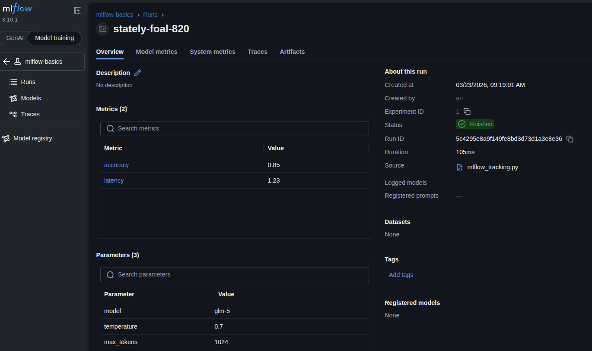
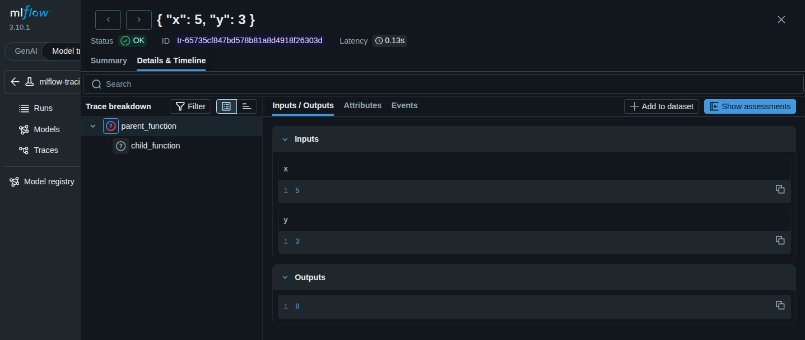
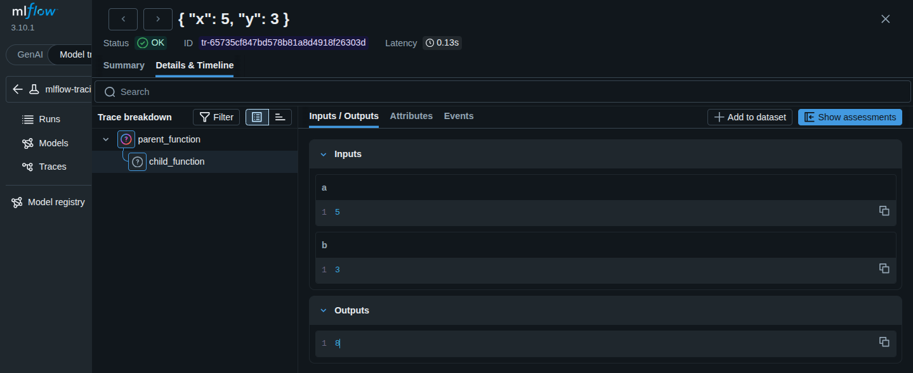
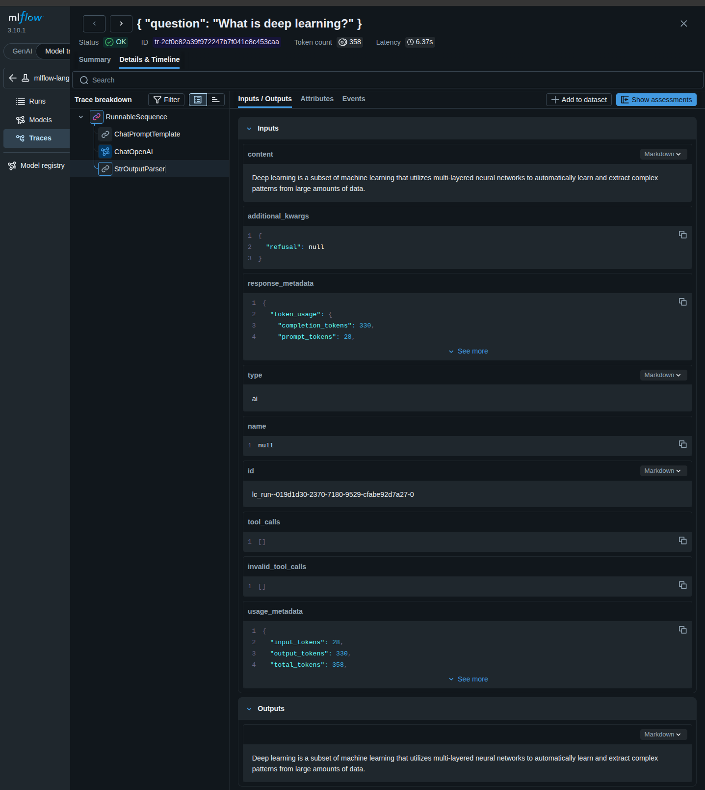

# MLflow Basics

This directory contains foundational examples for learning MLflow's core tracking and logging capabilities. These examples demonstrate how to track experiments, log parameters/metrics/artifacts, and work with LLM models.

## Prerequisites

Before running these examples, ensure you have:

1. **Set up your API key** in `.env` file:
   ```bash
   ZHIPU_API_KEY=your_zhipu_api_key_here
   ```

2. **Start MLflow UI** (if not already running):
   ```bash
   uv run mlflow ui --backend-store-uri sqlite:///mlflow.db --port 5000
   ```

   Then open: http://localhost:5000

3. **Install dependencies** (if needed):
   ```bash
   uv sync --all-extras --dev
   ```

---

## Examples

### 1. MLflow Tracking (`mlflow_tracking.py`)

**Overview:** Demonstrates the core MLflow tracking functionality - creating experiments, logging parameters, metrics, and artifacts.

**What it demonstrates:**
- Creating a new MLflow experiment
- Starting a run within an experiment
- Logging parameters (model configuration)
- Logging metrics (performance measurements)
- Logging artifacts (output files)

**Key MLflow APIs:**

```python
import mlflow

# Creating an experiment
experiment_id = mlflow.create_experiment(
    name="mlflow-basics",
    tags={"version": "1.0", "team": "data-science"}
)

# Starting a run and logging data
with mlflow.start_run(experiment_id=experiment_id) as run:
    # Log hyperparameters (configuration inputs)
    mlflow.log_param("learning_rate", 0.01)
    mlflow.log_param("batch_size", 32)
    mlflow.log_param("epochs", 100)

    # Log metrics (performance measurements)
    mlflow.log_metric("accuracy", 0.95)
    mlflow.log_metric("loss", 0.05)

    # Log metrics with step (for time-series data)
    for epoch in range(10):
        accuracy = train_one_epoch(epoch)
        mlflow.log_metric("accuracy", accuracy, step=epoch)

    # Log artifacts (output files)
    mlflow.log_artifact("model.pkl")
    mlflow.log_text("Training completed successfully", "summary.txt")

    # Get run info
    run_id = run.info.run_id
    print(f"Run ID: {run_id}")
```

**Run the example:**
```bash
uv run python src/basics/mlflow_tracking.py
```

**Expected output:**
```
✓ Experiment 'mlflow-basics' (ID: 1)
✓ Started run: 5c4295e8a9f149fe8bd3d73d1a3e8e36
✓ Logged 3 parameters
✓ Logged 2 metrics
✓ Logged artifact: tmpuqc44xqz.txt

Run ID: 5c4295e8a9f149fe8bd3d73d1a3e8e36
View results at: http://localhost:5000
```

**Result in MLflow UI:**



**Key concepts learned:**
- **Experiments**: Organizational units for grouping related runs
- **Runs**: Single executions of your code with tracking
- **Parameters**: Configuration inputs (hyperparameters, settings)
- **Metrics**: Output measurements (accuracy, latency, scores)
- **Artifacts**: Output files (models, plots, data files)

---

### 2. Tracing Decorators (`tracing_decorators.py`)

**Overview:** Demonstrates MLflow's `@mlflow.trace` decorator for automatic function instrumentation and trace visualization.

**What it demonstrates:**
- Using `@mlflow.trace` decorator to automatically track function calls
- Adding custom span types and attributes
- Retrieving and displaying trace data programmatically
- Visualizing function call hierarchies in MLflow UI

**Key MLflow APIs:**

```python
import mlflow
from mlflow.entities import SpanType

# Basic tracing with decorator
@mlflow.trace(name="custom_operation", span_type="LLM")
def process_data(input_text: str) -> str:
    """Automatically tracks function inputs, outputs, and execution time."""
    result = input_text.upper()
    return result

# Tracing with custom attributes
@mlflow.trace
def calculate_metrics(data: list) -> dict:
    """Add custom metadata to spans."""
    span = mlflow.get_current_span()
    span.set_attribute("custom_field", "value")
    span.set_attribute("data_length", len(data))

    result = {"mean": sum(data) / len(data)}
    return result

# Nested function calls (automatic span hierarchy)
@mlflow.trace
def parent_function(x: int, y: int) -> int:
    """Parent span that calls other traced functions."""
    return child_function(x, y)

@mlflow.trace
def child_function(a: int, b: int) -> int:
    """Child span - automatically linked to parent."""
    return a + b

# Retrieve and display trace information
trace = mlflow.get_trace(trace_id)
print(f"Trace ID: {trace.info.trace_id}")
print(f"Execution time: {trace.info.execution_time_ms}ms")

for span in trace.data.spans:
    print(f"{span.name}: {span.inputs} → {span.outputs}")
```

**Run the example:**
```bash
# Basic decorator tracing
uv run python src/basics/tracing_decorators.py

# Nested span tracing (shows parent-child relationships)
uv run python src/basics/tracing_nested_example.py
```

**Expected output:**
```
Running traced functions...

add_numbers(5, 3) = 8

multiply_numbers(4, 7) = 28

Trace ID: tr-9b8f10f55429671de5ad00389698f025
Now run `mlflow ui` and open MLflow UI to see traces!
```

**Result in MLflow UI:**

**Example 1: Basic Decorator Tracing**


*Screenshot showing a single traced function with inputs, outputs, and span attributes*

**Example 2: Nested Span Hierarchy**


*Screenshot showing parent-child span relationships where `parent_function` calls `child_function`*

**What you see in the screenshots:**

**Basic Tracing:**
- Function name (`multiply_numbers`)
- Input parameters (`{"a": 4, "b": 7}`)
- Return value (`28`)
- Execution time
- Span attributes (operation type)

**Nested Spans:**
- Parent span (`parent_function`)
- Child span (`child_function`) indented under parent
- Each span shows its own inputs/outputs
- Visual hierarchy showing the call flow

**How the nested span is created:**
```python
@mlflow.trace
def child_function(a: int, b: int) -> int:
    return a + b

@mlflow.trace
def parent_function(x: int, y: int) -> int:
    result = child_function(x, y)  # Creates nested span
    return result
```

**Span hierarchy in MLflow UI:**
```
parent_function (root span)
└── child_function (child span)
```

**Key concepts learned:**
- **Spans**: Individual units of work representing function calls
- **Traces**: Collections of spans representing a complete execution flow
- **Decorator-based tracing**: Automatic instrumentation using `@mlflow.trace`
- **Nested spans**: Parent-child span relationships when functions call other functions
- **Span attributes**: Custom metadata attached to spans (operation types, etc.)
- **Trace retrieval**: Programmatic access to trace data via `mlflow.get_trace()`
- **Span hierarchy**: Visual tree structure showing call flow in MLflow UI

---

### 3. Zhipu Completions (`zhipu_completions.py`)

**Overview:** Demonstrates basic usage of the Zhipu AI GLM-5 model API client.

**What it demonstrates:**
- Setting up Zhipu AI client configuration
- Making simple completion requests to GLM-5
- Understanding the request/response pattern

**Key Zhipu AI APIs:**

```python
from zhipuai import ZhipuAI
import os

# Initialize Zhipu AI client
client = ZhipuAI(api_key=os.getenv("ZHIPU_API_KEY"))

# Simple completion request
response = client.chat.completions.create(
    model="glm-5",  # Zhipu's latest model
    messages=[
        {"role": "system", "content": "You are a helpful assistant."},
        {"role": "user", "content": "What is machine learning? Explain in one sentence."}
    ],
    temperature=0.7,
    max_tokens=150
)

# Extract response
answer = response.choices[0].message.content
print(f"Response: {answer}")

# With MLflow tracking
import mlflow

with mlflow.start_run():
    mlflow.log_param("model", "glm-5")
    mlflow.log_param("temperature", 0.7)

    response = client.chat.completions.create(
        model="glm-5",
        messages=[{"role": "user", "content": "Hello!"}]
    )

    mlflow.log_metric("tokens_used", response.usage.total_tokens)
    mlflow.log_text(response.choices[0].message.content, "response.txt")
```

**Run the example:**
```bash
uv run python src/basics/zhipu_completions.py
```

**Expected output:**
```
✓ Initialized Zhipu AI client with model: glm-5

Prompt: What is machine learning? Explain in one sentence.

Response: Machine learning is a subset of artificial intelligence that enables
computers to learn from data and improve their performance on tasks without
being explicitly programmed.
```

**Note:** This example doesn't use MLflow tracking - it's a foundational example showing how to use the Zhipu AI client that other examples build upon.

---

### 4. LangChain Integration (`langchain_tracing.py`)

**Overview:** Demonstrates LangChain integration with MLflow tracking, showing how to build chains with LCEL (LangChain Expression Language) and trace them automatically.

**What it demonstrates:**
- Creating LangChain LLM instances for Zhipu AI
- Building chains with LCEL (prompt | LLM | parser)
- Automatic tracing of LangChain operations
- Prompt template inputs and LLM call spans
- Response parsing and output

**Key LangChain + MLflow APIs:**

```python
from langchain_openai import ChatOpenAI
from langchain_core.prompts import ChatPromptTemplate
from langchain_core.output_parsers import StrOutputParser
import mlflow

# Create LangChain LLM for Zhipu AI
llm = ChatOpenAI(
    model="glm-5",
    openai_api_base="https://open.bigmodel.cn/api/paas/v4",
    openai_api_key=os.getenv("ZHIPU_API_KEY"),
    temperature=0.7,
)

# Create a prompt template
prompt = ChatPromptTemplate.from_template(
    "You are a helpful assistant. Answer: {question}"
)

# Build the chain using LCEL
chain = prompt | llm | StrOutputParser()

# Run with MLflow tracking
with mlflow.start_run():
    response = chain.invoke({"question": "What is MLflow?"})
    print(response)
```

**Run the example:**
```bash
uv run python src/basics/langchain_tracing.py
```

**Expected output:**
```
✓ Created LangChain LLM for Zhipu AI model: glm-5
✓ Created LangChain chain

Running sample queries...

Query 1: What is machine learning?
Response: Machine learning is a branch of artificial intelligence that enables
computer systems to learn from data...

Query 2: What is deep learning?
Response: Deep learning is a subset of machine learning that utilizes
multi-layered neural networks...

🏃 View run at: http://localhost:5000/#/experiments/15/runs/xxx
```

**Result in MLflow UI:**


*Screenshot showing LangChain chain trace with prompt, LLM call, and response parsing spans*

**What you see in the screenshot:**
- **Chain invocation** - The main LangChain chain execution
- **Prompt template** - Input parameters to the prompt
- **LLM call** - The actual LLM invocation with model name
- **Response parsing** - Output parsing from StrOutputParser
- **Timing breakdown** - Execution time for each component

**LangChain Chain Architecture:**
```
┌─────────────────────────────────────┐
│         LangChain Chain              │
│  ┌──────────┐  ┌──────────┐  ┌─────┐│
│  │  Prompt  │→ │   LLM    │→ │Parser││
│  │ Template │  │  (GLM-5) │  │Output││
│  └──────────┘  └──────────┘  └─────┘│
└─────────────────────────────────────┘
```

**Utility Module (`langchain_integration.py`):**

This module provides helper functions used by other examples:
- `create_zhipu_langchain_llm()` - Creates a LangChain ChatOpenAI instance for Zhipu AI
- `create_streaming_llm()` - Creates a streaming-enabled LangChain LLM

**Real-World Use Cases:**
- **Quick prototyping** - Build LLM chains in minutes
- **Prompt engineering** - Test different prompt templates
- **Chain composition** - Combine multiple components (prompt → LLM → parser)
- **Observability** - Automatic tracing of every chain component

**Key concepts learned:**
- **LCEL (LangChain Expression Language)** - Composable chains with `|` operator
- **Chain components** - Prompt templates, LLMs, output parsers
- **Automatic tracing** - MLflow traces every chain component
- **Span hierarchy** - See how data flows through the chain
- **LangChain + MLflow** - Seamless integration for observability

# Build chain with LCEL (LangChain Expression Language)
chain = prompt | llm

# Use chain with MLflow tracking
with mlflow.start_run():
    response = chain.invoke({"question": "What is MLflow?"})
    print(response.content)

    # Log metrics
    mlflow.log_metric("response_length", len(response.content))
```

**With MLflow Autologging:**

```python
import mlflow
from langchain_openai import ChatOpenAI

# Enable MLflow autologging for LangChain
mlflow.langchain.autolog()

# All LangChain operations are automatically traced
llm = ChatOpenAI(model="glm-5")
response = llm.invoke("Hello!")

# Traces and metrics are logged automatically
```

---

### 5. Model Logging (`model_logging.py`)

**NOTE:** Currently has compatibility issues with LangChain v0.3+ and MLflow's models-from-code requirement. Skipped for now.

---

## Common Issues

**Q: MLflow UI shows "Experiment not found"**
- A: Make sure you're using the correct backend store URI: `sqlite:///mlflow.db`

**Q: ZHIPU_API_KEY error**
- A: Ensure your `.env` file exists and contains a valid API key from https://open.bigmodel.cn/

**Q: Port 5000 already in use**
- A: Either stop the existing MLflow UI process or use a different port: `mlflow ui --port 5001`
