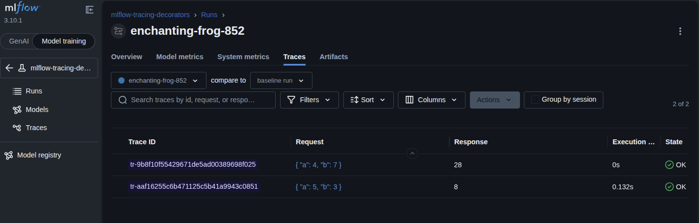

# MLflow Basics

This directory contains foundational examples for learning MLflow's core tracking and logging capabilities. These examples demonstrate how to track experiments, log parameters/metrics/artifacts, and work with LLM models.

## Prerequisites

Before running these examples, ensure you have:

1. **Set up your API key** in `.env` file:
   ```bash
   ZHIPU_API_KEY=your_zhipu_api_key_here
   ```

2. **Start MLflow UI** (if not already running):
   ```bash
   uv run mlflow ui --backend-store-uri sqlite:///mlflow.db --port 5000
   ```

   Then open: http://localhost:5000

3. **Install dependencies** (if needed):
   ```bash
   uv sync --all-extras --dev
   ```

---

## Examples

### 1. MLflow Tracking (`mlflow_tracking.py`)

**Overview:** Demonstrates the core MLflow tracking functionality - creating experiments, logging parameters, metrics, and artifacts.

**What it demonstrates:**
- Creating a new MLflow experiment
- Starting a run within an experiment
- Logging parameters (model configuration)
- Logging metrics (performance measurements)
- Logging artifacts (output files)

**Run the example:**
```bash
uv run python src/basics/mlflow_tracking.py
```

**Expected output:**
```
✓ Experiment 'mlflow-basics' (ID: 1)
✓ Started run: 5c4295e8a9f149fe8bd3d73d1a3e8e36
✓ Logged 3 parameters
✓ Logged 2 metrics
✓ Logged artifact: tmpuqc44xqz.txt

Run ID: 5c4295e8a9f149fe8bd3d73d1a3e8e36
View results at: http://localhost:5000
```

**Result in MLflow UI:**


**Key concepts learned:**
- **Experiments**: Organizational units for grouping related runs
- **Runs**: Single executions of your code with tracking
- **Parameters**: Configuration inputs (hyperparameters, settings)
- **Metrics**: Output measurements (accuracy, latency, scores)
- **Artifacts**: Output files (models, plots, data files)

---

### 2. Tracing Decorators (`tracing_decorators.py`)

**Overview:** Demonstrates MLflow's `@mlflow.trace` decorator for automatic function instrumentation and trace visualization.

**What it demonstrates:**
- Using `@mlflow.trace` decorator to automatically track function calls
- Adding custom span types and attributes
- Retrieving and displaying trace data programmatically
- Visualizing function call hierarchies in MLflow UI

**Run the example:**
```bash
uv run python src/basics/tracing_decorators.py
```

**Expected output:**
```
Running traced functions...

add_numbers(5, 3) = 8

multiply_numbers(4, 7) = 28

Trace ID: tr-9b8f10f55429671de5ad00389698f025
Now run `mlflow ui` and open MLflow UI to see traces!
```

**Result in MLflow UI:**



**Key concepts learned:**
- **Spans**: Individual units of work representing function calls
- **Traces**: Collections of spans representing a complete execution flow
- **Decorator-based tracing**: Automatic instrumentation using `@mlflow.trace`
- **Span attributes**: Custom metadata attached to spans (operation types, etc.)
- **Trace retrieval**: Programmatic access to trace data via `mlflow.get_trace()`

---

### 3. Zhipu Completions (`zhipu_completions.py`)

**Overview:** Demonstrates basic usage of the Zhipu AI GLM-5 model API client.

**What it demonstrates:**
- Setting up Zhipu AI client configuration
- Making simple completion requests to GLM-5
- Understanding the request/response pattern

**Run the example:**
```bash
uv run python src/basics/zhipu_completions.py
```

**Expected output:**
```
✓ Initialized Zhipu AI client with model: glm-5

Prompt: What is machine learning? Explain in one sentence.

Response: Machine learning is a subset of artificial intelligence that enables
computers to learn from data and improve their performance on tasks without
being explicitly programmed.
```

**Note:** This example doesn't use MLflow tracking - it's a foundational example showing how to use the Zhipu AI client that other examples build upon.

---

### 4. LangChain Integration (`langchain_integration.py`)

**Note:** This is a utility module providing helper functions for LangChain integration with Zhipu AI. It's used by other examples rather than run directly.

**Provides:**
- `create_zhipu_langchain_llm()` - Creates a LangChain ChatOpenAI instance for Zhipu AI
- `create_streaming_llm()` - Creates a streaming-enabled LangChain LLM

---

### 5. Model Logging (`model_logging.py`)

**NOTE:** Currently has compatibility issues with LangChain v0.3+ and MLflow's models-from-code requirement. Skipped for now.

---

## Common Issues

**Q: MLflow UI shows "Experiment not found"**
- A: Make sure you're using the correct backend store URI: `sqlite:///mlflow.db`

**Q: ZHIPU_API_KEY error**
- A: Ensure your `.env` file exists and contains a valid API key from https://open.bigmodel.cn/

**Q: Port 5000 already in use**
- A: Either stop the existing MLflow UI process or use a different port: `mlflow ui --port 5001`
