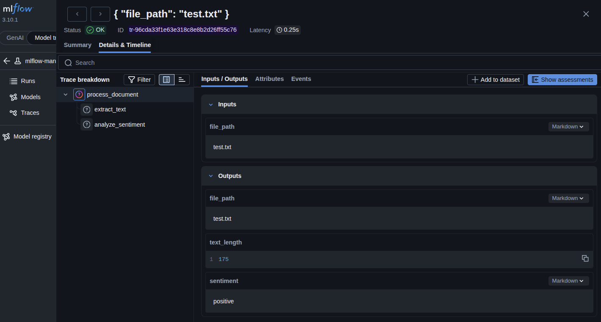
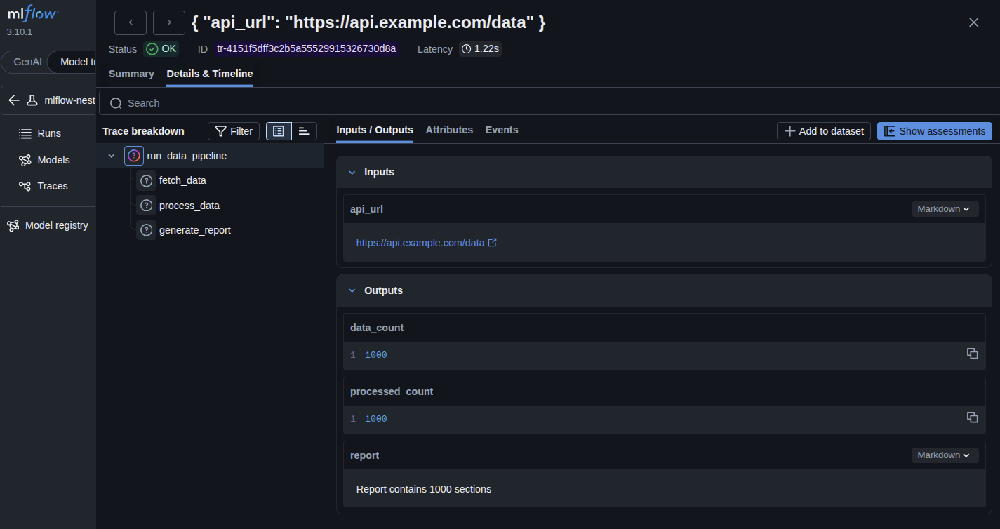
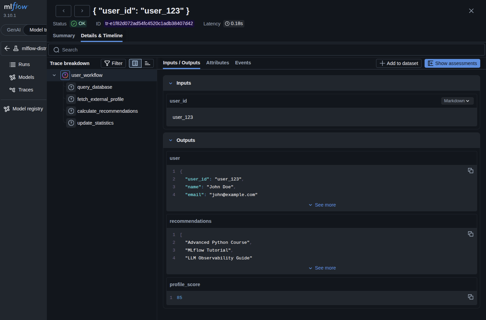
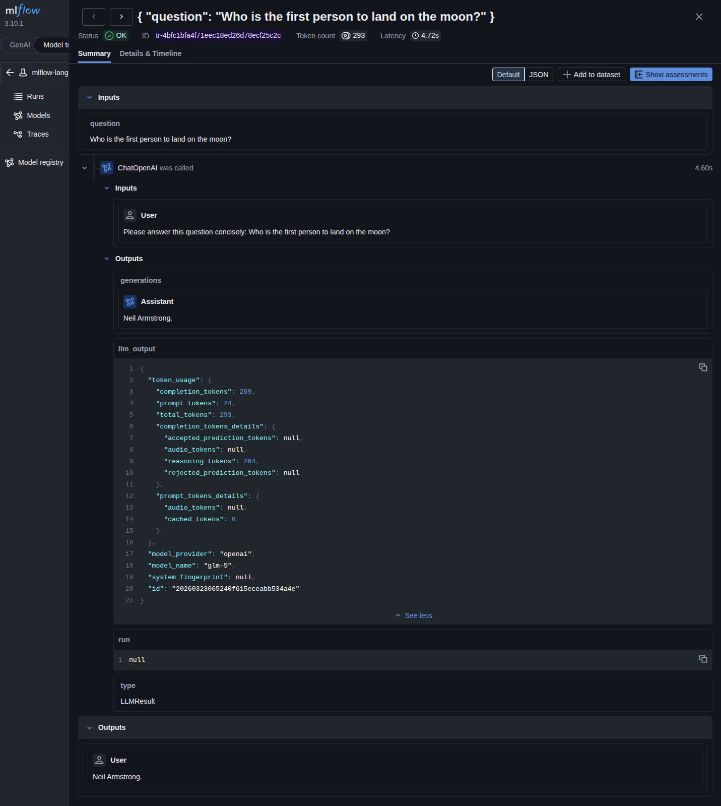

# MLflow Intermediate Examples

This directory contains intermediate-level examples that demonstrate more advanced MLflow capabilities, including manual span tracing, nested spans, distributed tracing, and evaluation metrics.

## Prerequisites

Before running these examples, ensure you have:

1. **Set up your API key** in `.env` file:
   ```bash
   ZHIPU_API_KEY=your_zhipu_api_key_here
   ```

2. **Start MLflow UI** (if not already running):
   ```bash
   uv run mlflow ui --backend-store-uri sqlite:///mlflow.db --port 5000
   ```

   Then open: http://localhost:5000

3. **Install dependencies** (if needed):
   ```bash
   uv sync --all-extras --dev
   ```

---

## Examples

### 1. Manual Span Tracing (`tracing_manual_spans.py`)

**Overview:** Demonstrates fine-grained control over tracing using `mlflow.start_span()` context manager, giving you complete control over what gets traced and when.

**What it demonstrates:**
- Manual span creation with `mlflow.start_span()`
- Building nested span hierarchies (parent-child relationships)
- Capturing inputs and outputs at each span level
- Document processing pipeline with multi-step tracing

**How it works:**

Instead of using `@mlflow.trace` decorators, you explicitly create spans:

```python
with mlflow.start_span(name="extract_text") as span:
    span.set_inputs({"file_path": file_path})
    # ... do work ...
    span.set_outputs({"text_length": len(text)})
```

**The example creates a nested span structure:**
```
process_document (parent span)
├── extract_text (child span)
└── analyze_sentiment (child span)
```

**Manual vs Decorator-Based Tracing:**

| Aspect | Decorator (`@mlflow.trace`) | Manual (`mlflow.start_span()`) |
|--------|----------------------------|--------------------------------|
| **Control** | Automatic, less control | Full control over what/when to trace |
| **Use case** | Quick tracing of functions | Complex workflows, conditional logic |
| **Setup** | Just add decorator | Explicitly wrap code sections |
| **Best for** | Simple function calls | Multi-step pipelines, async work |

**Run the example:**
```bash
uv run python src/intermediate/tracing_manual_spans.py
```

**Expected output:**
```
Processing document: test.txt
✓ Extracted text: 175 characters
✓ Analyzed sentiment: positive
Document processing completed

Trace ID: tr-96cda33f1e63e318c8e8b2d26ff55c76
View in MLflow UI to see span hierarchy!
```

**Result in MLflow UI:**


*Screenshot showing the parent-child span hierarchy*

**Real-World Use Cases:**
- Document processing pipelines
- Data ETL jobs
- Multi-step workflows where you want to see exactly what happens at each stage
- Identifying bottlenecks in complex operations
- Conditional tracing based on runtime logic

**Key concepts learned:**
- **Manual span creation**: Using `mlflow.start_span()` for explicit control
- **Span hierarchies**: Parent-child relationships in trace visualization
- **Input/output tracking**: Recording data flow through each operation
- **Fine-grained tracing**: Tracing only what matters, not entire functions

---

### 2. Nested Spans (`tracing_nested.py`)

**Overview:** Demonstrates deep span hierarchies in a data pipeline, showing how parent-child relationships represent the call flow and timing information for each stage.

**What it demonstrates:**
- Creating multi-level nested span hierarchies
- Automatic parent-child relationships from function calls
- Timing information for each span and total execution time
- Data pipeline visualization with sequential operations

**The example creates a sequential pipeline hierarchy:**
```
run_data_pipeline (root span)
├── fetch_data (child span, ~500ms)
├── process_data (child span, ~300ms)
└── generate_report (child span, ~200ms)
```

**Run the example:**
```bash
uv run python src/intermediate/tracing_nested.py
```

**Expected output:**
```
Fetching data from API...
Processing data: 1000 records
Generating report...
Pipeline completed successfully

Total execution time: 1.32s
```

**Result in MLflow UI:**



**Real-World Use Cases:**
- Data ETL pipelines: Extract → Transform → Load workflows
- API request chains: Multiple sequential service calls
- Batch processing jobs: Multi-stage data processing
- Performance profiling: Identifying slow stages in pipelines
- ML pipelines: Data preprocessing → Training → Evaluation

**Key concepts learned:**
- **Automatic parent-child relationships**: Spans inherit context from calling code
- **Timing hierarchy**: Total time vs individual span times
- **Sequential workflows**: Visualizing execution flow
- **Pipeline debugging**: Pinpoint slow stages in complex workflows

---

### 3. Distributed Tracing (`tracing_distributed.py`)

**Overview:** Demonstrates trace correlation across multiple distributed function calls and trace retrieval with MLflow's search capabilities.

**What it demonstrates:**
- Correlating spans across distributed function calls
- Trace retrieval using `mlflow.get_trace()`
- Searching traces with `mlflow.search_traces()`
- Understanding span counts and trace metadata

**The example creates a distributed workflow hierarchy:**
```
user_workflow (root span)
├── query_database (span 1)
├── fetch_external_profile (span 2)
├── calculate_recommendations (span 3)
└── update_statistics (span 4)
```

**Run the example:**
```bash
uv run python src/intermediate/tracing_distributed.py
```

**Expected output:**
```
Querying database for user: user_123
Fetching user profile from external service
Calculating user recommendations
Updating user statistics
User workflow completed

Trace ID: tr-e1f82d072ad54fc4520c1adb38407d42
Trace spans: 5
Found 1 traces for this workflow
```

**Result in MLflow UI:**



**Real-World Use Cases:**
- **Microservices**: Tracing requests across multiple services
- **Workflow orchestration**: Complex multi-step business processes
- **API gateways**: Request routing and aggregation
- **Event-driven systems**: Async message processing
- **Debugging distributed systems**: Finding where failures occur

**Key concepts learned:**
- **Trace correlation**: Linking related operations across functions
- **Trace retrieval**: Fetching complete trace data by ID
- **Trace search**: Querying traces with filters
- **Span counting**: Understanding trace complexity

---

### 4. LangChain Autologging (`tracing_langchain.py`)

**Overview:** Demonstrates automatic LangChain chain tracing using `mlflow.langchain.autolog()`, which automatically instruments all LangChain operations without manual decorators.

**What it demonstrates:**
- Automatic LangChain chain tracing
- No manual span creation needed
- Multiple trace capture from sequential invocations
- Trace search and retrieval for LangChain operations

**How it works:**

Instead of manually adding `@mlflow.trace` decorators, enable autologging once:

```python
mlflow.langchain.autolog()  # Enable automatic tracing

# All LangChain chains are now automatically traced
chain.invoke({"question": "What is the capital of Japan?"})
chain.invoke({"question": "How many animals are there?"})
```

**Run the example:**
```bash
uv run python src/intermediate/tracing_langchain.py
```

**Expected output:**
```
✓ Enabled LangChain autologging
Invoking chain with question: What is the capital of Japan?
Response: The capital of Japan is Tokyo.

Invoking chain with question: How many animals are there?
Response: Scientists estimate there are approximately 8.7 million animal species...

✓ Retrieved 3 traces

Trace ID: tr-4bfc1bfa4f71eec18ed26d78ecf25c2c
Spans: 4
```

**Result in MLflow UI:**



**Autologging vs Manual Tracing:**

| Aspect | Autologging | Manual Tracing |
|--------|------------|----------------|
| **Setup** | One line: `mlflow.langchain.autolog()` | Add `@mlflow.trace` to each function |
| **Coverage** | All LangChain operations automatically | Only explicitly traced functions |
| **Control** | Automatic, less control | Full control over what's traced |
| **Best for** | Quick instrumentation of LangChain apps | Custom tracing logic, non-LangChain code |

**Real-World Use Cases:**
- **RAG applications**: Automatically trace retrieval + generation
- **Chain workflows**: Multi-step LangChain chains
- **Agent systems**: Complex agent decision-making
- **Quick debugging**: No code changes needed for tracing

**Key concepts learned:**
- **Automatic instrumentation**: Enable tracing with one line
- **Framework integration**: MLflow integrates with LangChain
- **Zero-code tracing**: No decorators needed for LangChain
- **Production-ready**: Drop-in observability for LangChain apps

---

### 5. Trace Search (`tracing_search.py`)

**Overview:** Demonstrates programmatic trace retrieval and filtering using MLflow's search API, enabling you to find and analyze traces matching specific criteria.

**What it demonstrates:**
- Searching traces by experiment name
- Filtering traces by run ID
- Retrieving trace details and span information
- Batch trace analysis
- Trace metadata extraction

**Run the example:**
```bash
uv run python src/intermediate/tracing_search.py
```

**Expected output:**
```
Running traced functions...
✓ Traced 10 function calls

Searching for traces...
Found 10 traces

Filtering traces by experiment: 8
Found 10 traces in experiment

Sample trace:
  ID: tr-99abde0bebc2cefc3a1cf9355f97ca6f
  Span Count: 4
  Execution Time: 1.23s

View in MLflow UI: http://localhost:5000/#/experiments/8
```

**Real-World Use Cases:**
- **Debugging**: Find traces for specific runs or time periods
- **Performance analysis**: Filter slow traces for investigation
- **Batch processing**: Analyze multiple traces programmatically
- **Monitoring**: Build custom dashboards with trace data
- **Compliance**: Export traces for auditing

**Key concepts learned:**
- **mlflow.search_traces()**: Search and filter traces
- **Trace filtering**: By experiment, run ID, time range
- **Trace metadata**: Extract span counts, execution times
- **Batch analysis**: Process multiple traces efficiently

---

## Common Issues

**Q: Manual spans don't appear in MLflow UI**
- A: Ensure you're inside an active MLflow run (`with mlflow.start_run():`)

**Q: Spans are not nested properly**
- A: Make sure child spans are created within the parent span's context manager scope

**Q: How is this different from decorator tracing?**
- A: Manual spans give you control over WHEN to create spans (useful for conditional logic, loops, async operations), while decorators trace entire functions automatically
