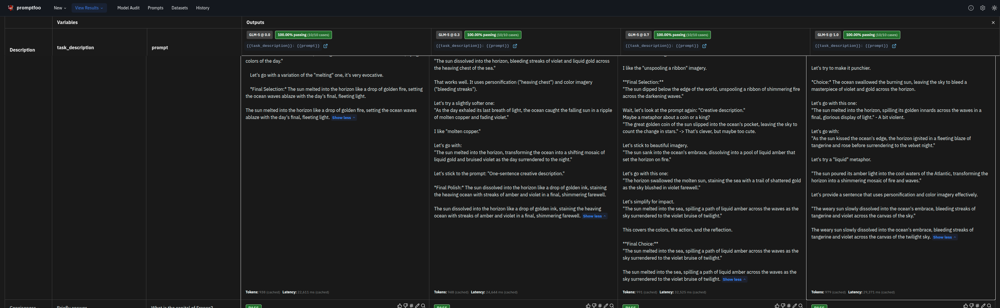

# Temperature Optimization

## Overview

Temperature is a key parameter that controls the randomness of LLM outputs. Lower temperatures produce more deterministic, consistent outputs, while higher temperatures produce more varied, creative responses. This evaluation helps you find the optimal temperature for different task types.

## Why It Matters

**Temperature directly affects output quality**:

- **Too low (0.0-0.2)**: Outputs become robotic, repetitive, and may miss nuanced answers
- **Just right (0.3-0.7)**: Balanced consistency and natural variation
- **Too high (0.8-1.0+)**: Outputs become unpredictable, potentially incoherent or off-topic

**Real-world impact**:
- A chatbot at T=0.0 might give identical responses to similar but distinct questions
- A code generator at T=0.9 might produce syntactically invalid code
- A creative writing assistant at T=0.1 produces boring, formulaic content

**Cost optimization**: Using the right temperature reduces the need for retries and re-generation.

## Prerequisites

Before running this evaluation, ensure you have:

1. **ZHIPU_API_KEY environment variable**:
   ```bash
   export ZHIPU_API_KEY=your_zhipu_api_key_here
   ```

2. **promptfoo installed**:
   ```bash
   npm install -g promptfoo
   ```

3. **Python dependencies**:
   ```bash
   uv sync --all-extras --dev
   ```

## Setup

### Configuration File

The `temperature_sweep.yaml` file tests 4 temperature values:

| Temperature | Characteristics |
|-------------|-----------------|
| **0.0** | Most deterministic, consistent, focused |
| **0.3** | Low creativity, high reliability |
| **0.7** | Balanced between consistency and creativity |
| **1.0** | Most creative, highest variance |

### Test Data

The `data/test_cases.json` file contains 8 task types:

| Task Type | Optimal Temperature | Why |
|-----------|---------------------|-----|
| **Creative writing** | High (0.7-1.0) | Benefits from variety and originality |
| **Factual QA** | Low (0.0-0.3) | Needs consistency and accuracy |
| **Code generation** | Low (0.0-0.3) | Syntax must be correct |
| **Summarization** | Medium (0.3-0.7) | Balance accuracy and readability |
| **Brainstorming** | High (0.7-1.0) | Creativity is valued over precision |
| **Translation** | Low (0.0-0.3) | Consistency in terminology matters |
| **Math** | Low (0.0-0.3) | Only one correct answer |
| **Metaphor creation** | High (0.7-1.0) | Originality is key |

## Running the Evaluation

### Option 1: Using the Python Runner (Recommended)

```bash
cd src/promptfoo_evaluation/advanced/choosing_right_temperature
uv run python temperature_test.py
```

### Option 2: Using promptfoo directly

```bash
cd src/promptfoo_evaluation/advanced/choosing_right_temperature
OPENAI_API_KEY=$ZHIPU_API_KEY npx promptfoo eval -c temperature_sweep.yaml
```

### View Results

```bash
npx promptfoo view
# Opens browser at http://localhost:15500
```

## Understanding Results

### Example Temperature Comparison

The following screenshot shows how different temperatures affect the same creative task:



**Figure 1:** Temperature comparison for a creative writing task ("Write a one-sentence creative description of a sunset over the ocean"). All four temperatures (0.0, 0.3, 0.7, 1.0) passed the test, but produced different creative approaches:

- **Temperature 0.0**: Produced "The sun melted into the horizon like a drop of golden fire, setting the ocean waves ablaze with the day's final, fleeting light." - Focused, precise imagery with controlled vocabulary.

- **Temperature 0.3**: Produced "The sun dissolved into the horizon like a drop of golden ink, staining the heaving ocean with streaks of amber and violet in a final, shimmering farewell." - Similar creativity with slightly more descriptive elements.

- **Temperature 0.7**: Produced "The sun melted into the sea, spilling a path of liquid amber across the waves as the sky surrendered to the violet bruise of twilight." - More evocative with stronger metaphorical language ("violet bruise").

- **Temperature 1.0**: Produced "The weary sun slowly dissolved into the ocean's embrace, bleeding streaks of tangerine and violet across the canvas of the twilight sky." - Highest creativity with personification ("weary sun") and artistic metaphors.

**Key insight**: While all temperatures passed this creative task, higher temperatures produced more varied, imaginative descriptions with stronger emotional language and unique metaphors.

### Metrics by Temperature

The evaluation produces a comparison table:

| Temperature | Pass Rate | Avg Score | Best For |
|-------------|-----------|-----------|----------|
| 0.0 | Highest for factual tasks | Lower for creative | Math, code, facts |
| 0.3 | High overall | Balanced | Translation, QA |
| 0.7 | Moderate | Good balance | Summarization |
| 1.0 | Lower for factual | Higher for creative | Writing, brainstorming |

### Variance Analysis

Variance measures how much temperature affects a metric:

| Variance Level | Interpretation |
|----------------|----------------|
| **Low** | Temperature has minimal impact on this metric |
| **Medium** | Temperature moderately affects results |
| **High** | Temperature significantly changes output quality |

**Example**: If pass rate variance is high, temperature choice is critical for your task.

### Selecting the Right Temperature

Based on your task requirements:

```python
# For factual, precision-critical tasks
temperature = 0.0  # Medical, legal, financial advice

# For general-purpose assistants
temperature = 0.3  # Customer service, general QA

# For balanced tasks
temperature = 0.5  # Email drafting, summarization

# For creative tasks
temperature = 0.8  # Creative writing, marketing copy

# For maximum creativity
temperature = 1.0  # Brainstorming, ideation
```

### Trade-off Analysis

| Consideration | Low Temperature | High Temperature |
|---------------|-----------------|------------------|
| **Consistency** | High | Low |
| **Creativity** | Low | High |
| **Accuracy** | Higher for factual tasks | May introduce errors |
| **Cost** | Fewer retries needed | May require regeneration |
| **User experience** | Predictable | Varied, potentially surprising |

## Best Practices

### 1. Task-Specific Temperature Selection

**Use decision tree for temperature selection**:

```
Does task require single correct answer?
├─ Yes → Use low temperature (0.0-0.3)
│  ├─ Math, coding, facts
│  └─ Translation, transcription
└─ No → Evaluate creativity requirement
   ├─ Low creativity → Medium (0.3-0.5)
   │  └─ Summarization, explanation
   └─ High creativity → High (0.7-1.0)
      └─ Writing, brainstorming, ideation
```

### 2. Testing Before Deployment

**Always test temperature on your specific task**:

1. Start with recommended temperature for your task type
2. Run evaluation on representative test cases
3. Adjust based on results
4. Consider A/B testing in production

### 3. Dynamic Temperature Adjustment

**Advanced pattern**: Adjust temperature based on query confidence:

```python
def select_temperature(query_confidence: float) -> float:
    """Select temperature based on query confidence."""
    if query_confidence > 0.9:
        # High confidence - use deterministic response
        return 0.1
    elif query_confidence > 0.7:
        # Moderate confidence
        return 0.3
    else:
        # Low confidence - allow more exploration
        return 0.5
```

### 4. Production Monitoring

**Track these metrics**:

| Metric | How to Track | Target |
|--------|--------------|--------|
| Output consistency | Compare similar queries | Depends on task |
| User satisfaction | Feedback scores | >4/5 |
| Retry rate | Regeneration count | <10% |
| Error rate | Syntax/factual errors | <5% |

### 5. Temperature vs. Other Parameters

Temperature interacts with other sampling parameters:

| Parameter | Effect | Interaction with Temperature |
|-----------|--------|------------------------------|
| **top_p** | Nucleus sampling | Consider using one or the other |
| **top_k** | Limit token choices | Use with low temperature for more control |
| **frequency_penalty** | Reduce repetition | Combine with higher temperature for variety |
| **presence_penalty** | Encourage new topics | Combine with mid-high temperature |

**Recommendation**: Start with temperature alone. Add other parameters only if needed.

### 6. Common Pitfalls

**Avoid these mistakes**:

| Mistake | Symptom | Fix |
|---------|---------|-----|
| Temperature too low for creative tasks | Generic, repetitive output | Increase to 0.7+ |
| Temperature too high for factual tasks | Inaccurate or conflicting information | Decrease to 0.0-0.3 |
| Using same temperature for all tasks | Suboptimal performance | Task-specific tuning |
| Not testing after changing temperature | Unexpected behavior | Always evaluate |
| Ignoring task requirements | Wrong temperature choice | Analyze task needs first |

## Further Reading

### Research on Temperature
- [Temperature in Language Models](https://arxiv.org/abs/2207.05241) - Theoretical analysis
- [On the Effect of Temperature](https://arxiv.org/abs/2305.14390) - Empirical study

### Practical Guides
- [OpenAI Documentation on Temperature](https://platform.openai.com/docs/api-reference/chat/create#chat-create-temperature)
- [Promptfoo Sampling Guide](https://promptfoo.dev/docs/configuration/expected-outputs/)

### Related Examples
- `../evaluating_factuality/` - Temperature affects factuality
- `../prevent_hallucination/` - Lower temperature reduces hallucinations
- `../../basics/model_comparison.yaml` - Comparing models at different temperatures

## Real-World Use Cases

| Application | Recommended Temperature | Rationale |
|-------------|------------------------|-----------|
| **Code generation** | 0.0 - 0.2 | Syntax must be correct |
| **Legal document review** | 0.0 - 0.3 | Accuracy critical, no room for creativity |
| **Marketing copy** | 0.7 - 1.0 | Originality valued |
| **Customer support chatbot** | 0.3 - 0.5 | Balance consistency with naturalness |
| **Data analysis** | 0.0 - 0.2 | Precision required |
| **Creative writing assistant** | 0.8 - 1.0 | Creativity is the goal |
| **Translation** | 0.1 - 0.3 | Consistency in terminology |
| **Summarization** | 0.3 - 0.6 | Balance accuracy and readability |
| **Brainstorming partner** | 0.9 - 1.0 | Maximize idea variety |
| **Educational content** | 0.4 - 0.6 | Clear but engaging explanations |
