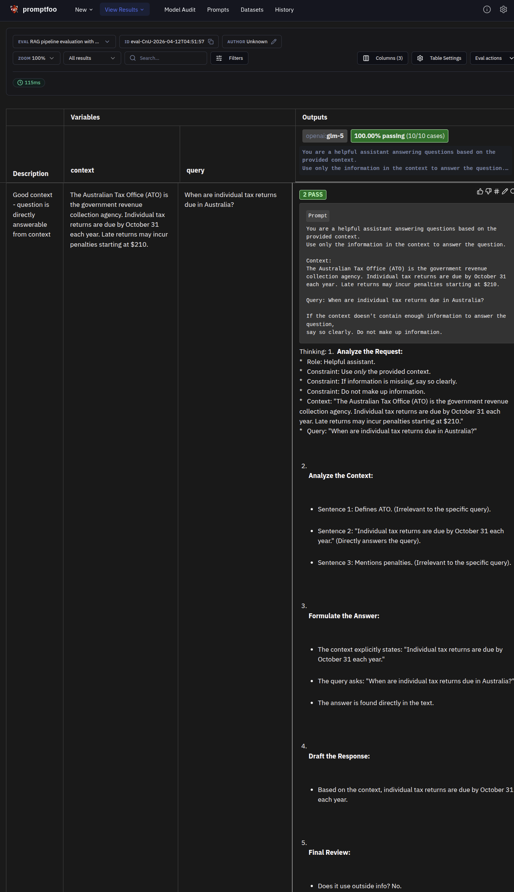
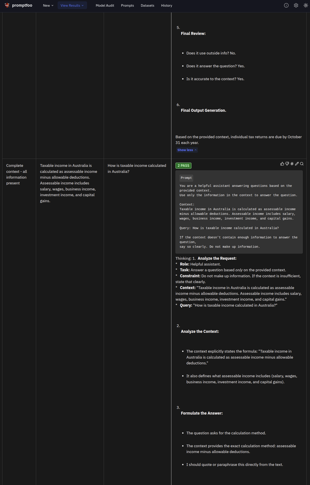
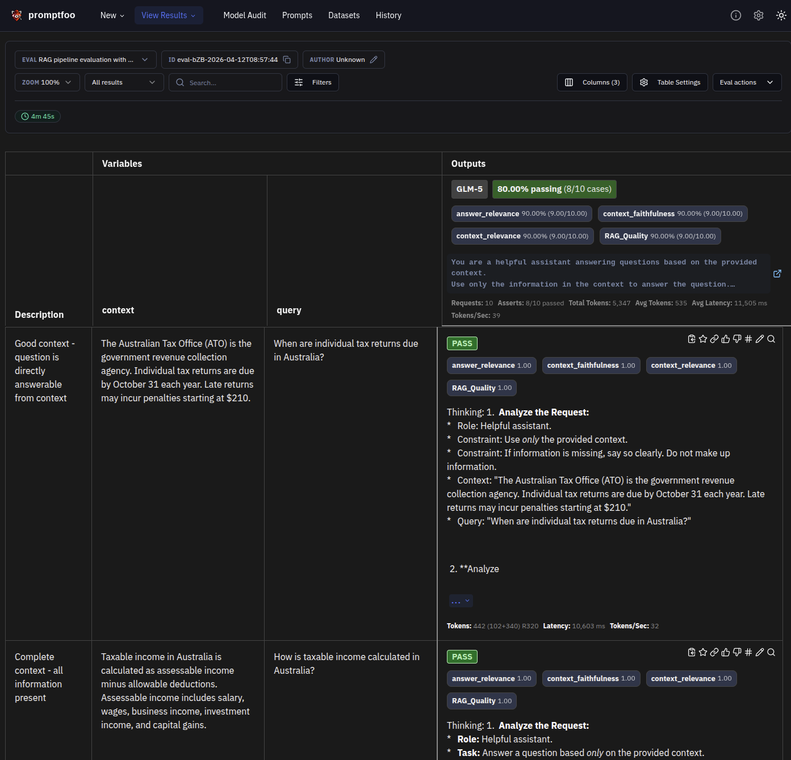

# RAG Pipeline Evaluation

## Overview

Retrieval-Augmented Generation (RAG) systems combine large language models with external knowledge retrieval to produce more accurate, up-to-date responses. This evaluation suite tests the quality of RAG systems by measuring how well they use retrieved context to answer questions.

## Why It Matters

Production RAG systems must consistently:
- **Use retrieved context effectively** - Not ignore the information you've provided
- **Avoid hallucinations** - Not make up facts not supported by the context
- **Acknowledge limitations** - Say when context is insufficient
- **Provide relevant answers** - Stay on-topic relative to the query

Poor RAG quality leads to:
- Incorrect or misleading answers
- Wasted API costs on ineffective retrieval
- User distrust in your system
- Compliance and liability risks

**Real-world impact**: A tax advisory RAG that hallucinates deductions could cause users to file incorrect returns, leading to penalties and legal issues.

## Prerequisites

Before running this evaluation, ensure you have:

1. **ZHIPU_API_KEY environment variable**:
   ```bash
   export ZHIPU_API_KEY=your_zhipu_api_key_here
   ```
   Get your API key from: https://open.bigmodel.cn/

2. **promptfoo installed**:
   ```bash
   npm install -g promptfoo
   # or use npx (no installation required)
   ```

3. **Python dependencies**:
   ```bash
   uv sync --all-extras --dev
   ```

## Setup

### Configuration File

The `rag_pipeline.yaml` file defines:

- **Prompts**: Template with `{{context}}` and `{{query}}` variables
- **Providers**: GLM-5 model via Zhipu AI (using OpenAI-compatible endpoint)
- **Python assertion** (`rag_assertion.py`): LLM-based RAG scoring using GLM-5
  - `context_relevance` - How well context matches the query
  - `context_faithfulness` - Response sticks to context (no hallucination)
  - `answer_relevance` - Response addresses the query
  - `RAG_Quality` - Overall RAG quality score (average of above metrics)

### Test Data

The `data/test_cases.json` file contains 10 test scenarios covering:

| Scenario Type | Description | Expected Behavior |
|---------------|-------------|-------------------|
| Good context | Directly answerable questions | High relevance/faithfulness |
| Insufficient context | Missing key information | Model acknowledges limitations |
| Irrelevant context | Context doesn't match question | Model detects mismatch |
| Numerical data | Precise values (rates, dates) | Accurate extraction |
| Multiple facts | Extract multiple data points | Comprehensive coverage |

**Tax law domain**: Tests use Australian tax content because it requires:
- Precise numerical data (rates, thresholds)
- Factual accuracy (dates, deadlines)
- Domain terminology (TFN, GST, deductions)

## Running the Evaluation

### Option 1: Using the Python Runner (Recommended)

```bash
cd src/promptfoo_evaluation/advanced/rag_pipeline
python rag_pipeline_test.py
```

**Benefits**:
- Automatic MLflow logging
- Formatted results display
- RAG-specific metrics calculation

### Option 2: Using promptfoo directly

```bash
cd src/promptfoo_evaluation/advanced/rag_pipeline
OPENAI_API_KEY=$ZHIPU_API_KEY npx promptfoo eval -c rag_pipeline.yaml
```

### View Results in Web UI

```bash
npx promptfoo view
# Opens browser at http://localhost:15500
```

## Example Output

### Test Case: Individual Tax Returns Due Date

The following screenshots show the RAG pipeline evaluation for a sample question about Australian tax return deadlines.



**Figure 1:** Promptfoo evaluation interface showing the RAG pipeline test case. The left panel displays the context (ATO information) and query variables. The center shows the model's reasoning process through multiple stages: Analyze Request, Analyze Context, Formulate Answer, Draft Response, and Final Review. The right panel shows the generated output with a 100% pass rate.



**Figure 2:** Detailed view of the RAG pipeline's generated response. The output correctly extracts the key information from the context (October 31 deadline) and provides a comprehensive answer about the ATO's role in processing tax returns, demonstrating effective context utilization.



**Figure 3:** RAG quality metrics displayed in the promptfoo web UI. The evaluation shows four key metrics: **Answer Relevance** (9.00), **Context Faithfulness** (9.00), **Context Relevance** (9.00), and **RAG Quality** (9.00). These scores are calculated by a Python assertion that calls GLM-5 to evaluate each response on how well it utilizes the retrieved context, stays faithful to the source material, and addresses the user's question. A score of 9.00 out of 10.00 indicates excellent RAG performance across all dimensions.

## Understanding Results

### Metrics Table

The Python runner displays:

| Metric | Description | Good Range |
|--------|-------------|------------|
| **Pass Rate** | Percentage of tests passing all assertions | >70% |
| **Average Score** | Mean score across all test cases | >0.7 |
| **Context Relevance** | How well context matches the query | >0.7 |
| **Context Faithfulness** | Response sticks to context (no hallucination) | >0.8 |
| **Answer Relevance** | Response addresses the query | >0.7 |
| **RAG Quality** | Overall RAG quality (average of above) | >0.7 |
| **Avg Latency** | Average response time per request | <15s |
| **Total Tokens** | Total tokens consumed (depends on usage) | varies |

### Interpreting Scores

- **0.9-1.0**: Excellent - Model handles this scenario well
- **0.7-0.9**: Good - Meets minimum quality standards
- **0.5-0.7**: Marginal - Some issues, may need prompt tuning
- **<0.5**: Poor - Significant problems with retrieval or generation

### Common Failure Patterns

| Failure | Likely Cause | Solution |
|---------|--------------|----------|
| Low context relevance | Poor retrieval quality | Improve chunking, embedding model, or top-k |
| Low faithfulness | Model hallucinates | Add "only use provided context" instruction |
| Low context recall | Model ignores context | Make context more prominent in prompt |
| Low answer relevance | Off-topic responses | Improve prompt clarity or question specificity |

### MLflow Integration

Results are automatically logged to MLflow experiment: `promptfoo-advanced-rag`

```bash
# View MLflow UI
mlflow ui --backend-store-uri sqlite:///mlflow.db --port 5000
# Open http://localhost:5000
```

**Logged artifacts**:
- `summary.txt` - Human-readable evaluation summary
- `rag_pipeline.json` - Full promptfoo results
- All metrics as MLflow metrics

## Best Practices

### 1. Context Quality

**Good context characteristics**:
- Relevant to the question
- Contains sufficient information
- Clearly structured and formatted
- Free of contradictions

**Example - Good context**:
```
Australian tax returns are due by October 31 each year.
Late returns may incur penalties starting at $210.
```

**Example - Poor context**:
```
Taxes are important. You should file them.
(Too vague, no specific information)
```

### 2. Prompt Engineering for RAG

**Effective RAG prompts should**:

- Clearly separate context from question
- Instruct model to use only provided context
- Tell model to acknowledge limitations
- Avoid mixing instructions with context

**Template**:
```
You are a helpful assistant answering questions based on the provided context.
Use only the information in the context to answer the question.

Context:
{{context}}

Query: {{query}}

If the context doesn't contain enough information to answer the question,
say so clearly. Do not make up information.
```

### 3. Assertion Selection

This evaluation uses Python assertions for RAG quality scoring:

| Assertion Type | When to Use | Example |
|----------------|-------------|---------|
| `python` (custom) | LLM-based RAG scoring | `rag_assertion.py` for context/faithfulness/relevance |

**How Python assertions work**:
1. The `rag_assertion.py` file receives the LLM output and test variables
2. It calls GLM-5 API to score the response on RAG dimensions
3. Returns `named_scores` which appear as metrics in promptfoo UI
4. Uses only built-in Python modules (`urllib`, `json`) for portability

### 4. Production Deployment

**Before deploying a RAG system**:

1. **Set up monitoring**:
   - Track context relevance scores
   - Monitor faithfulness metrics
   - Alert on score degradation

2. **Implement safeguards**:
   - Add confidence thresholds
   - Route low-confidence queries to human review
   - Log all context/answer pairs for audit

3. **Continuous testing**:
   - Run this evaluation suite on every retrieval system change
   - Add new test cases for failure patterns discovered in production
   - Periodically review and update test data

4. **Version control your prompts**:
   - Track prompt versions in git
   - A/B test prompt changes
   - Roll back quickly if issues detected

### 5. Evaluation Frequency

| Trigger | Action |
|---------|--------|
| New model version | Run full evaluation |
| Retrieval system changes | Run context-focused tests |
| Prompt template changes | Run answer-focused tests |
| Detected production issues | Add regression test |

## Further Reading

### Promptfoo Resources
- [Promptfoo RAG Evaluation Guide](https://promptfoo.dev/docs/guides/rag-evaluation/)
- [Assertion Reference](https://promptfoo.dev/docs/configuration/expected-outputs/#assertions)
- [Custom Providers](https://promptfoo.dev/docs/providers/#custom-providers)

### RAG Research
- [Retrieval-Augmented Generation for Large Language Models](https://arxiv.org/abs/2005.11401) - Original RAG paper
- [RAG vs Fine-Tuning](https://lilianweng.github.io/posts/2023-10-23-rag/) - When to use RAG

### Evaluation Frameworks
- [RAGAS](https://docs.ragas.io/) - RAG assessment framework
- [TruLens](https://www.trulens.org/) - LLM application observability
- [DeepEval](https://deepeval.org/) - LLM evaluation framework

### Related Examples
- `../prevent_hallucination/` - Hallucination detection techniques
- `../evaluating_factuality/` - Factuality scoring methods
- `../../intermediate/python_asserts.yaml` - Custom assertion patterns

## Real-World Use Cases

| Application | RAG Challenges | This Evaluation Helps With |
|-------------|----------------|----------------------------|
| **Customer support** | Accurate product information | Faithfulness, relevance |
| **Legal research** | Case citation accuracy | Context recall, factuality |
| **Medical advice** | Treatment correctness | High faithfulness threshold |
| **Financial advisory** | Regulatory compliance | Precision, completeness |
| **Technical documentation** | Code/API accuracy | Numerical verification |
| **Education** | Curriculum alignment | Answer relevance |
