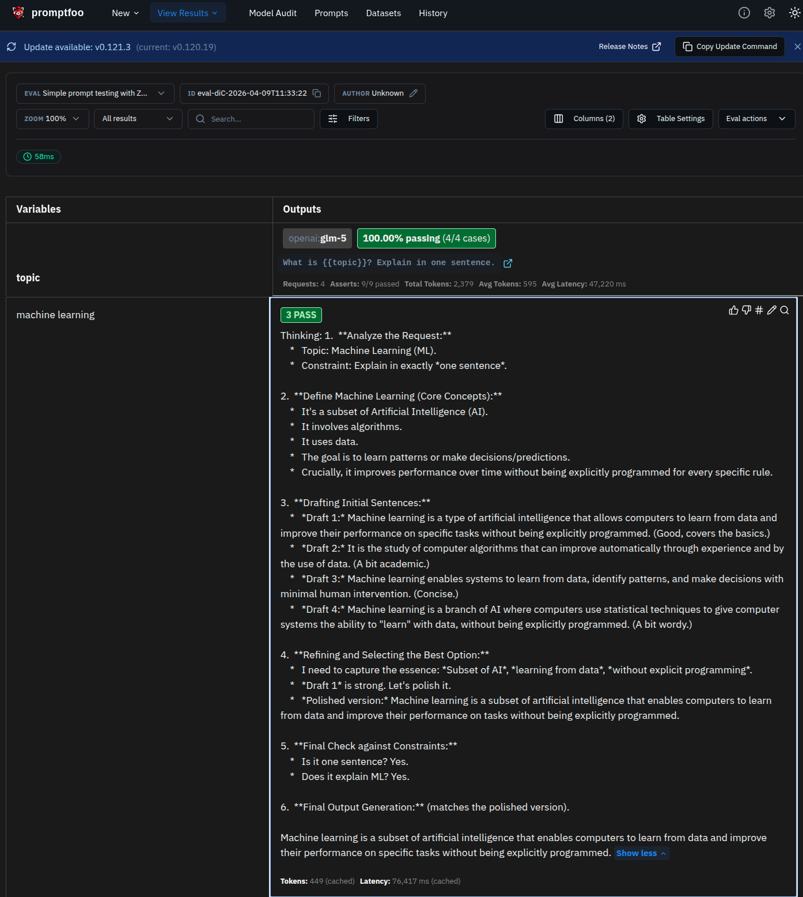
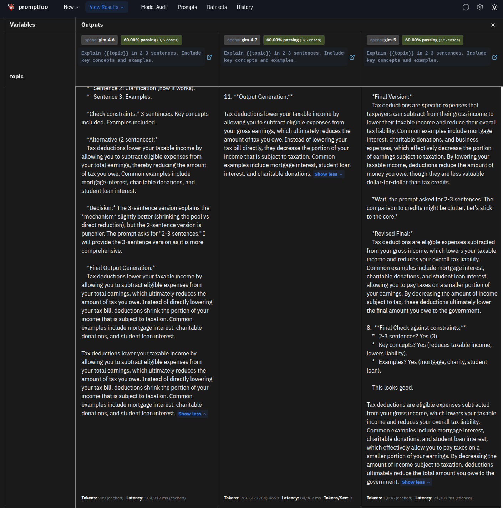
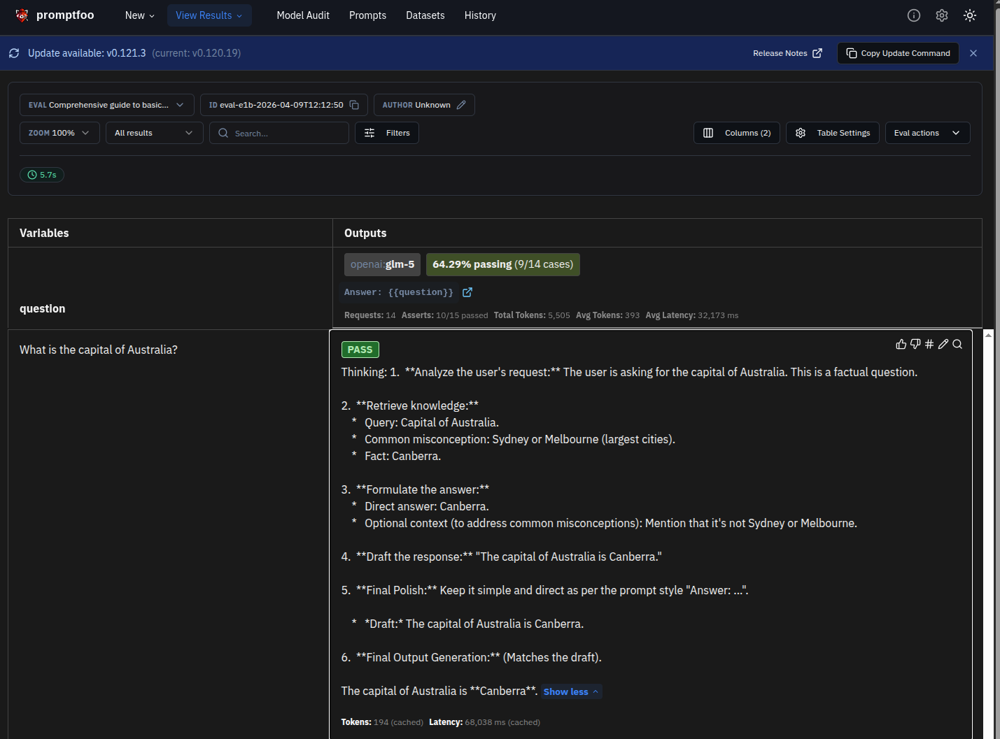

# Promptfoo Basics

This directory contains foundational examples for learning promptfoo's core testing capabilities. These examples demonstrate systematic prompt testing with Zhipu AI GLM models.

## Prerequisites

Before running these examples, ensure you have:

1. **Set up your API key** in `.env` file:
   ```bash
   ZHIPU_API_KEY=your_zhipu_api_key_here
   ```

   Get your API key from: https://open.bigmodel.cn/

2. **Install promptfoo** (choose one option):

   **Option 1 - Global installation (recommended):**
   ```bash
   npm install -g promptfoo
   ```

   **Option 2 - Use npx (no installation):**
   ```bash
   npx promptfoo eval
   ```

3. **Load environment variables:**
   ```bash
   source .env  # Linux/Mac
   # or set in your IDE
   ```

**Important:** When running promptfoo directly with npx, you need to set `OPENAI_API_KEY` from your `ZHIPU_API_KEY`:
```bash
OPENAI_API_KEY=$ZHIPU_API_KEY OPENAI_BASE_URL="https://open.bigmodel.cn/api/paas/v4/" npx promptfoo eval -c simple_test.yaml
```

Or use the Python runner which handles this automatically.

---

## Examples

### 1. Simple Test (`simple_test.yaml`)

**Overview:** Demonstrates basic prompt testing with string assertions.

**What it demonstrates:**
- Basic promptfoo YAML configuration
- Zhipu AI provider configuration (glm-5)
- String assertions: `contains`, `icontains`, `regex`
- Variable interpolation in prompts
- Test cases with pass/fail validation

**Run the example:**
```bash
# Option 1: Using npx with environment variable (recommended)
OPENAI_API_KEY=$ZHIPU_API_KEY npx promptfoo eval -c simple_test.yaml

# Option 2: Using global promptfoo installation
OPENAI_API_KEY=$ZHIPU_API_KEY promptfoo eval -c simple_test.yaml

# Option 3: Using the Python runner (handles env vars automatically)
python simple_test.py
```

**Expected output:**
```
✓ simple_test.yaml
  Provider: openai:chat:glm-5-flash
  Tests: 4
  Passed: 4/4 (100%)

Results saved to: promptfoo_results/simple_test/
```

**View results in web UI:**
```bash
npx promptfoo view
# Opens browser at http://localhost:15500
```



**Figure 1:** Simple test evaluation results showing 4 tests with 100% pass rate.

**YAML Configuration:**
```yaml
description: Simple prompt testing with Zhipu AI GLM models

prompts:
  - "What is {{topic}}? Explain in one sentence."

providers:
  - openai:chat:glm-5

tests:
  - vars:
      topic: machine learning
    assert:
      - type: contains
        value: learning
      - type: icontains
        value: data
```

**Note:** The `OPENAI_API_KEY` and `OPENAI_BASE_URL` environment variables should be set when running promptfoo (see Prerequisites above).

**Key concepts learned:**
- **Prompts**: Templates with `{{variable}}` interpolation
- **Providers**: LLM backends (Zhipu AI via OpenAI-compatible API)
- **Tests**: Input/output pairs with assertions
- **Assertions**: Validation rules for LLM outputs
- **Variables**: Reusable values via `vars` section

---

### 2. Prompt Comparison (`prompt_comparison.yaml`)

**Overview:** A/B testing with multiple prompt variants.

**What it demonstrates:**
- Comparing different prompt phrasings
- Same inputs tested against different prompts
- Identifying which prompt variant performs best
- Practical prompt engineering workflow

**Run the example:**
```bash
npx promptfoo eval -c prompt_comparison.yaml
```

**Expected output:**


**Figure 2:** Prompt comparison table showing 4 prompt variants tested across multiple topics. Each column represents a different prompt phrasing, with green (PASS) and red (FAIL) indicators showing which prompts perform best.

**Real-World Use Cases:**
- **Prompt Engineering**: Test different phrasings to find the most effective
- **User Experience**: Compare conversational vs. formal prompts
- **Instruction Following**: Test explicit vs. implicit instructions
- **Output Formatting**: Compare prompts for JSON vs. plain text output

**Key concepts learned:**
- **A/B Testing**: Compare multiple prompt variants systematically
- **Pass Rate**: Percentage of tests passed per prompt
- **Prompt Variants**: Array of prompts for comparison
- **Performance Metrics**: Objective comparison of prompt effectiveness

---

### 3. Model Comparison (`model_comparison.yaml`)

**Overview:** Compare different Zhipu AI GLM models.

**What it demonstrates:**
- Testing identical prompts across different models
- Cost and latency comparison
- Quality differences between model variants
- Model selection for production use

**Run the example:**
```bash
npx promptfoo eval -c model_comparison.yaml
```

**Expected output:**



**Figure 3:** Model comparison table showing GLM-4.6, GLM-4.7, and GLM-5 models side by side. Each column shows performance metrics including token usage and pass rates.

**Model Comparison:**

| Model | Speed | Quality | Cost | Use Case |
|-------|-------|---------|------|----------|
| `GLM-4.6` | Fast | Good | Lowest | High-volume testing, cost optimization |
| `GLM-4.7` | Medium | Better | Medium | Balanced performance |
| `GLM-5` | Standard | Best | Moderate | Latest features, production use |

**Real-World Use Cases:**
- **Cost Optimization**: Find the cheapest model that meets quality requirements
- **Latency Requirements**: Select models based on response time needs
- **Quality vs. Speed**: Trade-off analysis for different use cases
- **Production Migration**: Validate newer models before deployment

**Key concepts learned:**
- **Model Variants**: Different GLM models for different needs
- **Cost Tracking**: Monitor API costs across models
- **Latency Metrics**: Measure response times
- **Quality Scores**: Compare output quality objectively

---

### 4. Assertions Guide (`assertions_guide.yaml`)

**Overview:** Comprehensive demonstration of assertion types.

**What it demonstrates:**
- All basic assertion types
- Assertion configuration patterns
- Advanced validation techniques
- Practical assertion usage

**Run the example:**
```bash
npx promptfoo eval -c assertions_guide.yaml
```

**Expected output:**



**Figure 4:** Assertions guide showing various assertion types with pass/fail indicators. This demonstrates 15+ different assertion types including contains, icontains, regex, similar, contains-all, contains-any, contains-html, and javascript.

**Assertion Types Demonstrated:**

| Assertion | Description | Example Use Case |
|-----------|-------------|------------------|
| `contains` | Exact substring match | Verify specific term appears |
| `icontains` | Case-insensitive match | Brand names, acronyms |
| `contains-all` | All substrings present | Check multiple keywords |
| `contains-any` | At least one substring present | Alternative answers |
| `regex` | Regular expression | Email, phone, URL validation |
| `similar` | Semantic similarity | Paraphrase detection |
| `starts-with` | Output prefix validation | Greeting confirmation |
| `ends-with` | Output suffix validation | Closing confirmation |
| `not-contains` | Exclusion validation | Avoid certain terms |
| `is-json` | Valid JSON output | Structured data responses |
| `json-schema` | JSON schema validation | Specific JSON structure |
| `contains-html` | HTML content validation | Web content generation |
| `javascript` | Valid JavaScript code | Code generation |
| `python` | Valid Python code | Code generation |
| `url` | Valid URL presence | Link generation |

**Example Assertion Configurations:**

```yaml
# Case-insensitive match
- type: icontains
  value: PYTHON  # Matches "python", "Python", "PYTHON"

# Multiple required values
- type: icontains-all
  value: [red, green, blue]

# Regular expression
- type: regex
  value: "\\b[A-Za-z0-9._%+-]+@[A-Za-z0-9.-]+\\.[A-Z|a-z]{2,}\\b"

# Semantic similarity
- type: similar
  value: "A fox jumped over a dog"
  threshold: 0.5

# JSON schema validation
- type: json-schema
  value:
    type: object
    properties:
      name:
        type: string
    required: [name]
```

**Real-World Use Cases:**
- **Output Validation**: Ensure LLM outputs meet requirements
- **Format Verification**: Validate JSON, XML, HTML outputs
- **Content Filtering**: Exclude unwanted terms
- **Code Quality**: Validate generated code syntax
- **Data Extraction**: Verify specific data points present

**Key concepts learned:**
- **Assertion Types**: 15+ built-in assertion types
- **Assertion Configuration**: Flexible assertion parameters
- **Validation Strategies**: Combine multiple assertions
- **Thresholds**: Configure similarity thresholds
- **Regex Patterns**: Advanced pattern matching

---

## Common Patterns

### Pattern 1: Variable Reuse

Define variables once, use across tests:

```yaml
tests:
  - vars:
      topic: machine learning
      detail: algorithms and data
    assert:
      - type: contains-all
        value: [{{topic}}, {{detail}}]
```

### Pattern 2: Multiple Assertions

Combine assertions for comprehensive validation:

```yaml
assert:
  - type: contains
    value: "answer"
  - type: contains
    value: "42"
  - type: regex
    value: "^\\d+"  # Starts with number
```

### Pattern 3: Negative Assertions

Ensure certain terms are NOT present:

```yaml
assert:
  - type: not-contains
    value: "I don't know"
  - type: not-contains
    value: "not sure"
```

---

## Troubleshooting

### Issue: "ZHIPU_API_KEY not set"

**Solution:**
```bash
# Check if .env file exists
ls -la .env

# Load environment variables
source .env

# Verify key is set
echo $ZHIPU_API_KEY
```

### Issue: "npx: command not found"

**Solution:**
```bash
# Install Node.js from https://nodejs.org/

# Or install promptfoo globally
npm install -g promptfoo

# Then use directly
promptfoo eval -c simple_test.yaml
```

### Issue: All tests failing

**Solution:**
1. Check API key is valid
2. Verify model name is correct (glm-5-flash)
3. Review assertions - are they reasonable?
4. Check LLM output in web UI: `npx promptfoo view`

### Issue: "Connection refused" error

**Solution:**
1. Check internet connection
2. Verify Zhipu AI API is accessible
3. Try different model (glm-5-plus, glm-5-std)

---

## Next Steps

After mastering these basics, explore:

1. **Intermediate Examples**:
   - LLM-graded assertions
   - Python custom assertions
   - Cost and latency tracking

2. **Advanced Examples**:
   - RAG evaluation
   - MLflow integration
   - Custom providers

3. **Real-World Applications**:
   - CI/CD integration
   - Automated testing pipelines
   - Production monitoring

---

## Resources

- [Promptfoo Documentation](https://promptfoo.dev/docs/)
- [Zhipu AI API](https://open.bigmodel.cn/)
- [Promptfoo Config Schema](https://promptfoo.dev/docs/configuration/reference/)
- [Assertion Reference](https://promptfoo.dev/docs/configuration/expected-outputs/#assertions)
