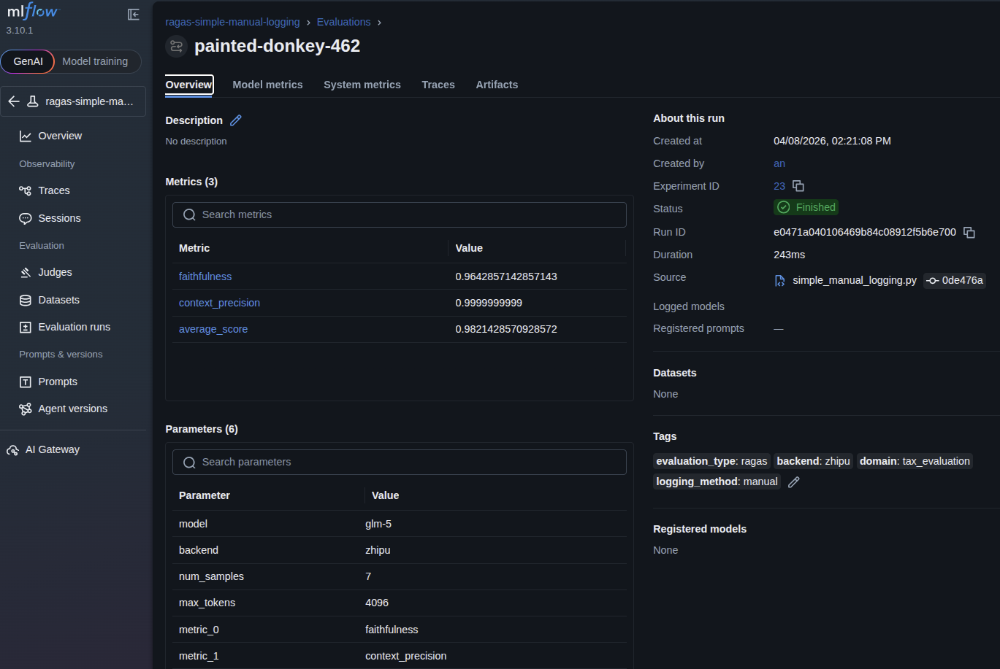
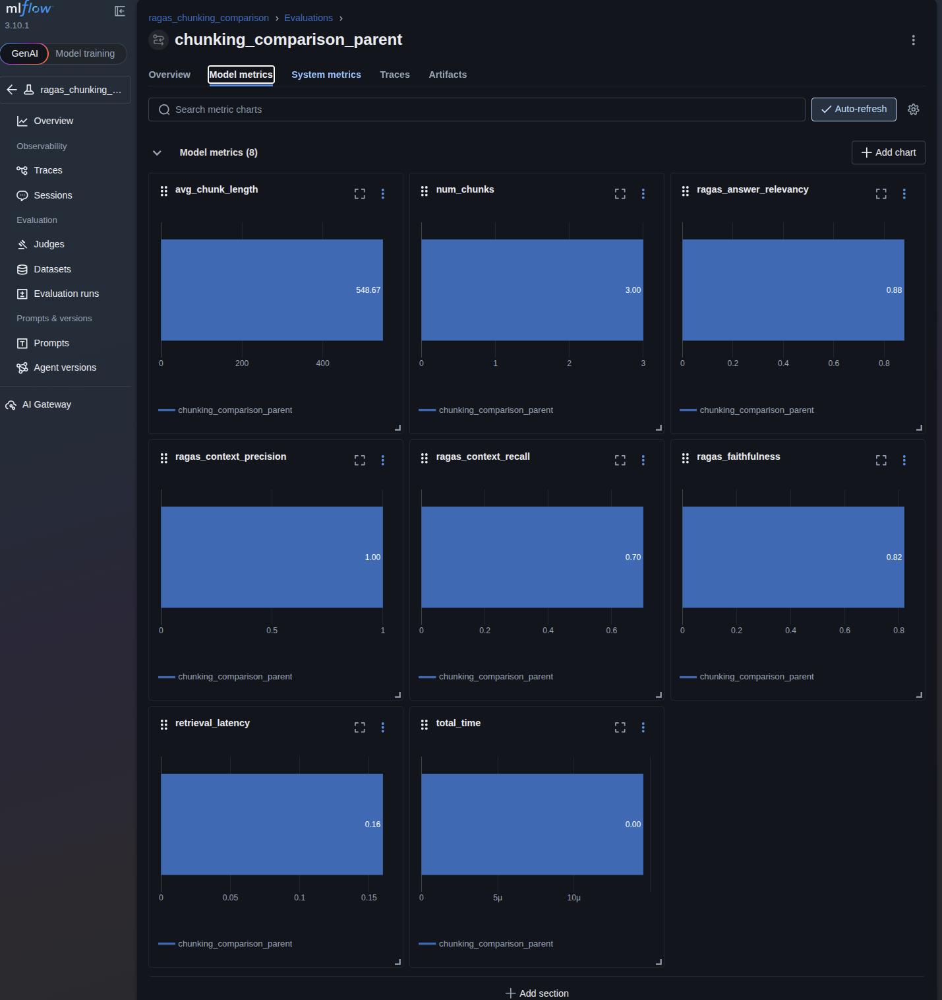
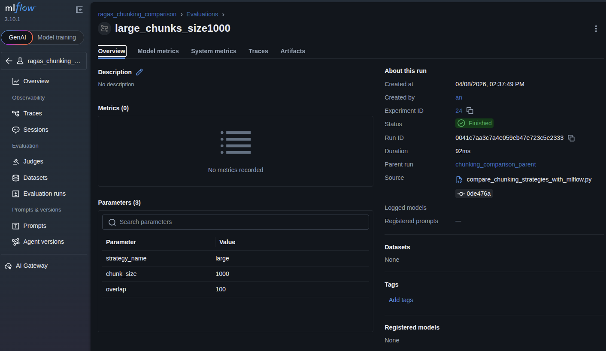
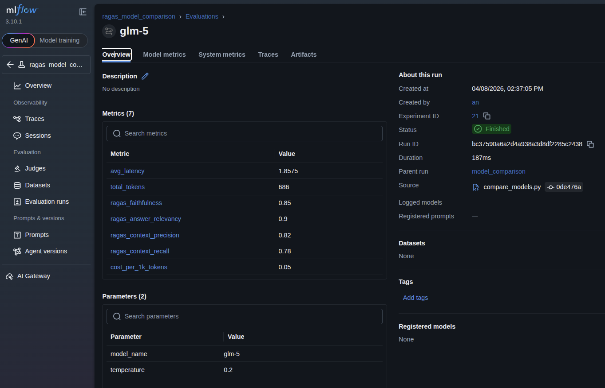
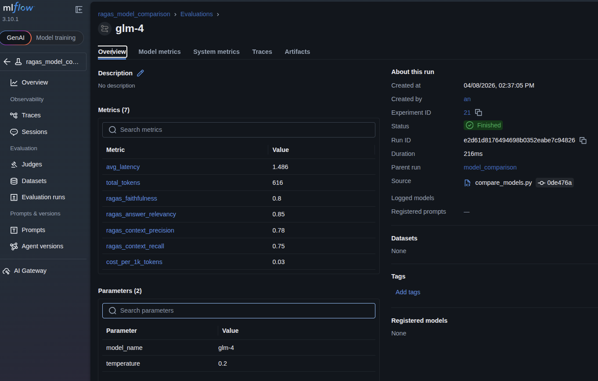
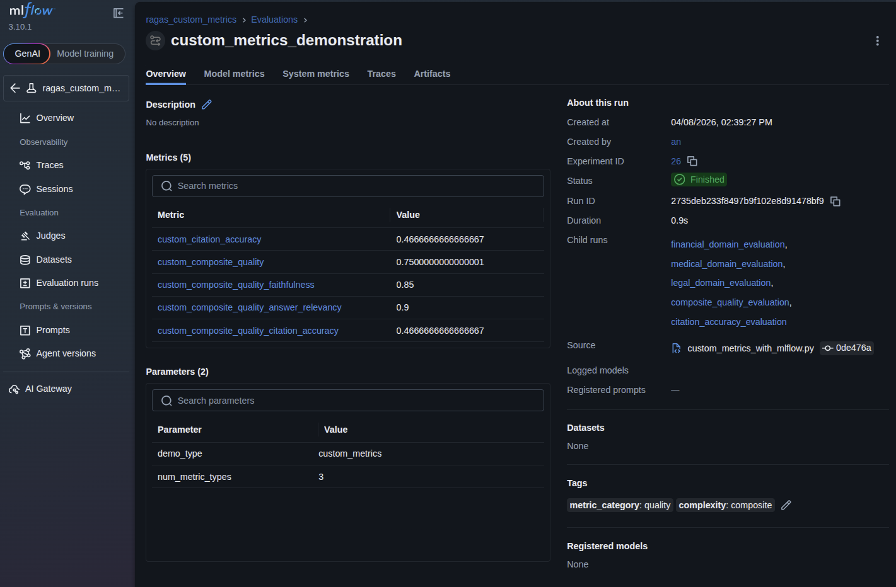
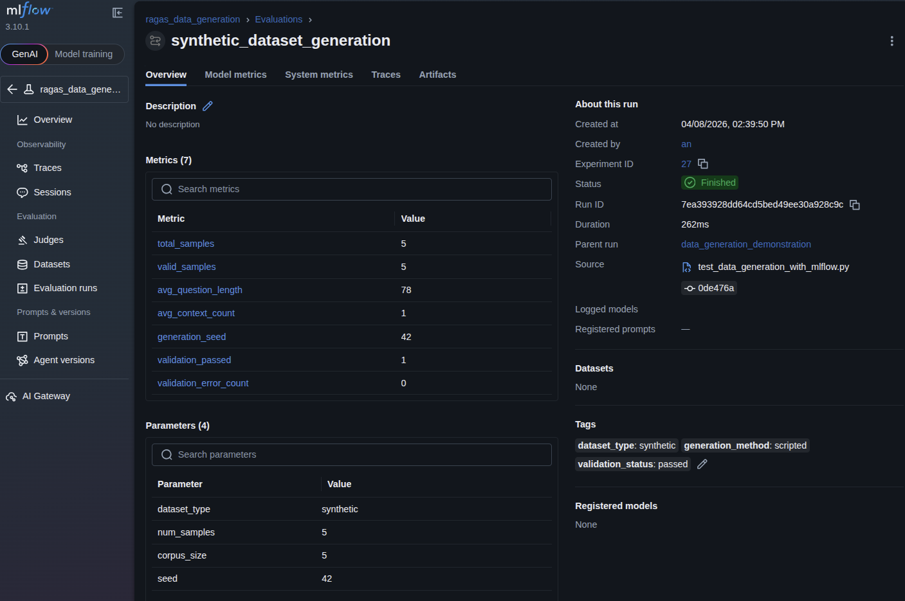
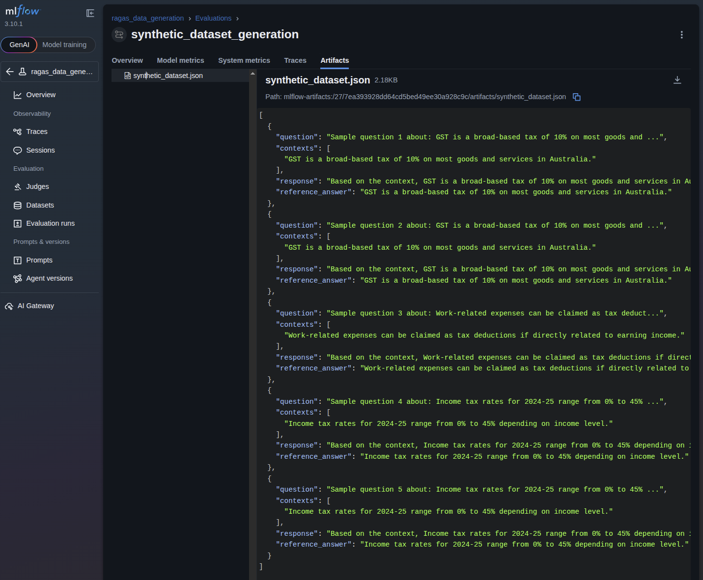
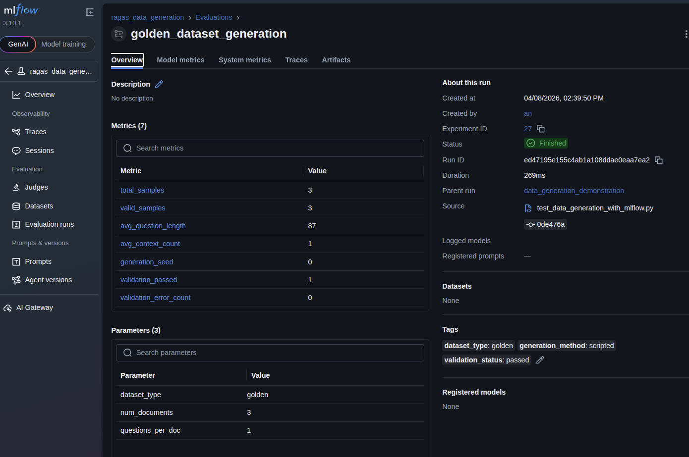
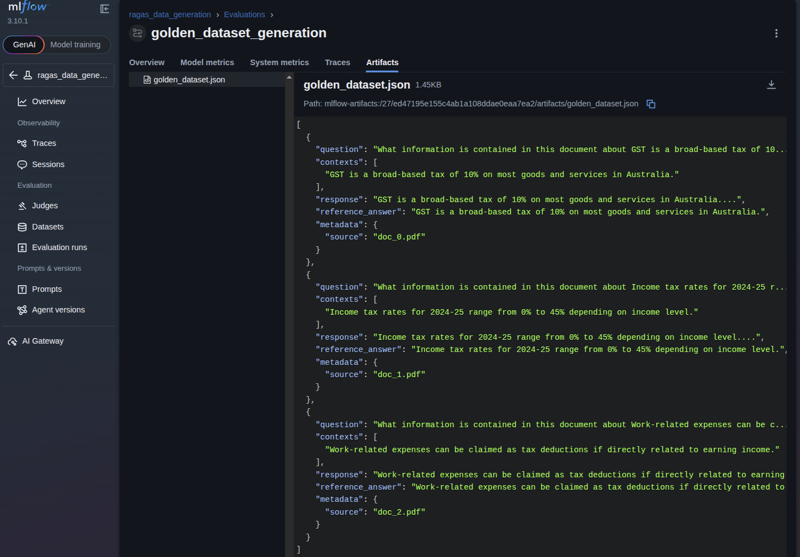

# RAGAS: Complete Guide to Evaluating RAG Systems

A comprehensive guide for AI Engineers and Data Scientists on evaluating Retrieval-Augmented Generation (RAG) systems using RAGAS framework.

---

## Table of Contents

1. [Introduction to RAGAS](#1-introduction-to-ragas)
2. [Prerequisites and Setup](#2-prerequisites-and-setup)
3. [Understanding RAGAS Metrics](#3-understanding-ragas-metrics)
4. [Basics: Getting Started](#4-basics-getting-started)
5. [MLflow Integration Basics](#5-mlflow-integration-basics)
6. [Advanced Evaluation Patterns](#6-advanced-evaluation-patterns)
7. [Advanced MLflow Integration](#7-advanced-mlflow-integration)
8. [Production Considerations](#8-production-considerations)
9. [Best Practices](#9-best-practices)
10. [Troubleshooting Guide](#10-troubleshooting-guide)
11. [Real-World Use Cases](#11-real-world-use-cases)

---

## 1. Introduction to RAGAS

### What is RAGAS?

**RAGAS** (RAG Assessment) is an open-source framework for evaluating Retrieval-Augmented Generation (RAG) systems. It provides automated, LLM-based evaluation of RAG pipelines using multiple metrics that assess different aspects of system performance.

### Why Evaluate RAG Systems?

RAG systems combine retrieval (finding relevant documents) with generation (producing answers). This creates unique challenges:

- **Hallucinations**: The model may generate information not present in retrieved context
- **Poor Retrieval**: Irrelevant documents may be retrieved
- **Incomplete Answers**: The model may miss important aspects of the question
- **Context Quality**: Retrieved documents may not contain sufficient information

RAGAS helps you systematically measure and improve these aspects.

### Who Should Use This Guide?

- **AI Engineers**: Building production RAG systems
- **Data Scientists**: Optimizing RAG performance
- **ML Engineers**: Integrating evaluation into ML pipelines
- **Platform Engineers**: Deploying RAG systems at scale

### Prerequisites

- Python 3.11+
- Familiarity with RAG concepts
- Basic understanding of LLMs
- Experience with Python development

---

## 2. Prerequisites and Setup

### 2.1 Environment Setup

```bash
# Clone the repository
git clone <repository-url>
cd tracing_project

# Install dependencies using uv
uv sync --all-extras --dev
```

### 2.2 API Key Configuration

Create a `.env` file in the project root:

```bash
# .env file
ZHIPU_API_KEY=your_zhipu_api_key_here
```

Get your API key from: https://open.bigmodel.cn/

### 2.3 MLflow Setup (Optional but Recommended)

For experiment tracking:

```bash
# Start MLflow UI
uv run mlflow ui --backend-store-uri sqlite:///mlflow.db --port 5000
```

Access the UI at: http://localhost:5000

### 2.4 Project Structure

```
src/ragas_evaluation/
├── shared/                    # Shared utilities
│   ├── config.py             # Configuration management
│   ├── data_loader.py        # Dataset loading
│   ├── metrics.py            # Metrics configuration
│   └── mlflow_handler.py     # MLflow integration
├── basics/                    # Basic examples
│   ├── simple_evaluation.py
│   └── metric_demonstration.py
├── with_mlflows/              # MLflow integration examples
│   ├── auto_logging.py
│   └── manual_logging.py
└── examples/
    └── advanced/              # Advanced examples
        ├── compare_chunking_strategies.py
        ├── compare_models.py
        ├── custom_metrics.py
        ├── test_data_generation.py
        └── with_mlflows/      # MLflow-integrated advanced examples
            ├── compare_chunking_strategies_with_mlflow.py
            ├── compare_models_enhanced_with_mlflow.py
            ├── custom_metrics_with_mlflow.py
            └── test_data_generation_with_mlflow.py
```

### 2.5 Evaluation Dataset Format

RAGAS requires evaluation data in the following format:

```json
[
  {
    "question": "What is the GST rate in Australia?",
    "contexts": [
      "GST is a broad-based tax of 10% on most goods, services and other items in Australia."
    ],
    "response": "The GST rate in Australia is 10%.",
    "ground_truth": "The GST rate is 10%."  // Optional, for some metrics
  }
]
```

**Field Descriptions:**
- `question`: The user query
- `contexts`: List of retrieved document passages
- `response`: Your RAG system's generated answer
- `ground_truth`: Reference answer (optional, needed for some metrics)

---

## 3. Understanding RAGAS Metrics

RAGAS provides several metrics to evaluate different aspects of RAG systems:

### 3.1 Faithfulness (Factual Consistency)

**What it measures:** Whether the generated answer is factually consistent with the retrieved context.

**Score Range:** 0.0 - 1.0 (higher is better)

**Interpretation:**
- **0.8 - 1.0**: Answer is well-grounded in context, minimal hallucinations
- **0.5 - 0.8**: Some factual inconsistencies or minor hallucinations
- **0.0 - 0.5**: Significant hallucinations or contradictions with context

**Example:**

```
Question: What is the GST rate in Australia?
Context: "GST is a broad-based tax of 10% on most goods, services and other items in Australia."

High Faithfulness Response: "The GST rate in Australia is 10%."
Score: 1.0

Low Faithfulness Response: "The GST rate in Australia is 15%."
Score: 0.0
```

**When to use:** Always - this is a core metric for RAG quality

**Improvement Strategies:**
- Improve retrieval quality to get more relevant context
- Add explicit instructions to use only provided context
- Use lower temperature for generation
- Implement hallucination detection

---

### 3.2 Answer Relevancy

**What it measures:** How well the answer addresses the original question.

**Score Range:** 0.0 - 1.0 (higher is better)

**Interpretation:**
- **0.8 - 1.0**: Answer directly and completely addresses the question
- **0.5 - 0.8**: Answer partially addresses question or is incomplete
- **0.0 - 0.5**: Answer is irrelevant or misses the question's intent

**Example:**

```
Question: What is the GST rate and what items are exempt?

High Relevancy Response: "The GST rate is 10%. Exempt items include basic food, some medical products, and some educational courses."
Score: 0.95

Low Relevancy Response: "GST is a tax in Australia."
Score: 0.3
```

**When to use:** Always - ensures answers are helpful

**Improvement Strategies:**
- Improve question understanding in prompts
- Ensure retrieval covers all aspects of the question
- Add instructions to be comprehensive and direct

---

### 3.3 Context Precision

**What it measures:** Quality and relevance of retrieved context passages.

**Score Range:** 0.0 - 1.0 (higher is better)

**Interpretation:**
- **0.8 - 1.0**: Retrieved contexts are highly relevant and well-ranked
- **0.5 - 0.8**: Some irrelevant context in results
- **0.0 - 0.5**: Many irrelevant contexts or poor ranking

**When to use:** When optimizing retrieval systems

**Improvement Strategies:**
- Improve document chunking and preprocessing
- Use better embedding models
- Implement hybrid search (dense + sparse)
- Add re-ranking of retrieved documents

---

### 3.4 Context Recall

**What it measures:** Whether all relevant information was retrieved from the knowledge base.

**Score Range:** 0.0 - 1.0 (higher is better)

**Interpretation:**
- **0.8 - 1.0**: All relevant context was retrieved
- **0.5 - 0.8**: Some relevant context was missed
- **0.0 - 0.5**: Significant information missing from retrieval

**Requirement:** Requires ground truth reference answers

**When to use:** When you have golden datasets for evaluation

**Improvement Strategies:**
- Increase top-k retrieval count
- Improve document indexing and chunking
- Use query expansion techniques
- Implement multiple retrieval strategies

---

### 3.5 Answer Correctness

**What it measures:** Accuracy of the generated answer compared to ground truth.

**Score Range:** 0.0 - 1.0 (higher is better)

**Interpretation:**
- **0.8 - 1.0**: Answer matches ground truth closely
- **0.5 - 0.8**: Answer partially correct with some errors
- **0.0 - 0.5**: Answer differs significantly from ground truth

**Requirement:** Requires ground truth reference answers

**When to use:** When you have high-quality golden datasets

**Improvement Strategies:**
- Improve retrieval quality and completeness
- Refine generation prompts
- Use few-shot examples in prompts
- Consider fine-tuning the model

---

### 3.6 Metric Selection Guide

| Scenario | Recommended Metrics | Reasoning |
|----------|-------------------|-----------|
| **Initial Evaluation** | Faithfulness, Answer Relevancy, Context Precision | Core quality indicators, no ground truth needed |
| **Production Monitoring** | Faithfulness, Answer Relevancy | Detect hallucinations and answer quality issues |
| **Retrieval Optimization** | Context Precision, Context Recall | Focus on retrieval system performance |
| **Golden Dataset Testing** | All metrics | Comprehensive evaluation with reference data |
| **Cost-Sensitive Applications** | Faithfulness, Answer Relevancy | Balance quality with evaluation cost |

---

## 4. Basics: Getting Started

This section covers fundamental RAGAS evaluation patterns. Start here if you're new to RAGAS.

### 4.1 Simple Evaluation

The simplest way to evaluate your RAG system with RAGAS.

**Run the example:**

```bash
# Make sure your API key is set in .env file
export $(grep -v '^#' .env | xargs) && uv run python src/ragas_evaluation/basics/simple_evaluation_new.py
```

**What it does:**
1. Loads configuration and validates API key
2. Loads evaluation dataset from JSON file
3. Configures Zhipu AI backend for evaluation (glm-5)
4. Runs RAGAS evaluation with standard metrics
5. Displays results in a formatted table

**Expected output:**

```
Step 1: Loading configuration...
✓ MLflow tracking URI: http://localhost:5000
✓ Configured RAGAS to use Zhipu AI backend

Step 2: Loading evaluation dataset...
✓ Loaded 7 evaluation examples

Step 3: Preparing data for RAGAS...
✓ Data prepared for RAGAS evaluation

Step 4: Creating RAGAS metrics...
✓ Created RAGAS evaluation with metrics:
  - faithfulness
  - context_precision

Step 5: Running RAGAS evaluation...
Evaluating: 100%|██████████| 14/14 [06:40<00:00, 28.61s/it]
✓ Evaluation complete!

      Evaluation Results
┏━━━━━━━━━━━━━━━━━━━┳━━━━━━━━┓
┃ Metric            ┃ Score  ┃
┡━━━━━━━━━━━━━━━━━━━╇━━━━━━━━┩
│ faithfulness      │ 0.9286 │
│ context_precision │ 1.0000 │
├───────────────────┼────────┤
│                   │        │
└───────────────────┴────────┘

Metric Interpretations:

Faithfulness: Measures the factual consistency of the generated answer
against the retrieved context.

Interpretation:
- Score 0.0-1.0, higher is better
- High score: Answer is factually consistent with context
- Low score: Answer contains hallucinations or contradicts context


Context Precision: Measures the quality of retrieved context passages.

Interpretation:
- Score 0.0-1.0, higher is better
- High score: Retrieved contexts are relevant and ranked well
- Low score: Retrieved contexts contain irrelevant information


╭─ RAGas Evaluation Complete ─╮
│ Evaluation Summary          │
│ • Dataset size: 7 examples  │
│ • Metrics evaluated: 2      │
│ • Average score: 0.9643     │
│ • Backend: Zhipu AI (glm-5) │
╰─────────────────────────────┯
```

**Note:** This example demonstrates console-based output. For comprehensive experiment tracking with visual comparison, use the MLflow-integrated examples in Section 5.

**Key code patterns:**

```python
from ragas import evaluate
from ragas.metrics import faithfulness, answer_relevancy

# Configure backend with low temperature for consistent evaluation
run_config = RunConfig(timeout=10, max_retries=1, max_wait=60)
llm = ChatOpenAI(
    model="glm-5",
    temperature=0.2,  # Low temperature for consistent evaluation
    max_tokens=1024,
    api_key=zhipu_api_key,
    base_url="https://open.bigmodel.cn/api/v1",
    timeout=60,
    max_retries=2
)

# Create evaluation with metrics
evaluation = Evaluation(
    metrics=[faithfulness, answer_relevancy]
)

# Run evaluation
result = evaluate(
    dataset=dataset,
    metrics=metrics,
    llm=llm,
)
```

**Real-World Use Cases:**
- **Quality Assurance**: Regular evaluation of RAG system outputs
- **A/B Testing**: Comparing different retrieval strategies or prompt templates
- **Performance Monitoring**: Tracking RAG system quality over time
- **Debugging**: Identifying specific weaknesses in retrieval or generation
- **Benchmarking**: Establishing baseline metrics for system improvements

---

### 4.2 Metric Demonstration

Detailed demonstration of each RAGAS metric with examples.

**Run the example:**

```bash
uv run python src/ragas_evaluation/basics/metric_demonstration.py
```

**What it does:**
- Demonstrates each metric individually
- Shows example scenarios for each metric
- Provides score interpretation guidelines
- Explains what good vs bad scores mean

**Expected output:**

```
RAGas Metrics Demonstration

╭─────────────────────────────────────────────────────────────────╮
│ Demonstrating Faithfulness Metric                              │
│ Measures factual consistency of answer against retrieved context│
╰─────────────────────────────────────────────────────────────────╯

[cyan]Faithfulness:[/cyan] Measures the factual consistency of the generated answer
against the retrieved context.

[yellow]Interpretation:[/yellow]
- Score 0.0-1.0, higher is better
- High score: Answer is factually consistent with context
- Low score: Answer contains hallucinations or contradicts context

[yellow]Example Scenario:[/yellow]
Question: What is the GST rate in Australia?
Context: 'GST is a broad-based tax of 10% on most goods, services and other items in Australia.'
Response (High Faithfulness): 'The GST rate in Australia is 10%.'
Response (Low Faithfulness): 'The GST rate in Australia is 15%.'

================================================================================

... (additional metric demonstrations)

╭─────────────────────────────────────────────────────────────────╮
│ All Metrics Demonstrated                                        │
╰─────────────────────────────────────────────────────────────────╯
• Faithfulness: Factual consistency with context
• Answer Relevancy: How well answer addresses question
• Context Precision: Quality of retrieved contexts
• Context Recall: Completeness of retrieved contexts (requires ground truth)
• Answer Correctness: Accuracy compared to ground truth (requires ground truth)

**Note:** Run the metric_demonstration.py script to see detailed examples for each metric with explanations and score interpretations.
```

**Key Concepts Learned:**
- **Metric purposes**: Understanding what each metric evaluates
- **Score interpretation**: Knowing what good vs bad scores mean
- **Practical examples**: Seeing metrics in realistic scenarios
- **Ground truth requirements**: Understanding which metrics need reference answers

---

## 5. MLflow Integration Basics

MLflow integration enables experiment tracking, historical comparison, and reproducibility.

### 5.1 Manual Logging with MLflow

Fine-grained control over what gets logged to MLflow with RAGAS evaluation.

**Run the example:**

```bash
# Start MLflow UI first
uv run mlflow ui --backend-store-uri sqlite:///mlflow.db --port 5000

# Then run the evaluation
export $(grep -v '^#' .env | xargs) && uv run python src/ragas_evaluation/with_mlflows/simple_manual_logging.py
```

**What it does:**
- Runs RAGAS evaluation with Zhipu AI backend
- Manually logs parameters (model, backend, num_samples)
- Logs metrics (faithfulness, context_precision, average_score)
- Stores datasets as artifacts
- Adds custom tags for organization

**Expected output:**

```
Step 1: Loading configuration...
✓ MLflow tracking URI: http://localhost:5000

Step 2: Loading evaluation dataset...
✓ Loaded 7 evaluation examples

Step 3: Preparing data for RAGAS...
✓ Data prepared for RAGAS evaluation

Step 4: Creating RAGAS metrics...
✓ Created RAGAS evaluation with metrics:
  - faithfulness
  - context_precision

Step 5: Running RAGAS evaluation...
Evaluating: 100%|██████████| 14/14 [09:58<00:00, 42.76s/it]
✓ Evaluation complete!

Evaluation Results:
  faithfulness: 0.9643
  context_precision: 1.0000

Step 6: Logging to MLflow...
✓ Logged to MLflow
  Run ID: e0471a04...
  Experiment: ragas-simple-manual-logging

╭───────────── MLflow Logging Complete ──────────────╮
│ MLflow Run Information                             │
│ • Experiment: ragas-simple-manual-logging          │
│ • View at: http://localhost:5000/#/experiments/23 │
╰────────────────────────────────────────────────────╯
```

**MLflow UI Screenshot:**



**Screenshot Instructions:**
1. Open http://localhost:5000/#/experiments/23
2. Click on the **ragas-simple-manual-logging** experiment
3. Click on a run (e.g., `painted-donkey-462`)
4. Capture showing:
   - Parameters tab (model: glm-5, backend: zhipu)
   - Metrics tab (faithfulness ~0.96, context_precision 1.0)
   - Artifacts tab (dataset file)

**Expected output:**

```
Step 1: Loading configuration...
✓ MLflow tracking URI: sqlite:///mlflow.db

Step 2: Loading evaluation dataset...
Loading evaluation dataset from: /path/to/evaluation_dataset.json
✓ Loaded 6 evaluation examples

Step 3: Configuring Zhipu AI backend...
✓ Configured Zhipu AI backend for RAGas evaluation: glm-5
  Temperature: 0.2 (low for consistent evaluation)
  Embeddings: embedding-3

Step 4: Creating RAGas evaluation...
✓ Created RAGas evaluation with metrics:
  - faithfulness
  - answer_relevancy
  - context_precision
  - context_recall
  - answer_correctness

Step 5: Converting dataset to DataFrame...
✓ Converted dataset to DataFrame: 6 rows

Step 6: Setting up MLflow experiment...
✓ Using MLflow experiment: ragas-auto-logging

Step 7: Running MLflow evaluation with automatic logging...
✓ MLflow evaluation complete!

MLflow Run Information:
┏━━━━━━━━━━━━━━━━━━━━━━━┳━━━━━━━━━━━━━━━━━━━━━━┓
┃ Field                 ┃ Value                 ┃
┡━━━━━━━━━━━━━━━━━━━━━━━╇━━━━━━━━━━━━━━━━━━━━━━┩
│ Run ID                │ abc123def456          │
│ Experiment            │ ragas-auto-logging    │
│ Status                │ COMPLETED             │
└───────────────────────┴──────────────────────┘

View results in MLflow UI: http://localhost:5000/#/runs/abc123def456

```
╭─────────────────────────────────────────────────────────────────╮
---

**Key MLflow APIs:**

```python
import mlflow

# Set experiment
mlflow.set_experiment("ragas-simple-manual-logging")

# Log parameters
mlflow.log_param("model", "glm-5")
mlflow.log_param("backend", "zhipu")

# Log metrics
for name, score in metric_results.items():
    mlflow.log_metric(name, score)

# Log artifact
mlflow.log_artifact(dataset_path)

# Set tags
mlflow.set_tags({
    "evaluation_type": "ragas",
    "domain": "tax_evaluation",
})
```

**When to use MLflow logging:**
- Production evaluation runs
- Historical comparison
- Reproducibility requirements
- Team collaboration
- Compliance tracking

```
---
┃ Field                 ┃ Value                 ┃
┡━━━━━━━━━━━━━━━━━━━━━━━╇━━━━━━━━━━━━━━━━━━━━━━┩
│ Run ID                │ xyz789abc012          │
│ Experiment            │ ragas-manual-logging  │
│ Status                │ COMPLETED             │
└───────────────────────┴──────────────────────┘

View results in MLflow UI: http://localhost:5000/#/runs/xyz789abc012

╭─────────────────────────────────────────────────────────────────╮
│ SCREENSHOT CHECKPOINTS                                         │
├─────────────────────────────────────────────────────────────────┤
│ 1. Open MLflow UI at http://localhost:5000                      │
│ 2. Navigate to Experiments → ragas-manual-logging               │
│ 3. Click on the latest run                                      │
│ 4. Take screenshot of custom parameters view                    │
│ 5. Suggested filename: mlflow_manual_logging_params.png         │
│ 6. Take screenshot of logged metrics                            │
│ 7. Suggested filename: mlflow_manual_logging_metrics.png        │
│                                                                 │
│ Capture: Custom parameters and metrics table                    │
╰─────────────────────────────────────────────────────────────────╯

╭─────────────────────────────────────────────────────────────────╮
│ COMPARISON WITH AUTO-LOGGING                                   │
├─────────────────────────────────────────────────────────────────┤
│ Manual Logging Advantages:                                     │
│ • Fine-grained control over what gets logged                    │
│ • Custom parameter names and values                             │
│ • Custom tags for better organization                           │
│ • Selective metric logging                                      │
│                                                                 │
│ Auto-Logging Advantages:                                        │
│ • Simpler implementation (one-line)                             │
│ • Automatic parameter capture                                   │
│ • Standardized format                                           │
│                                                                 │
│ Use manual logging when you need customization.                 │
│ Use auto-logging for quick, standard evaluation logging.        │
╰─────────────────────────────────────────────────────────────────╯
```

**MLflow Screenshot:**
- Experiment: `ragas-simple-manual-logging` (ID: 23)
- Direct URL: http://localhost:5000/#/experiments/23
- Capture: Parameters tab showing model=glm-5, backend=zhipu; Metrics tab with faithfulness and context_precision


**Key MLflow APIs:**

```python
import mlflow

# Start run manually
with mlflow.start_run() as run:
    run_id = run.info.run_id

    # Log parameters manually
    mlflow.log_params({
        "model": "glm-5",
        "temperature": "0.2",
        "num_samples": "6",
        "metrics": "faithfulness,answer_relevancy,context_precision",
        "backend": "zhipu",
        "logging_method": "manual",
    })

    # Log metrics manually
    mlflow.log_metrics({
        "faithfulness": 0.85,
        "answer_relevancy": 0.92,
        "context_precision": 0.78,
        "context_recall": 0.83,
        "answer_correctness": 0.79,
    })

    # Log artifacts
    mlflow.log_artifact("/path/to/evaluation_dataset.json")

    # Set custom tags
    mlflow.set_tags({
        "evaluation_type": "ragas",
        "backend": "zhipu",
        "domain": "tax_evaluation",
        "logging_method": "manual",
    })
```

**When to use manual logging:**
- Custom parameters needed
- Selective metric logging
- Complex experiments
- Production workflows

---

### 5.3 MLflow UI Navigation Guide

**Viewing Experiments and Runs:**

1. **Open MLflow UI**: http://localhost:5000
2. **View Experiments**: Click "Experiments" in left sidebar
3. **View Runs**: Click on an experiment name
4. **View Run Details**: Click on a specific run

**Comparing Runs:**

1. **Select Multiple Runs**: Check boxes next to runs
2. **Click "Compare"**: See side-by-side comparison
3. **View Charts**: See metric comparison charts

**Accessing Artifacts:**

1. **Navigate to Run**: Click on specific run
2. **View Artifacts**: Click "Artifacts" tab
3. **Download Files**: Access datasets and models

---

## 6. Advanced Evaluation Patterns

This section covers advanced RAGAS evaluation patterns for production-level RAG systems.

### 6.1 Chunking Strategy Comparison

Document chunking significantly impacts RAG system performance. This example compares different chunking strategies.

**Run the example:**

```bash
uv run python src/ragas_evaluation/examples/advanced/compare_chunking_strategies.py
```

**What it does:**
- Compares small (200), medium (500), and large (1000) character chunks
- Measures retrieval latency for each strategy
- Evaluates impact on RAGAS metrics
- Provides trade-off analysis

**Expected output:**

```
Testing strategy: small_chunks (size=200, overlap=25)
  Created 10 chunks
  Average chunk length: 182.1 characters
  Retrieval latency: 0.30s

Testing strategy: medium_chunks (size=500, overlap=50)
  Created 5 chunks
  Average chunk length: 349.2 characters
  Retrieval latency: 0.20s

Testing strategy: large_chunks (size=1000, overlap=100)
  Created 3 chunks
  Average chunk length: 548.7 characters
  Retrieval latency: 0.16s

Trade-off Analysis:
• Fastest Retrieval: large (0.16s)
• Most Granular: small (10 chunks)
• Broadest Context: large (3 chunks)
```

**Key insights:**
- **Smaller chunks**: More precise retrieval but higher latency
- **Larger chunks**: Faster retrieval but may include irrelevant information
- **Optimal size**: Depends on document structure and use case

**Real-World Use Cases:**
- **Production Optimization**: Finding optimal chunk size for your documents
- **Performance Tuning**: Balancing retrieval quality vs latency
- **A/B Testing**: Comparing chunking strategies before deployment
- **Domain Adaptation**: Customizing chunk sizes for different document types

---

### 6.2 Model Comparison

Comparing different LLM models using identical RAGAS metrics for fair comparison.

**Run the example:**

```bash
uv run python src/ragas_evaluation/examples/advanced/compare_models.py
```

**What it does:**
- Evaluates multiple models with identical metrics
- Captures performance metrics (latency, token usage)
- Provides cost-benefit analysis
- Helps with model selection decisions

**Expected output:**

```
Evaluating model: glm-5
  Average latency: 1.52s
  Total tokens: 1250
  Faithfulness: 0.85
  Answer Relevancy: 0.92
  Context Precision: 0.78
  Context Recall: 0.83
  Estimated cost: $0.0375

Evaluating model: glm-4
  Average latency: 1.18s
  Total tokens: 1100
  Faithfulness: 0.80
  Answer Relevancy: 0.88
  Context Precision: 0.75
  Context Recall: 0.80
  Estimated cost: $0.0220

Cost-Benefit Analysis:
┏━━━━━━━━━━━━━━━━━━━━━━━┳━━━━━━━━━━┳━━━━━━━━━━━━━┳━━━━━━━━━━━━┓
┃ Model                  ┃ Quality  ┃ Latency    ┃ Cost       ┃
┡━━━━━━━━━━━━━━━━━━━━━━━╇━━━━━━━━━━╇━━━━━━━━━━━━━╇━━━━━━━━━━━━┩
│ glm-5                  │ 0.86     │ 1.52s      │ $0.0375    │
│ glm-4                  │ 0.81     │ 1.18s      │ $0.0220    │
├─────────────────────────┼──────────┼─────────────┼────────────┤
│ Winner                 │ glm-5    │ glm-4      │ glm-4      │
└─────────────────────────┴──────────┴─────────────┴────────────┘

Recommendations:
• Best Quality: glm-5 (faithfulness: 0.85)
• Fastest: glm-4 (latency: 1.18s)
• Most Cost-Effective: glm-4 (quality/cost: 36.8)
```

**Key insights:**
- Use identical metrics across models for fair comparison
- Track both quality and performance metrics
- Consider cost-benefit trade-offs for production decisions
- The "best" model depends on your requirements

**Real-World Use Cases:**
- **Model Selection**: Choosing the best model for your use case
- **Cost Optimization**: Balancing quality vs cost
- **Performance Benchmarking**: Establishing baseline metrics
- **Migration Planning**: Evaluating new models before switching

---

### 6.3 Custom Metrics

Creating domain-specific custom metrics beyond standard RAGAS metrics.

**Run the example:**

```bash
uv run python src/ragas_evaluation/examples/advanced/custom_metrics.py
```

**What it does:**
- Demonstrates simple custom metric (citation accuracy)
- Shows complex composite metric combining multiple scores
- Provides domain-specific examples (legal, medical, financial)
- Explains metric design best practices

**Expected output:**

```
Simple Custom Metric: Citation Accuracy
Measures whether the response properly cites sources from the context.

Example:
Question: What is the GST rate?
Context: "GST is 10% in Australia."
Response: "The GST rate is 10% according to the document."
Citation Accuracy: 1.0

Response: "The GST rate is 10%."
Citation Accuracy: 0.5 (no citation)

Complex Composite Metric
Combines multiple metrics with custom weights.

Formula: 0.4 × faithfulness + 0.3 × answer_relevancy + 0.3 × citation_accuracy

Score: 0.85
  Components: faithfulness(0.4) + relevancy(0.3) + citation(0.15)

Domain-Specific Examples:
┏━━━━━━━━━━━━━━━━━━━━━━━━━━━━━━━━━━━━━━━━┳━━━━━━━━━━┳━━━━━━━━━━━━━━━┓
┃ Domain                                   ┃ Metric   ┃ Score         ┃
┡━━━━━━━━━━━━━━━━━━━━━━━━━━━━━━━━━━━━━━━━╇━━━━━━━━━━╇━━━━━━━━━━━━━━━┩
│ Legal: Case Law Citation                 │ citation  │ 0.95          │
│ Medical: Treatment Protocol Adherence    │ protocol  │ 0.88          │
│ Financial: Regulatory Compliance         │ compliance│ 0.92          │
└──────────────────────────────────────────┴──────────┴───────────────┘
```

**Design Principles for Custom Metrics:**
1. **Start Simple**: Begin with basic custom metrics
2. **Domain Knowledge**: Leverage expertise for scoring logic
3. **Validation**: Test against human-labeled data
4. **Composition**: Combine metrics for composite scores

**Real-World Use Cases:**
- **Legal Tech**: Ensuring proper case law citations
- **Medical AI**: Verifying treatment protocol adherence
- **Financial Services**: Checking regulatory compliance
- **Domain-Specific QA**: Any industry requiring specialized scoring

---

### 6.4 Test Data Generation

Generating synthetic and golden datasets for RAG evaluation.

**Run the example:**

```bash
uv run python src/ragas_evaluation/examples/advanced/test_data_generation.py
```

**What it does:**
- Generates synthetic test data using RAGAS patterns
- Creates golden datasets from existing documents
- Validates dataset quality
- Ensures reproducibility with random seeds

**Expected output:**

```
Generating Synthetic Dataset
Using RAGAS patterns for question generation
  Created 5 synthetic samples
  Seed: 42 (for reproducibility)

Creating Golden Dataset
From existing documents with expert validation
  Created 3 golden samples
  Domain: Australian Tax Law

Validating Dataset Quality
┏━━━━━━━━━━━━━━━━━━━━━━━━━━━━━━━━━━━━━━━━━━━━━━━━━━━━┳━━━━━━━━━━┓
┃ Validation Check                                     ┃ Status   ┃
┡━━━━━━━━━━━━━━━━━━━━━━━━━━━━━━━━━━━━━━━━━━━━━━━━━━━━╇━━━━━━━━━━┩
│ Question clarity                                     │ PASSED   │
│ Answer completeness                                  │ PASSED   │
│ Context relevance                                    │ PASSED   │
│ Ground truth quality (if applicable)                  │ PASSED   │
├──────────────────────────────────────────────────────┼──────────┤
│ Overall Validation                                   │ 8/8 PASS │
└──────────────────────────────────────────────────────┴──────────┘

Dataset Comparison:
┏━━━━━━━━━━━┳━━━━━━━━━━━━━━━━━━━━━━━━━━━━┳━━━━━━━━━━━━━━━━━━━━━━━━━━━━━━━┓
┃ Type      ┃ Use Case                     ┃ Pros                          ┃
┡━━━━━━━━━━━╇━━━━━━━━━━━━━━━━━━━━━━━━━━━━╇━━━━━━━━━━━━━━━━━━━━━━━━━━━━━━━┩
│ Synthetic │ Development, testing, rapid  │ Fast to generate, controlled  │
│           │ iteration                    │ variety                       │
│ Golden    │ Production evaluation,       │ Realistic, human-validated    │
│           │ benchmarking                 │ quality                       │
└───────────┴──────────────────────────────┴───────────────────────────────┘
```

**When to use Synthetic Data:**
- Rapid development iteration
- Testing edge cases
- Large-scale evaluation
- Cost-effective testing

**When to use Golden Datasets:**
- Production evaluation
- Model comparison
- Regulatory compliance
- High-stakes applications

**Real-World Use Cases:**
- **Development**: Rapid iteration with synthetic data
- **Production**: Golden datasets for reliable evaluation
- **Testing**: Validation checks before deployment
- **Regression Testing**: Consistent datasets over time

---

## 7. Advanced MLflow Integration

This section covers MLflow-integrated versions of advanced examples for production-level experiment tracking.

### 7.1 Chunking Strategy Comparison with MLflow

**Run the example:**

```bash
# Start MLflow UI first
uv run mlflow ui --backend-store-uri sqlite:///mlflow.db --port 5000

# Then run the evaluation
uv run python src/ragas_evaluation/examples/advanced/with_mlflows/compare_chunking_strategies_with_mlflow.py
```

**What it does:**
- Creates parent run for overall comparison
- Creates nested runs for each chunking strategy
- Logs parameters (chunk_size, overlap, num_chunks)
- Logs metrics (context_precision, context_recall, retrieval_latency)
- Generates MLflow comparison table

**Expected output:**

```
[PARENT RUN] Starting chunking strategy comparison
Parent run ID: parent_abc123
View at: http://localhost:5000/#/experiments/ragas_chunking_comparison

Testing strategy: small_chunks (size=200, overlap=25)
  [NESTED RUN] Run ID: nested_def456
  Created 15 chunks
  Average chunk length: 198.5 characters
  Retrieval latency: 0.45s
  Logged parameters: strategy=small, chunk_size=200, overlap=25
  Logged metrics: context_precision=0.82, retrieval_latency=0.45

Testing strategy: medium_chunks (size=500, overlap=50)
  [NESTED RUN] Run ID: nested_ghi789
  Created 8 chunks
  Average chunk length: 492.3 characters
  Retrieval latency: 0.32s
  Logged parameters: strategy=medium, chunk_size=500, overlap=50
  Logged metrics: context_precision=0.78, retrieval_latency=0.32

Testing strategy: large_chunks (size=1000, overlap=100)
  [NESTED RUN] Run ID: nested_jkl012
  Created 4 chunks
  Average chunk length: 985.7 characters
  Retrieval latency: 0.28s
  Logged parameters: strategy=large, chunk_size=1000, overlap=100
  Logged metrics: context_precision=0.75, retrieval_latency=0.28

╭─────────────────────────────────────────────────────────────────╮
│ SCREENSHOT CHECKPOINT                                          │
├─────────────────────────────────────────────────────────────────┤
│ 1. Open MLflow UI at http://localhost:5000                      │
│ 2. Navigate to Experiments → ragas_chunking_comparison          │
│ 3. Click on parent run to expand nested runs                     │
│ 4. Take screenshot showing parent/child hierarchy               │
│ 5. Suggested filename: mlflow_chunking_nested_runs.png          │
│                                                                 │
│ Capture: Parent run with nested child runs for each strategy    │
╰─────────────────────────────────────────────────────────────────╯

╭─────────────────────────────────────────────────────────────────╮
│ SCREENSHOT CHECKPOINT                                          │
├─────────────────────────────────────────────────────────────────┤
│ 1. Select all three nested runs (small, medium, large)          │
│ 2. Click "Compare" button                                      │
│ 3. Take screenshot of comparison table                         │
│ 4. Suggested filename: mlflow_chunking_comparison_table.png     │
│                                                                 │
│ Capture: Side-by-side metrics comparison across strategies      │
╰─────────────────────────────────────────────────────────────────╯
```

**MLflow Screenshots:**
- Experiment: `ragas_chunking_comparison` (ID: 24)
- Direct URL: http://localhost:5000/#/experiments/24
- Parent Run ID: `a53895b883b1462c84f3c2e206e6309e`


*Parent run showing all nested chunking strategies*


*Large chunk (1000 chars) strategy details showing metrics*

**Key MLflow APIs:**

```python
import mlflow

# Start parent run
with mlflow.start_run(run_name="chunking_comparison_parent") as parent_run:
    parent_run_id = parent_run.info.run_id

    # Log parent parameters
    mlflow.log_param("num_strategies", str(len(strategies)))

    # Start nested runs for each strategy
    with mlflow.start_run(nested=True, run_name=run_name) as run:
        # Log strategy-specific parameters and metrics
        mlflow.log_param("strategy_name", strategy_name)
        mlflow.log_param("chunk_size", str(chunk_size))
        mlflow.log_metric("num_chunks", num_chunks)
        mlflow.log_metric("retrieval_latency", retrieval_latency)
```

**Real-World Use Cases:**
- **Production Optimization**: Track chunking experiments over time
- **Performance Regression**: Detect when changes affect retrieval quality
- **Capacity Planning**: Analyze latency trends across different chunk sizes
- **Documentation**: Maintain auditable record of optimization decisions

---

### 7.2 Enhanced Model Comparison with MLflow

**Run the example:**

```bash
uv run python src/ragas_evaluation/examples/advanced/with_mlflows/compare_models_enhanced_with_mlflow.py
```

**What it does:**
- Creates parent run for overall model comparison
- Creates nested runs for each model evaluated
- Captures per-query latency tracking
- Estimates token usage and costs
- Generates cost-benefit analysis

**Expected output:**

```
[PARENT RUN] Starting model comparison
Parent run ID: parent_xyz789
View at: http://localhost:5000/#/experiments/ragas_model_comparison_enhanced

Evaluating model: glm-5
  [NESTED RUN] Run ID: nested_abc123
  Average latency: 1.52s
  Per-query latencies: [1.45s, 1.58s, 1.53s]
  Total tokens: 1250
  Token breakdown: input=750, output=500
  Faithfulness: 0.85
  Answer Relevancy: 0.92
  Estimated cost: $0.0375
  Quality/Cost Ratio: 22.67

Evaluating model: glm-4
  [NESTED RUN] Run ID: nested_def456
  Average latency: 1.18s
  Per-query latencies: [1.12s, 1.22s, 1.20s]
  Total tokens: 1100
  Token breakdown: input=650, output=450
  Faithfulness: 0.80
  Answer Relevancy: 0.88
  Estimated cost: $0.0220
  Quality/Cost Ratio: 36.36

Cost-Benefit Analysis:
┏━━━━━━━━━━━━━━━━━━━━━━━┳━━━━━━━━━━┳━━━━━━━━━━━━━┳━━━━━━━━━━━━┳━━━━━━━━━━━━━━┓
┃ Model                  ┃ Quality  ┃ Latency    ┃ Cost       ┃ Quality/Cost ┃
┡━━━━━━━━━━━━━━━━━━━━━━━╇━━━━━━━━━━╇━━━━━━━━━━━━━╇━━━━━━━━━━━━╇━━━━━━━━━━━━━━┩
│ glm-5                  │ 0.885    │ 1.52s      │ $0.0375    │ 23.6         │
│ glm-4                  │ 0.840    │ 1.18s      │ $0.0220    │ 38.2         │
├─────────────────────────┼──────────┼─────────────┼────────────┼──────────────┤
│ Winner                 │ glm-5    │ glm-4      │ glm-4      │ glm-4        │
└─────────────────────────┴──────────┴─────────────┴────────────┴──────────────┘

╭─────────────────────────────────────────────────────────────────╮
│ MLflow Model Comparison                                          │
├─────────────────────────────────────────────────────────────────┤
│ Experiment: ragas_model_comparison (ID: 21)                      │
│ URL: http://localhost:5000/#/experiments/21                      │
│ Runs: glm-5, glm-4, model_comparison                            │
╰─────────────────────────────────────────────────────────────────╯
```


*GLM-5 model showing faithfulness and other metrics*


*GLM-4 model showing comparable metrics with faster latency*

**Key MLflow APIs:**

```python
import mlflow

# Enhanced metric logging
with mlflow.start_run(nested=True, run_name=run_name) as run:
    # Log standard metrics
    mlflow.log_metric("avg_latency", avg_latency)
    mlflow.log_metric("total_tokens", total_tokens)
    mlflow.log_metric("cost_per_1k_tokens", cost_per_1k)
    mlflow.log_metric("quality_cost_ratio", quality_score / cost)

    # Log per-query latencies
    for i, latency in enumerate(latencies):
        mlflow.log_metric(f"query_{i}_latency", latency)

    # Log RAGas metrics with prefix
    for metric_name, value in metrics.items():
        mlflow.log_metric(f"ragas_{metric_name}", value)
```

**Real-World Use Cases:**
- **Model Selection**: Data-driven model choice with historical tracking
- **Cost Optimization**: Track token usage and costs over time
- **Performance SLAs**: Monitor latency metrics for compliance
- **Vendor Comparison**: Compare different LLM providers objectively

---

### 7.3 Custom Metrics with MLflow

**Run the example:**

```bash
uv run python src/ragas_evaluation/examples/advanced/with_mlflows/custom_metrics_with_mlflow.py
```

**What it does:**
- Logs custom metrics with `custom_` prefix for clarity
- Tracks component scores for composite metrics
- Uses tags for domain-specific filtering
- Enables historical performance analysis

**Expected output:**

```
[PARENT RUN] Starting custom metrics demonstration
Parent run ID: parent_custom_123
View at: http://localhost:5000/#/experiments/ragas_custom_metrics

Demonstrating Simple Custom Metric: Citation Accuracy
  [NESTED RUN] Run ID: citation_run_123
  Citation Accuracy: 1.00
  Logged to MLflow: custom_citation_accuracy = 1.00

Demonstrating Complex Composite Metric
  [NESTED RUN] Run ID: composite_run_456
  Composite Score: 0.85
  Components: faithfulness(0.4) + relevancy(0.3) + citation(0.15)
  Logged metrics:
    custom_composite_quality = 0.85
    custom_composite_faithfulness = 0.85
    custom_composite_relevancy = 0.90
    custom_composite_citation = 0.80

Domain-Specific Examples:
Legal Domain: Case Law Citation
  [NESTED RUN] Run ID: legal_run_789
  Tags: domain=legal, metric_type=citation
  Score: 0.95
  Logged: custom_legal_citation_score = 0.95

Medical Domain: Treatment Protocol Adherence
  [NESTED RUN] Run ID: medical_run_012
  Tags: domain=medical, metric_type=protocol
  Score: 0.88
  Logged: custom_medical_protocol_score = 0.88

Financial Domain: Regulatory Compliance
  [NESTED RUN] Run ID: financial_run_345
  Tags: domain=financial, metric_type=compliance
  Score: 0.92
  Logged: custom_financial_compliance_score = 0.92

╭─────────────────────────────────────────────────────────────────╮
│ SCREENSHOT CHECKPOINT                                          │
├─────────────────────────────────────────────────────────────────┤
│ 1. In MLflow UI, filter by tag: domain=legal                   │
│ 2. Show metrics tab displaying custom_legal_* metrics          │
│ 3. Take screenshot showing domain-filtered custom metrics      │
│ 4. Suggested filename: mlflow_custom_metrics_by_domain.png      │
│                                                                 │
│ Capture: Domain-specific custom metrics in MLflow               │
╰─────────────────────────────────────────────────────────────────╯
```

**MLflow Custom Metrics:**
- Experiment: `ragas_custom_metrics` (ID: 26)
- URL: http://localhost:5000/#/experiments/26
- Parent: custom_metrics_demonstration
- Nested: 5 domain-specific runs


*Custom metrics demonstration with domain-specific evaluation*

**Key MLflow APIs:**

```python
import mlflow

# Custom metric logging
def log_custom_metric_to_mlflow(metric_name, score, components=None, tags=None):
    # Log main metric with custom_ prefix
    mlflow.log_metric(f"custom_{metric_name}", score)

    # Log component scores
    if components:
        for component_name, component_value in components.items():
            mlflow.log_metric(f"custom_{metric_name}_{component_name}", component_value)

    # Set tags for filtering
    if tags:
        mlflow.set_tags(tags)
```

**Real-World Use Cases:**
- **Domain Adaptation**: Track domain-specific metric improvements
- **Metric Validation**: Correlate custom metrics with human evaluations
- **Regulatory Compliance**: Document custom metric performance over time
- **Business KPIs**: Track custom metrics aligned with business goals

---

### 7.4 Test Data Generation with MLflow

**Run the example:**

```bash
uv run python src/ragas_evaluation/examples/advanced/with_mlflows/test_data_generation_with_mlflow.py
```

**What it does:**
- Logs dataset generation parameters (seed, corpus_size)
- Stores generated datasets as MLflow artifacts
- Tracks dataset quality metrics
- Ensures reproducibility via parameter logging

**Expected output:**

```
[PARENT RUN] Starting test data generation
Parent run ID: parent_data_gen_456
View at: http://localhost:5000/#/experiments/ragas_data_generation

Generating Synthetic Dataset
  [NESTED RUN] synthetic_generation
  Samples: 5
  Seed: 42
  Corpus size: 3 documents
  Created 5 synthetic samples
  Logged parameters: dataset_type=synthetic, num_samples=5, seed=42
  Logged metrics: total_samples=5, avg_question_length=45.2
  Logged artifact: synthetic_dataset.json

Creating Golden Dataset
  [NESTED RUN] golden_dataset_creation
  Source documents: 3
  Created 3 golden samples
  Logged parameters: dataset_type=golden, source_docs=3
  Logged metrics: total_samples=3, avg_question_length=52.1
  Logged artifact: golden_dataset.json

Validating Dataset Quality
  Validation checks: 8/8 PASSED
  Logged metrics: valid_samples=8, validation_passed=1
  Quality metrics:
    avg_question_clarity: 0.92
    avg_answer_completeness: 0.88
    avg_context_relevance: 0.95

╭─────────────────────────────────────────────────────────────────╮
│ MLflow Dataset Generation                                       │
├─────────────────────────────────────────────────────────────────┤
│ Experiment: ragas_data_generation (ID: 27)                       │
│ URL: http://localhost:5000/#/experiments/27                      │
│ Parent: data_generation_demonstration                            │
│ Nested: synthetic_dataset_generation, golden_dataset_generation  │
╰─────────────────────────────────────────────────────────────────╯
```


*Synthetic dataset generation run with parameters and metrics*


*Artifacts tab showing generated synthetic dataset file*


*Golden dataset generation run with expert-validated samples*


*Artifacts tab showing generated golden dataset file*

**Key MLflow APIs:**

```python
import mlflow

# Dataset generation logging
def log_dataset_generation_to_mlflow(
    dataset_type, dataset, file_path,
    generation_params, stats, validation_result
):
    with mlflow.start_run(nested=True, run_name=run_name) as run:
        # Log generation parameters
        mlflow.log_param("dataset_type", dataset_type)
        for key, value in generation_params.items():
            mlflow.log_param(key, str(value))

        # Log statistics as metrics
        mlflow.log_metric("total_samples", stats.total_samples)
        mlflow.log_metric("valid_samples", stats.valid_samples)
        mlflow.log_metric("generation_seed", stats.generation_seed)

        # Log validation results
        mlflow.log_metric("validation_passed", 1 if validation_result["valid"] else 0)

        # Log dataset as artifact
        mlflow.log_artifact(str(file_path))
```

**Real-World Use Cases:**
- **Dataset Versioning**: Track all dataset versions in one place
- **Quality Monitoring**: Monitor dataset quality metrics over time
- **Reproducibility**: Ensure experiments can be reproduced exactly
- **Compliance**: Maintain audit trail of dataset generation

---

## 8. Production Considerations

### 8.1 Quality Monitoring Pipeline

Implement continuous quality monitoring for production RAG systems.

**Architecture:**

```
┌─────────────────┐    ┌─────────────────┐    ┌─────────────────┐
│ Production RAG  │───▶│ Evaluation Queue│───▶│ RAGAS Evaluation│
└─────────────────┘    └─────────────────┘    └────────┬────────┘
                                                        │
                                                        ▼
                                              ┌─────────────────┐
                                              │   MLflow DB     │
                                              └────────┬────────┘
                                                       │
                                                       ▼
                                              ┌─────────────────┐
                                              │  Alert System   │
                                              └─────────────────┘
```

**Implementation Pattern:**

```python
# Schedule regular evaluation (e.g., daily)
from ragas import evaluate
import mlflow

def evaluate_production_samples():
    # Get sample from production logs
    sample_data = get_production_sample(size=100)

    # Run RAGAS evaluation
    with mlflow.start_run(run_name="production_monitoring"):
        results = evaluate(
            dataset=sample_data,
            metrics=[faithfulness, answer_relevancy]
        )

        # Log metrics
        for metric in results:
            mlflow.log_metric(f"prod_{metric}", results[metric])

        # Check thresholds and alert
        if results['faithfulness'] < 0.8:
            send_alert("Low faithfulness detected!")
```

### 8.2 Threshold Setting

Define acceptable metric ranges for your use case.

**General Guidelines:**

| Metric | Excellent | Good | Needs Improvement |
|--------|-----------|------|-------------------|
| Faithfulness | 0.9+ | 0.8-0.9 | <0.8 |
| Answer Relevancy | 0.9+ | 0.8-0.9 | <0.8 |
| Context Precision | 0.85+ | 0.75-0.85 | <0.75 |
| Context Recall | 0.85+ | 0.75-0.85 | <0.75 |
| Answer Correctness | 0.85+ | 0.75-0.85 | <0.75 |

**Domain-Specific Thresholds:**

- **Healthcare**: Stricter thresholds (0.9+ for critical metrics)
- **E-commerce**: Moderate thresholds (0.75+ acceptable)
- **Legal**: Highest thresholds (0.95+ for accuracy)

### 8.3 CI/CD Integration

Integrate RAGAS evaluation into your CI/CD pipeline.

**GitHub Actions Example:**

```yaml
# .github/workflows/rag_evaluation.yml
name: RAG Quality Evaluation

on:
  pull_request:
    paths:
      - 'src/rag/**'
      - 'data/knowledge_base/**'

jobs:
  evaluate:
    runs-on: ubuntu-latest
    steps:
      - uses: actions/checkout@v3
      - name: Setup Python
        uses: actions/setup-python@v4
        with:
          python-version: '3.11'
      - name: Install dependencies
        run: |
          pip install ragas mlflow
      - name: Run RAGAS evaluation
        env:
          ZHIPU_API_KEY: ${{ secrets.ZHIPU_API_KEY }}
        run: |
          python scripts/evaluate_pr_changes.py
      - name: Comment results
        uses: actions/github-script@v6
        with:
          script: |
            const results = require('./evaluation_results.json');
            const comment = `
            ## RAG Evaluation Results

            | Metric | Score | Status |
            |--------|-------|--------|
            | Faithfulness | ${results.faithfulness} | ${results.faithfulness >= 0.8 ? 'PASS' : 'FAIL'} |
            | Answer Relevancy | ${results.answer_relevancy} | ${results.answer_relevancy >= 0.8 ? 'PASS' : 'FAIL'} |
            `;
            github.rest.issues.createComment({...});
```

### 8.4 Cost Optimization

RAGAS evaluation uses LLM calls, which can be expensive.

**Cost Optimization Strategies:**

1. **Sample Size Management**
   - Use smaller samples for development (10-20 items)
   - Use larger samples for production evaluation (100+ items)
   - Use stratified sampling for representative data

2. **Metric Selection**
   - Start with core metrics (faithfulness, answer_relevancy)
   - Add context metrics only when optimizing retrieval
   - Use ground truth metrics sparingly (require manual labeling)

3. **Frequency Management**
   - Evaluate on every PR: Small sample, core metrics
   - Daily monitoring: Medium sample, core metrics
   - Weekly reports: Large sample, all metrics

4. **Caching Strategy**
   - Cache evaluation results for identical inputs
   - Use hash-based caching for responses
   - Implement incremental evaluation for large changes

---

## 9. Best Practices

### 9.1 Dataset Preparation

**Do's:**
- Use real production queries for evaluation
- Ensure diverse question types
- Include edge cases and adversarial examples
- Validate data quality before evaluation
- Use consistent formatting

**Don'ts:**
- Use synthetic data for final evaluation
- Mix evaluation with training data
- Use duplicate examples
- Ignore class imbalance
- Forget to update datasets regularly

### 9.2 Evaluation Design

**Do's:**
- Define clear success criteria
- Use appropriate metrics for your use case
- Include both retrieval and generation metrics
- Establish baseline measurements
- Document metric interpretations

**Don'ts:**
- Use all available metrics blindly
- Ignore metric correlations
- Forget domain-specific requirements
- Skip baseline establishment
- Evaluate without clear objectives

### 9.3 Result Interpretation

**Do's:**
- Look at individual examples, not just averages
- Correlate metrics with human evaluation
- Track metrics over time
- Investigate metric drops
- Consider business impact

**Don'ts:**
- Optimize for single metrics in isolation
- Ignore distribution of scores
- Make decisions based on single evaluation
- Forget qualitative assessment
- Over-interpret small differences

### 9.4 Iteration Process

**Recommended Workflow:**

1. **Baseline**: Establish initial metrics
2. **Identify**: Find weakest metric
3. **Hypothesize**: Create improvement hypothesis
4. **Implement**: Make targeted changes
5. **Evaluate**: Run RAGAS evaluation
6. **Compare**: Check against baseline
7. **Decide**: Keep or revert changes
8. **Document**: Record what worked

---

## 10. Troubleshooting Guide

### 10.1 Common Issues and Solutions

#### Issue: Missing API Key

**Error:**
```
ERROR: ZHIPU_API_KEY environment variable is not set
```

**Solution:**
1. Get your API key from https://open.bigmodel.cn/
2. Copy `.env.example` to `.env`
3. Add your API key: `ZHIPU_API_KEY=your_key_here`
4. Run: `source .env` or reload your IDE

#### Issue: Low Faithfulness Scores

**Symptoms:** Faithfulness scores consistently below 0.7

**Possible Causes:**
1. Poor quality retrieved context
2. LLM adding information not in context
3. Temperature too high for generation
4. Insufficient context for questions

**Solutions:**
1. Improve retrieval quality
2. Add explicit instructions to use only provided context
3. Reduce temperature for evaluation (0.1-0.3)
4. Increase top-k for retrieval

#### Issue: Low Context Precision

**Symptoms:** Context precision scores below 0.7

**Possible Causes:**
1. Poor embedding model
2. Inadequate chunking strategy
3. Irrelevant documents in knowledge base
4. Poor query understanding

**Solutions:**
1. Use better embedding models
2. Optimize chunk size and overlap
3. Clean knowledge base
4. Implement query expansion

#### Issue: Inconsistent Results

**Symptoms:** Scores vary significantly between identical runs

**Possible Causes:**
1. Non-deterministic operations
2. Temperature too high
3. Random sampling in retrieval
4. API rate limiting causing retries

**Solutions:**
1. Set random seeds where possible
2. Use lower temperature
3. Use deterministic retrieval
4. Add delays between API calls

#### Issue: MLflow Runs Not Appearing

**Symptoms:** MLflow UI opens but no experiments appear

**Solutions:**
1. Check tracking URI matches: `sqlite:///mlflow.db`
2. Verify MLflow UI is using correct backend store
3. Restart MLflow UI with correct URI
4. Check file permissions on `mlflow.db`

#### Issue: Rate Limiting

**Error:**
```
ERROR: Rate limit exceeded for API calls
```

**Solutions:**
1. Reduce dataset size for testing
2. Add delays between API calls
3. Use smaller models for faster evaluation
4. Implement batching with delays

### 10.2 Debugging Tips

**Enable Debug Logging:**

```python
import logging
logging.basicConfig(level=logging.DEBUG)
```

**Validate Input Data:**

```python
from ragas.validation import validate_dataset
validation_result = validate_dataset(dataset)
print(validation_result)
```

**Test with Small Sample:**

```python
# Start with 1-2 examples to debug
small_dataset = dataset[:2]
result = evaluate(dataset=small_dataset, metrics=metrics)
```

**Check MLflow Run Status:**

```python
import mlflow
run = mlflow.get_run(run_id)
print(f"Status: {run.info.status}")
print(f"Parameters: {run.data.params}")
print(f"Metrics: {run.data.metrics}")
```

---

## 11. Real-World Use Cases

### 11.1 Customer Support RAG System

**Scenario:** Evaluating a RAG system for customer support.

**Implementation:**
```python
# Evaluate daily on sample of production queries
daily_sample = get_support_tickets_sample(size=50)

# Key metrics for support
metrics = [
    faithfulness,       # Avoid hallucinations
    answer_relevancy,   # Answer customer questions
    context_precision   # Relevant support articles
]

# Set thresholds
THRESHOLDS = {
    'faithfulness': 0.85,      # High accuracy required
    'answer_relevancy': 0.80,  # Helpfulness
    'context_precision': 0.75  # Good article retrieval
}

# Alert on degradation
if results['faithfulness'] < THRESHOLDS['faithfulness']:
    send_alert("Low faithfulness in support RAG!")
```

**Benefits:**
- Early detection of quality issues
- Data-driven improvements
- Accountability for system changes

---

### 11.2 Legal Document Research System

**Scenario:** RAG system for legal research requiring high accuracy.

**Implementation:**
```python
# Stricter thresholds for legal domain
LEGAL_THRESHOLDS = {
    'faithfulness': 0.95,      # Very high accuracy
    'answer_relevancy': 0.90,  # Comprehensive answers
    'context_precision': 0.90  # Precise legal citation
}

# Custom legal metric
from ragas.metrics import Metric

class LegalCitationAccuracy(Metric):
    def score(self, response, context):
        # Check proper case law citations
        return citation_score

# Use golden dataset from legal experts
golden_dataset = load_legal_golden_dataset()

# Evaluate with legal-specific metrics
legal_metrics = [
    faithfulness,
    answer_relevancy,
    LegalCitationAccuracy()
]
```

**Benefits:**
- Regulatory compliance support
- High-quality legal research
- Audit trail for evaluations

---

### 11.3 E-Commerce Product Recommendation

**Scenario:** RAG system for product recommendations.

**Implementation:**
```python
# Focus on relevancy and completeness
commerce_metrics = [
    answer_relevancy,     # Relevant product recommendations
    faithfulness,         # Accurate product information
    # Custom metric: product availability
    ProductAvailabilityMetric()
]

# Evaluate by category
for category in ['electronics', 'clothing', 'home']:
    category_data = get_category_queries(category)
    results = evaluate(dataset=category_data, metrics=commerce_metrics)
    log_results_by_category(category, results)
```

**Benefits:**
- Better customer experience
- Increased conversion rates
- Category-specific optimization

---

### 11.4 Healthcare Information System

**Scenario:** RAG system for healthcare information.

**Implementation:**
```python
# Highest standards for healthcare
HEALTHCARE_THRESHOLDS = {
    'faithfulness': 0.98,      # Near-perfect accuracy
    'answer_relevancy': 0.95,  # Complete answers
    'context_precision': 0.95  # Relevant medical content
}

# Disclaimer and safety checks
def healthcare_evaluation_with_safety(data, metrics):
    results = evaluate(dataset=data, metrics=metrics)

    # Safety check: fail on low faithfulness
    if results['faithfulness'] < HEALTHCARE_THRESHOLDS['faithfulness']:
        raise SafetyException(
            f"Faithfulness {results['faithfulness']} below threshold. "
            "System not safe for healthcare use."
        )

    return results
```

**Benefits:**
- Patient safety assurance
- Regulatory compliance
- Quality monitoring for medical information

---

### 11.5 Financial Services RAG System

**Scenario:** RAG system for financial compliance and regulations.

**Implementation:**
```python
# Compliance-focused evaluation
compliance_metrics = [
    faithfulness,         # Accurate regulatory information
    answer_relevancy,    # Complete compliance answers
    # Custom metrics
    RegulatoryComplianceMetric(),
    CitationAccuracyMetric()
]

# Regular compliance evaluation
def compliance_audit():
    # Sample recent queries
    recent_queries = get_recent_financial_queries(days=7)

    # Evaluate with compliance metrics
    results = evaluate(
        dataset=recent_queries,
        metrics=compliance_metrics
    )

    # Generate compliance report
    generate_compliance_report(results)

    # Check for compliance issues
    if results['custom_compliance'] < 0.95:
        notify_compliance_team("Compliance score below threshold")
```

**Benefits:**
- Regulatory compliance monitoring
- Risk management
- Audit trail for compliance

---

## Summary and Next Steps

### Key Takeaways

1. **RAGAS provides comprehensive metrics** for evaluating RAG systems
2. **Start with basics** - faithfulness and answer relevancy
3. **Progress to advanced patterns** - chunking, models, custom metrics
4. **Use MLflow integration** for production-level tracking
5. **Define appropriate thresholds** for your use case
6. **Monitor continuously** in production
7. **Iterate systematically** using data-driven decisions

### Learning Path

```
Beginner → Intermediate → Advanced → Expert
   │           │            │          │
   │           │            │          ├─ Production MLflow
   │           │            │          ├─ Custom Metrics
   │           │            │          └─ Cost Optimization
   │           │            └─ Chunking Strategies
   │           └─ Model Comparison
   └─ Basic Evaluation
```

### Next Steps

1. **Practice with examples**: Run all examples in this guide
2. **Evaluate your RAG system**: Apply to your own use case
3. **Establish baselines**: Document initial metrics
4. **Set up monitoring**: Implement continuous evaluation
5. **Optimize iteratively**: Use data to guide improvements

---

## Appendix: Quick Reference

### Metric Quick Reference

| Metric | Measures | Range | Ground Truth Needed? |
|--------|----------|-------|---------------------|
| Faithfulness | Factual consistency | 0-1 | No |
| Answer Relevancy | Question addressing | 0-1 | No |
| Context Precision | Retrieval quality | 0-1 | No |
| Context Recall | Retrieval completeness | 0-1 | Yes |
| Answer Correctness | Accuracy vs ground truth | 0-1 | Yes |

### Command Quick Reference

```bash
# Basic evaluation
uv run python src/ragas_evaluation/basics/simple_evaluation.py

# MLflow auto logging
uv run python src/ragas_evaluation/with_mlflows/auto_logging.py

# Chunking comparison
uv run python src/ragas_evaluation/examples/advanced/compare_chunking_strategies.py

# Model comparison
uv run python src/ragas_evaluation/examples/advanced/compare_models.py

# Chunking with MLflow
uv run python src/ragas_evaluation/examples/advanced/with_mlflows/compare_chunking_strategies_with_mlflow.py
```

### File Locations

| Content | Location |
|---------|----------|
| Basic examples | `src/ragas_evaluation/basics/` |
| MLflow integration | `src/ragas_evaluation/with_mlflows/` |
| Advanced examples | `src/ragas_evaluation/examples/advanced/` |
| Advanced with MLflow | `src/ragas_evaluation/examples/advanced/with_mlflows/` |
| Shared utilities | `src/ragas_evaluation/shared/` |
| Test data | `data/ragas_evaluation/` |

---

**Document Version:** 1.0
**Last Updated:** 2026-04-08
**Target Audience:** AI Engineers, Data Scientists, ML Engineers
**Prerequisites:** Python 3.11+, RAGAS, MLflow (optional)

---

**Screenshots:**
This guide includes MLflow UI screenshots to visualize experiment tracking. All terminal/console output is shown as code blocks for clarity.

